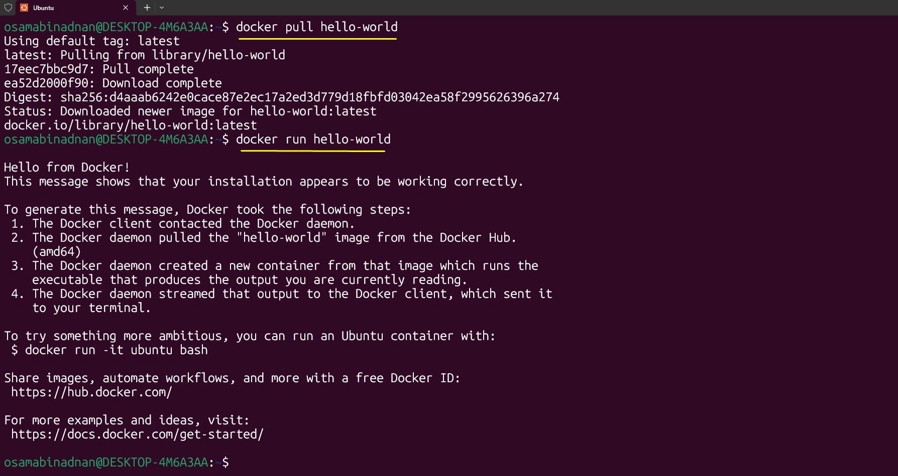

# Docker Setup Guide

- Download Docker Desktop but you have to select which version you should install according to your operating system.
- Copy your system spec to ChatGPT and it will give you the Docker version you should install.

- Download the [Docker Desktop](https://www.docker.com/products/docker-desktop/) and install it.

- Docker Hub is a cloud-based registry service for storing, managing, and distributing Docker container images. It is the default and most widely used container registry in the Docker ecosystem, acting as a central library for millions of container images.
- Link of this website: [Docker Hub](https://hub.docker.com/)
- We will go on this website and search for the `hello world` image, and then click on the `Pull` button.

- After installation login to your docker desktop account via gmail, github or own email, password and click on the login button.

- When you docker engine started on desktop, open Ubuntu account and run command `docker pull hello-world` to get the `hello world` image.

- To run the `hello world` image, run the command `docker run hello-world`

- To remove the `hello world` image, run the command `docker rmi hello-world`

- See below image

---

---