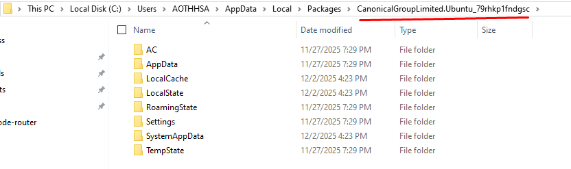

## Where are WSL & Ubuntu files actually stored?

When you install **WSL + Ubuntu**, Windows creates a **separate Linux filesystem**.

### Physical location on Windows (hidden by default)

```bash
C:\Users\<YourWindowsUser>\AppData\Local\Packages\CanonicalGroupLimited.Ubuntu*\LocalState\ext4.vhdx
```

-   `ext4.vhdx` = a **virtual Linux disk**
-   This contains:
    -   `/home`
    -   `/usr`    
    -   `/etc`
    -   installed Linux packages
    -   your Linux user files

💡 Windows **cannot directly see Linux paths** unless going through special bridges.

---



You’re looking in the right place, but this is the key misunderstanding 👇
Your Linux /home folder is NOT a normal Windows folder, so you won’t see it there.

Let me explain clearly.

## ❌ Why you don’t see `/home` here

You are here:

```bash 

C:\Users\YourWindowsUser\AppData\Local\Packages\CanonicalGroupLimited.Ubuntu_79rhkp1fndgsc\
```

This folder **does NOT directly contain Linux folders like `/home`, `/usr`, `/etc`**.

### The reason:

Your entire Ubuntu filesystem lives inside **ONE FILE**:

```bash
LocalState\ext4.vhdx
```

That file is a **virtual Linux disk** (EXT4 filesystem).

Windows Explorer **cannot open EXT4**, so it hides everything inside it.

That’s why:

-   ❌ No `/home`
-   ❌ No `/usr`
-   ❌ No Linux files visible

## ✅ Where your Ubuntu `/home` ACTUALLY is

### Inside the virtual disk:

```bash

ext4.vhdx 
└── /     
    └── home         
        └── <your-linux-username>
```
But Windows can’t browse this directly.

## ✅ Correct ways to access `/home` (IMPORTANT and RECOMMENDED)

### ✅ Method 1 (BEST): Use `\\wsl$` (Windows Explorer)

1.  Open **File Explorer**
2.  Paste this in the address bar:
    
```bash
\\wsl$
```

3.  Click:

```bash
Ubuntu
```

4.  Then:

```bash
home → your_linux_user
```    

✔️ This is the **official + safe** way  
✔️ Real-time access  
✔️ No corruption risk

---

### ✅ Method 2: From inside WSL (recommended for dev)

```bash
cd ~ 
pwd
```
That is:

```bash
/home/your_linux_user
```

---

## ❌ DO NOT try this (dangerous)
-   ❌ Mount `ext4.vhdx` manually
-   ❌ Edit files directly inside `LocalState`
-   ❌ Copy `ext4.vhdx` while WSL is running
    
This can **corrupt Ubuntu**.