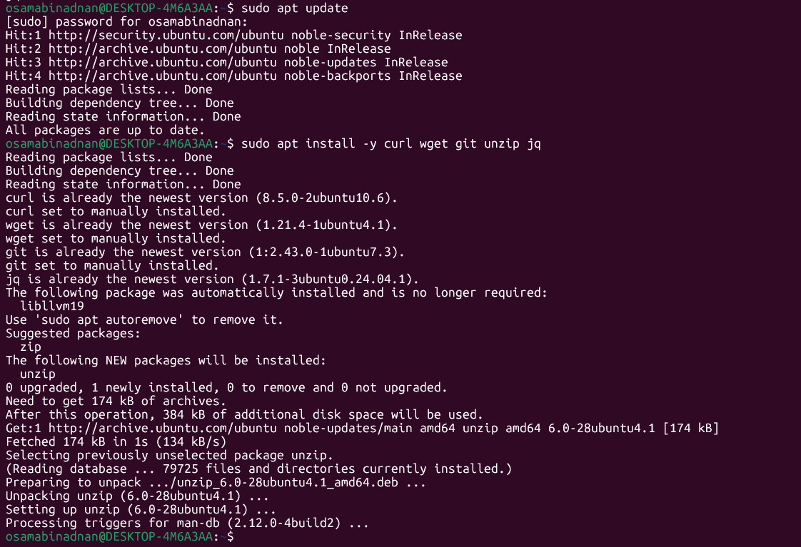
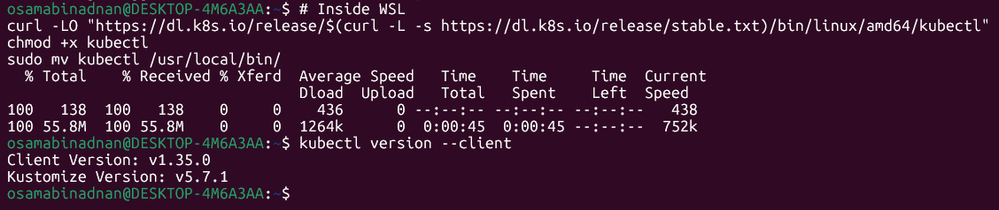
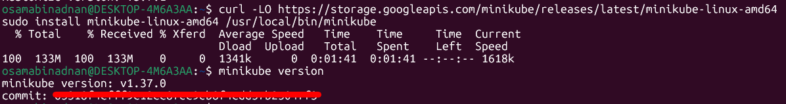
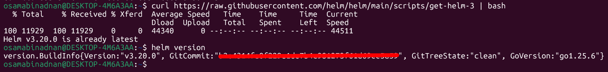
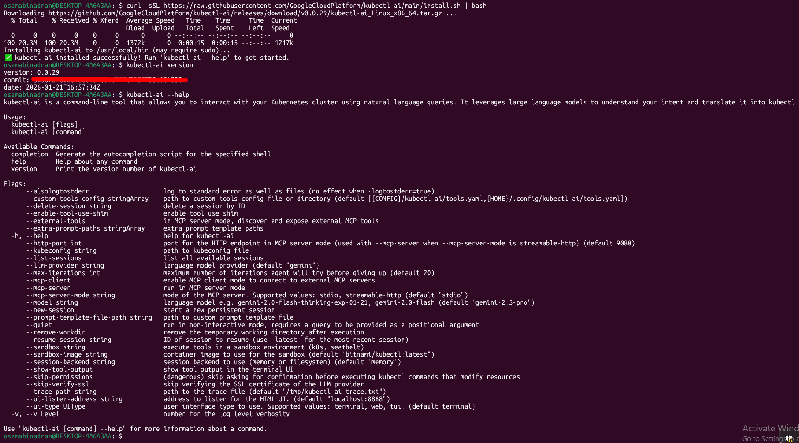
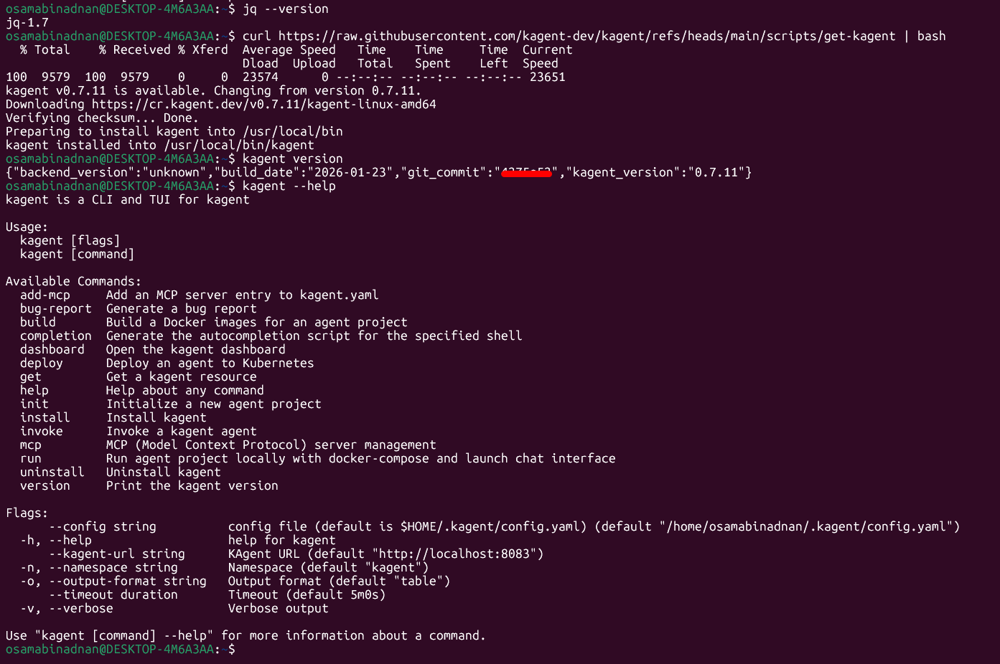

# Local Kubernetes Deployment Guide

**Windows + WSL2 (Ubuntu recommended)**

### Recommended order of installation

1.  Docker Desktop
2.  WSL2 + Ubuntu (if not already done)
3.  kubectl
4.  minikube
5.  helm
6.  jq ← **very important for kagent**
7.  kubectl-ai
8.  kagent

### 1\. Docker Desktop

→ [https://www.docker.com/products/docker-desktop/](https://www.docker.com/products/docker-desktop/) → Download & install normal Windows version → During installation **tick both** checkboxes:

-   Use WSL 2 instead of Hyper-V
-   Add shortcut to desktop

→ After installation → open Docker Desktop → **Settings → Resources → WSL Integration** → Enable integration with your distro (Ubuntu usually)

### 2\. Install very useful basic tools in WSL

```bash
sudo apt update
sudo apt install -y curl wget git unzip jq
```



**Very important:** `jq` is required by kagent installer!

### 3\. kubectl (Kubernetes command-line tool)

**Easiest & recommended way**
```bash
# Inside WSL
curl -LO "https://dl.k8s.io/release/$(curl -L -s https://dl.k8s.io/release/stable.txt)/bin/linux/amd64/kubectl"
chmod +x kubectl
sudo mv kubectl /usr/local/bin/
```

**Quick check:**
```bash
    kubectl version --client
```



### 4\. minikube

**Best & most stable method right now**

```bash
# Inside WSL
curl -LO https://storage.googleapis.com/minikube/releases/latest/minikube-linux-amd64
sudo install minikube-linux-amd64 /usr/local/bin/minikube
```
Quick check:
```bash
minikube version
```
**After installation – first start (choose driver)**

```bash
minikube start --driver=docker
#               or
minikube start --driver=kvm2     ← if you have KVM
#               or
minikube start --driver=hyperv   ← only if you use Hyper-V (very rare now)
```



### 5\. helm

**Most comfortable way (script)**

```Bash
# Inside WSL
curl https://raw.githubusercontent.com/helm/helm/main/scripts/get-helm-3 | bash
```
**Alternative – manual**

```Bash
curl -LO https://get.helm.sh/helm-v3.16.2-linux-amd64.tar.gz   # ← check latest version!
tar xvf helm-v3.16.2-linux-amd64.tar.gz
sudo mv linux-amd64/helm /usr/local/bin/
```
**Quick check**

```Bash
helm version
```



### 6\. kubectl-ai (very useful AI helper for kubectl)

Two best ways – choose **one**

**Linux & MacOS only**

```Bash
curl -sSL https://raw.githubusercontent.com/GoogleCloudPlatform/kubectl-ai/main/install.sh | bash
```
Quick check

```Bash
kubectl-ai version
```



### 7\. kagent (AI Kubernetes Agent)

**VERY IMPORTANT first step**

Make sure you already have jq !!!

```Bash
# You MUST have jq installed
jq --version     # ← must show version
```
**Method 1 – Official script (recommended)**

```Bash
curl https://raw.githubusercontent.com/kagent-dev/kagent/refs/heads/main/scripts/get-kagent | bash
```

**Method 2 – Manual latest release (very safe)**

```Bash
# Find latest version here → https://github.com/kagent-dev/kagent/releases

VERSION=v0.2.3          # ← change to newest version !

curl -LO "https://github.com/kagent-dev/kagent/releases/download/${VERSION}/kagent_Linux_x86_64.tar.gz"
tar xvf kagent_Linux_x86_64.tar.gz
chmod +x kagent
sudo mv kagent /usr/local/bin/
```
**Quick check**

```Bash
kagent version
kagent --help
```

