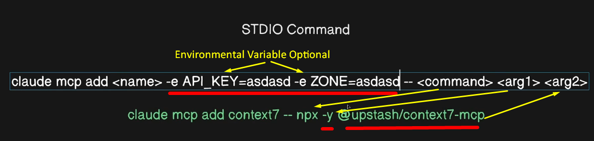

## Installing MCP Servers on Claude Code CLI

MCP servers can be configured in three different ways depending on your needs:

### Option 1: Add a remote HTTP server
HTTP servers are the recommended option for connecting to remote MCP servers. This is the most widely supported transport for cloud-based services.
```
# Basic syntax
claude mcp add --transport http <name> <url>

# Real example: Connect to Notion
claude mcp add --transport http notion https://mcp.notion.com/mcp

# Example with Bearer token
claude mcp add --transport http secure-api https://api.example.com/mcp \
  --header "Authorization: Bearer your-token"
```


### Option 2: Add a remote SSE server

Although, the SSE (Server-Sent Events) transport is deprecated. Use HTTP servers instead, where available.

```
# Basic syntax
claude mcp add --transport sse <name> <url>

# Real example: Connect to Asana
claude mcp add --transport sse asana https://mcp.asana.com/sse

# Example with authentication header
claude mcp add --transport sse private-api https://api.company.com/sse \
  --header "X-API-Key: your-key-here"
```

### Option 3: Add a local stdio server

Stdio servers run as local processes on your machine. They’re ideal for tools that need direct system access or custom scripts.

```
# Basic syntax
claude mcp add --transport stdio <name> <command> [args...]

# Real example: Add Airtable server
claude mcp add --transport stdio airtable --env AIRTABLE_API_KEY=YOUR_KEY \
  -- npx -y airtable-mcp-server

# For Window user without WSL
# Run below command on `command prompt`
claude mcp add context7 -- cmd /c npx -y @upstash/context7-mcp@latest
```



---

### MCP installation scopes

We have 3 different layers of scope

#### Local Scope
- Server is only available for specific scope at user level
- Other users working on same project will not have access to that server

```
# Add a local-scoped server (default)
claude mcp add --transport http stripe https://mcp.stripe.com

# Explicitly specify local scope
# Instead of scope, we can write simply `s`
claude mcp add --transport http stripe --scope local https://mcp.stripe.com
```

#### Project Scope
- Server will actually be added at project level, ensuring that all team members have access to the same MCP server as well

```
# Add a project-scoped server
# Instead of scope, we can write simply `s`
claude mcp add --transport http paypal --scope project https://mcp.paypal.com/mcp
```

#### User Scope
- MCP servers are added on global level which means servers will be available to the user spanning all the different project

```
# Add a project-scoped server
# Instead of scope, we can write simply `s`
claude mcp add --transport http paypal --scope project https://mcp.paypal.com/mcp
```

### Remove MCP Servers
- To remove MCP Server from Claude Code CLI
```
# Remove MCP server general command
claude mcp remove [server name]

# Remove MCP server specific command for server
claude mcp remove context7

# To remove from a specific scope, use:
  claude mcp remove "context7" -s local
  claude mcp remove "context7" -s project
  claude mcp remove "context7" -s user
```
