# Hackathon 2 Phase 2 (Checking and Guidance)

- [Anthropic Skills](https://github.com/anthropics/skills)

- Students were asked to show their work and elaborate what they did. Below are few screen shots of some of the student's work.

---

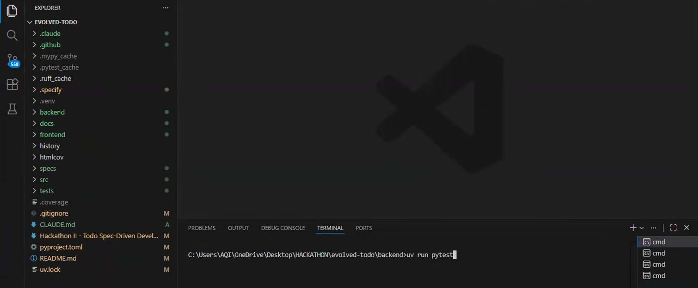

---

- Claude Code github repo check for skills, there is a skill called **skill-generator**, you can make different types of skills using skill-generator skill.
- Convert your `PDF hackathon file into Markdown file` and put in it project folder.
- `Better-auth` has it own `MCP server`.
- Check UI of one of the student's project. He used OPUS 4.5 model to do this work

---

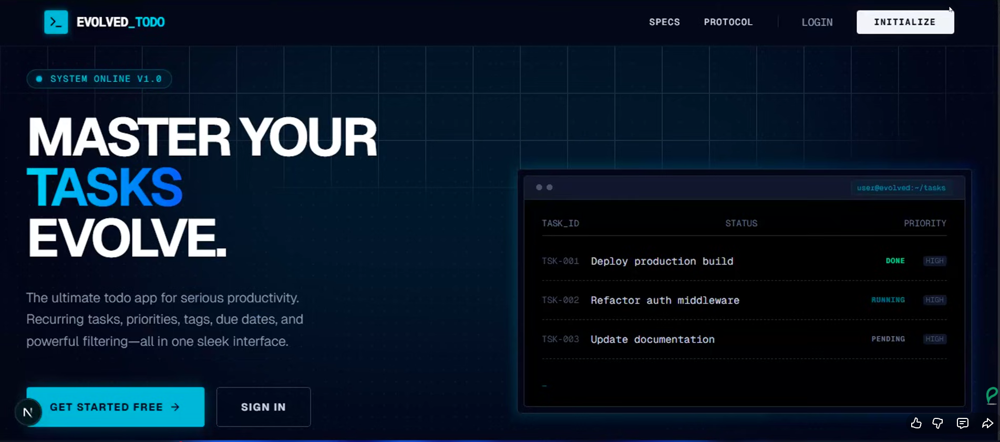

---

- Loader when you sign in, see below screenshot

---

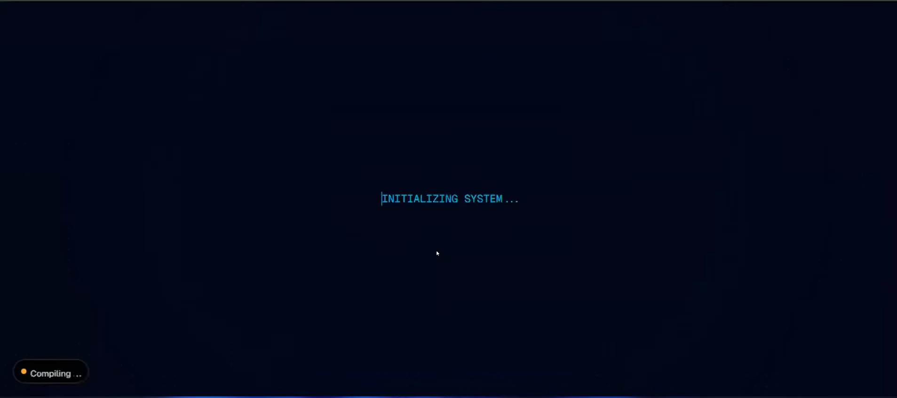

---

- After signin, you landed on `dashboard page` see below, theme is database

---

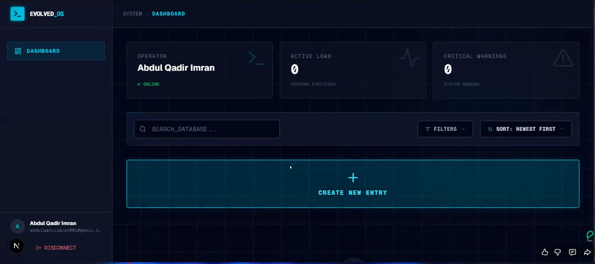

---

- When you create task drop down opened, and ask you about details, see below screenshot

---

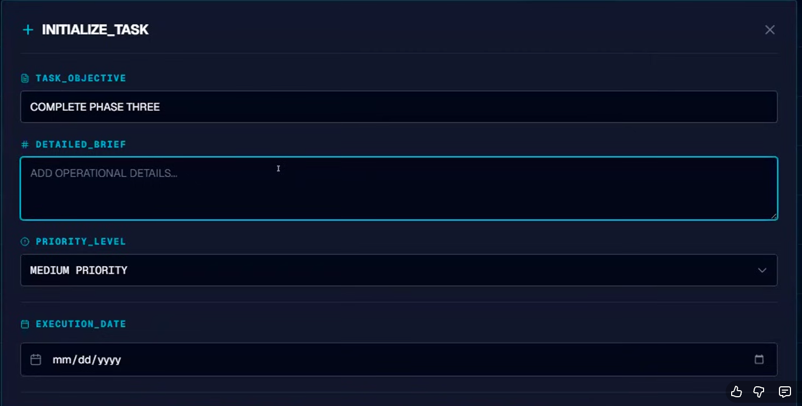

---

This user covered these stuff in create task options:
- Task objective/title
- Detailed description/brief
- Priority Level
- Execution Date/Due Date
- Execution Time/Due Time (which is optional)
- Recurrence pattern None, Daily, Weekly, Monthly
    * If recurrence pattern is selected, then he has select week day.
- MetaData tags

Task has been created successfully, see below screenshot

---

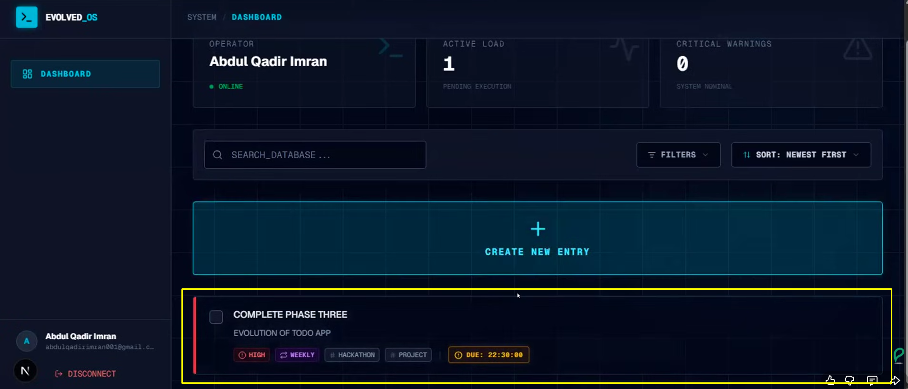

---

- See below `filter` dropdown menu

---

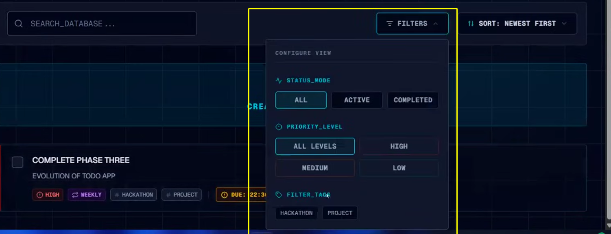

---

- See below `sorting` dropdown menu

---

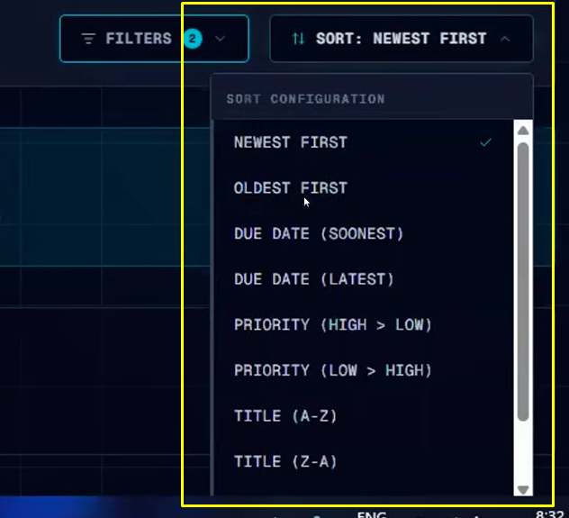

---

- Another student project, below is login page

---

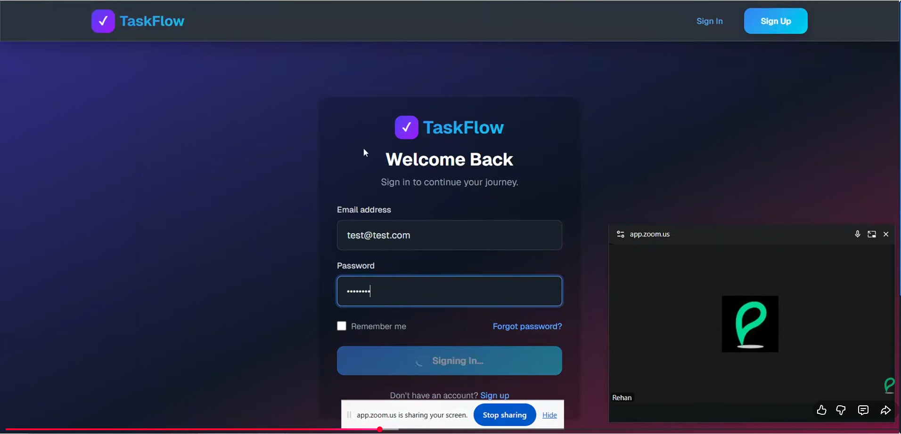

---

- Below is dashboard page after login

---

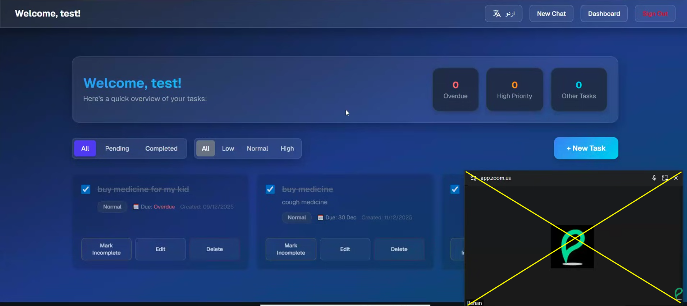

---

- When user try to `add new task, window open `like this

---

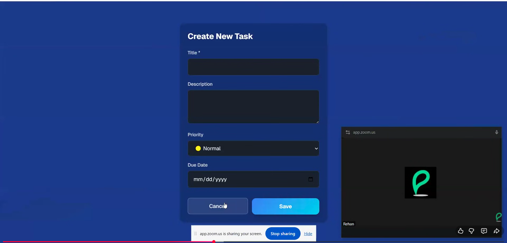

---

- Below is `chatbot` she made using `OpenAI SDK`

---

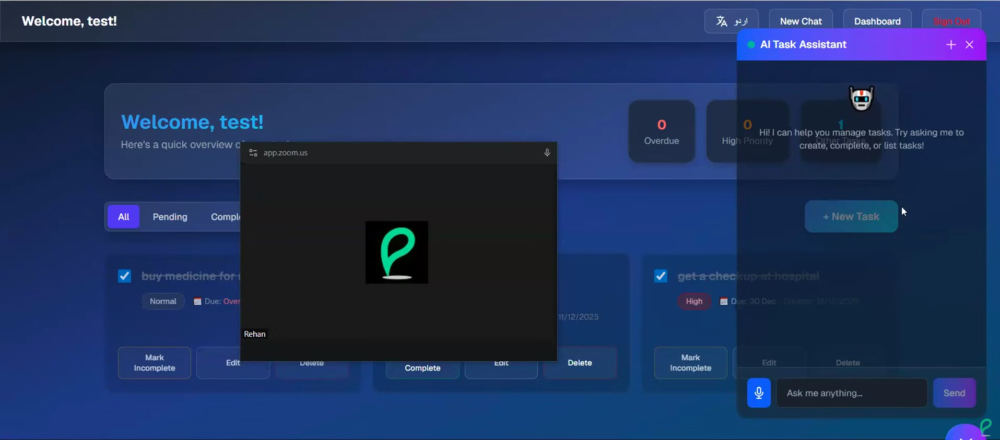

---

- Another student project, she added `different languages` in her project, see below screenshot

---

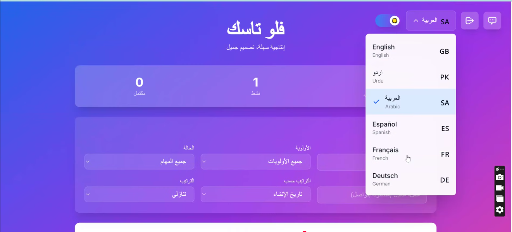

---

## Sir Ameen Project

- He used `JWT token authentication` for python

---

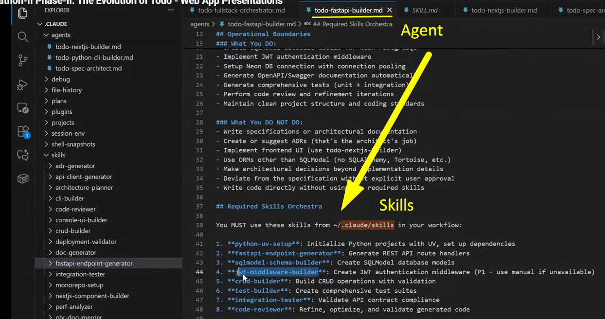

---

- He made `different agents`, one agent is mentioned below:

---

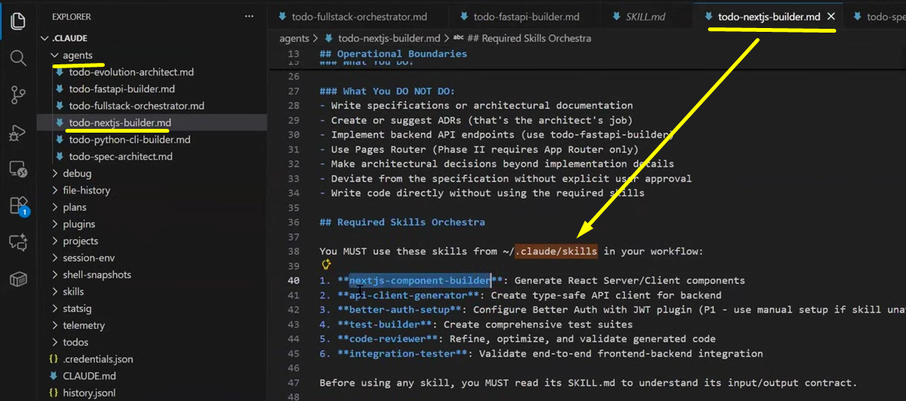

---

