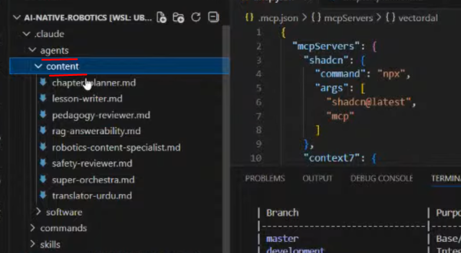
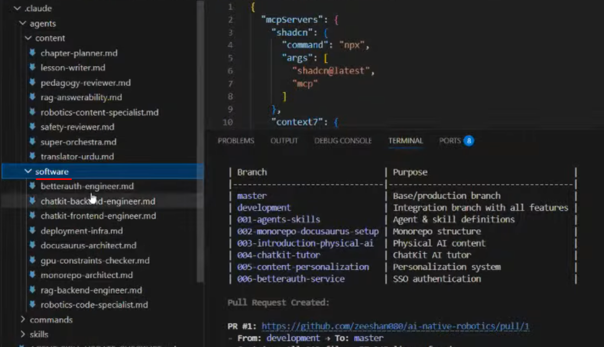

# Session 02: AI-Driven • Spec-Driven Hackathon — Pre-Show Kickoff (Submission Review)

- We can make different types of sub-agents like:
    * In .claude/agents/content folder you can manage agents related to content
    ---
    
    ---
    * In .claude/agents/software folder you can manage agents related to software and working on it
    ---
    
    ---

- Below is the link of user who made project. You can give example constitution as well from Panaversity Repo
    * [Umer-Mq](https://github.com/umar-mq/phys-ai-book)
