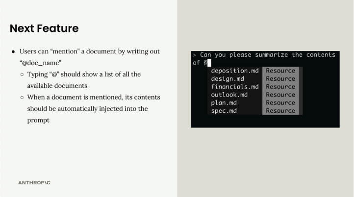
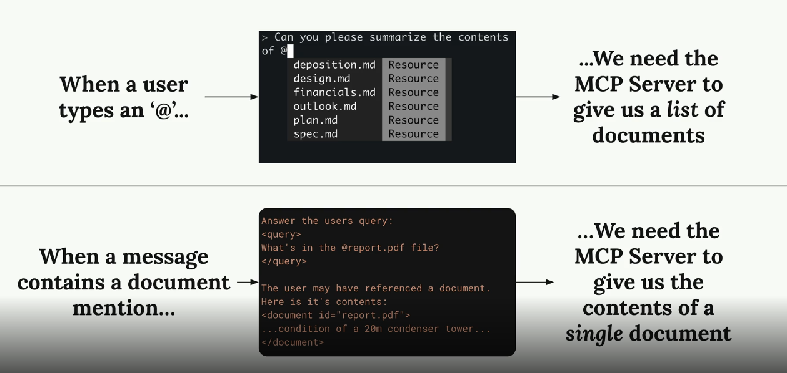
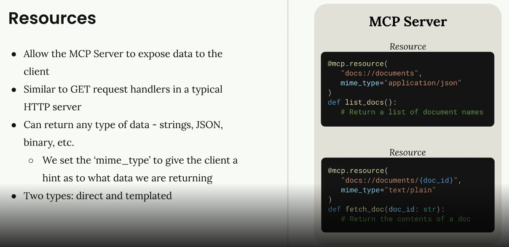
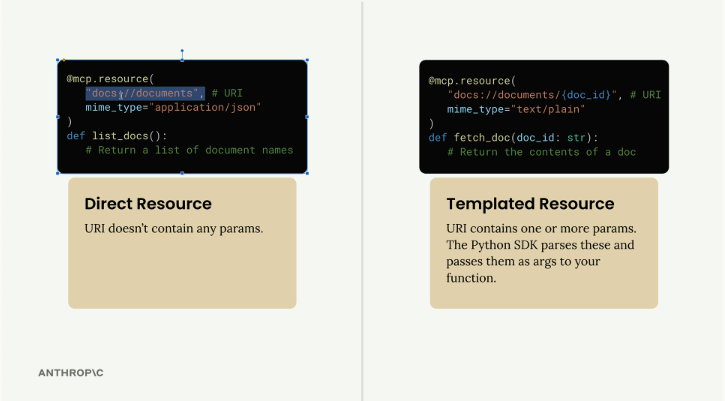
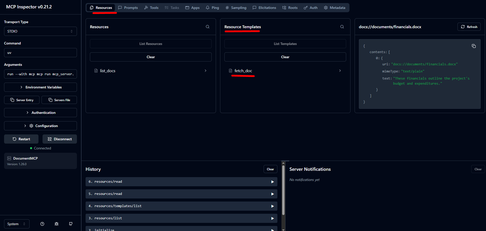
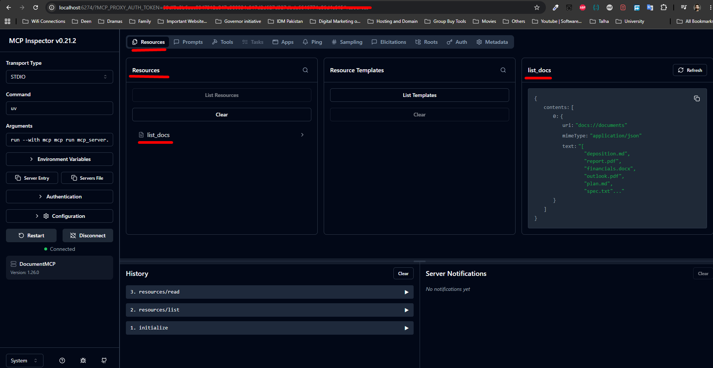

# Connecting with MCP clients

## Implementing a Client

Now that we have our MCP server working, it's time to build the client side. The client is what allows our application code to communicate with the MCP server and access its functionality.

### Understanding the Client Architecture

In most real-world projects, you'll either implement an MCP client or an MCP server - not both. We're building both in this project just so you can see how they work together.


The MCP client consists of two main components:

- **MCP Client** - A custom class we create to make using the session easier
- **Client Session** - The actual connection to the server (part of the MCP Python SDK)


The client session requires careful resource management - we need to properly clean up connections when we're done. That's why we wrap it in our own class that handles all the cleanup automatically.

### How the Client Fits Into Our Application

Remember our application flow diagram? The client is what enables our code to interact with the MCP server at two key points:


Our CLI code uses the client to:

- Get a list of available tools to send to Claude
- Execute tools when Claude requests them

### Implementing Core Client Functions

We need to implement two essential functions: `list_tools()` and `call_tool()`.

#### List Tools Function

This function gets all available tools from the MCP server:

```python
async def list_tools(self) -> list[types.Tool]:
    result = await self.session().list_tools()
    return result.tools
```

It's straightforward - we access our session (the connection to the server), call the built-in `list_tools()` method, and return the tools from the result.

#### Call Tool Function

This function executes a specific tool on the server:

```python
async def call_tool(
    self, tool_name: str, tool_input: dict
) -> types.CallToolResult | None:
    return await self.session().call_tool(tool_name, tool_input)
```

We pass the tool name and input parameters (provided by Claude) to the server and return the result.

### Testing the Client

The client file includes a simple test harness at the bottom. You can run it directly to verify everything works:

```bash
uv run mcp_client.py
```

This will connect to your MCP server and print out the available tools. You should see output showing your tool definitions, including descriptions and input schemas.

### Putting It All Together

Once the client functions are implemented, you can test the complete flow by running your main application:

```bash
uv run main.py
```

Try asking: "What is the contents of the report.pdf document?"

Here's what happens behind the scenes:

1.  Your application uses the client to get available tools
2.  These tools are sent to Claude along with your question
3.  Claude decides to use the read\_doc\_contents tool
4.  Your application uses the client to execute that tool
5.  The result is returned to Claude, who then responds to you

The client acts as the bridge between your application logic and the MCP server's functionality, making it easy to integrate powerful tools into your AI workflows.

## Defining resources


Resources in MCP servers allow you to expose data to clients, similar to GET request handlers in a typical HTTP server. They're perfect for scenarios where you need to fetch information rather than perform actions.

### Understanding Resources Through an Example

Let's say you want to build a document mention feature where users can type `@document_name` to reference files. This requires two operations:

- Getting a list of all available documents (for autocomplete)
- Fetching the contents of a specific document (when mentioned)



When a user mentions a document, your system automatically injects the document's contents into the prompt sent to Claude, eliminating the need for Claude to use tools to fetch the information.


---



### Resources



### How Resources Work

Resources follow a request-response pattern. When your client needs data, it sends a `ReadResourceRequest` with a URI to identify which resource it wants. The MCP server processes this request and returns the data in a `ReadResourceResult`.


The flow looks like this: your code requests a resource from the MCP client, which forwards the request to the MCP server. The server processes the URI, runs the appropriate function, and returns the result.

### Types of Resources

There are two types of resources:

#### Direct Resources

Direct resources have static URIs that never change. They're perfect for operations that don't need parameters.

```python
@mcp.resource(
    "docs://documents",
    mime_type="application/json"
)
def list_docs() -> list[str]:
    return list(docs.keys())
```

#### Templated Resources

Templated resources include parameters in their URIs. The Python SDK automatically parses these parameters and passes them as keyword arguments to your function.

```python
@mcp.resource(
    "docs://documents/{doc_id}",
    mime_type="text/plain"
)
def fetch_doc(doc_id: str) -> str:
    if doc_id not in docs:
        raise ValueError(f"Doc with id {doc_id} not found")
    return docs[doc_id]
```



### Implementation Details

Resources can return any type of data - strings, JSON, binary data, etc. Use the `mime_type` parameter to give clients a hint about what kind of data you're returning:

- `"application/json"` for structured data
- `"text/plain"` for plain text
- `"application/pdf"` for binary files

The MCP Python SDK automatically serializes your return values. You don't need to manually convert objects to JSON strings - just return the data structure and let the SDK handle serialization.

## Testing Your Resources

You can test resources using the MCP Inspector. Start your server with:

```bash
uv run mcp dev mcp_server.py
```

Then connect to the inspector in your browser. You'll see two sections:

- **Resources** - Lists your direct/static resources
- **Resource Templates** - Lists your templated resources



Click on any resource to test it. For templated resources, you'll need to provide values for the parameters. The inspector shows you the exact response structure your client will receive, including the MIME type and serialized data.



Resources provide a clean way to expose read-only data from your MCP server, making it easy for clients to fetch information without the complexity of tool calls.