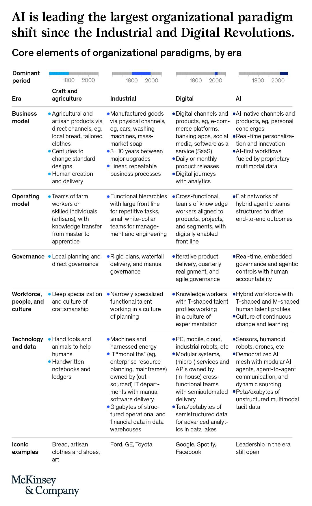
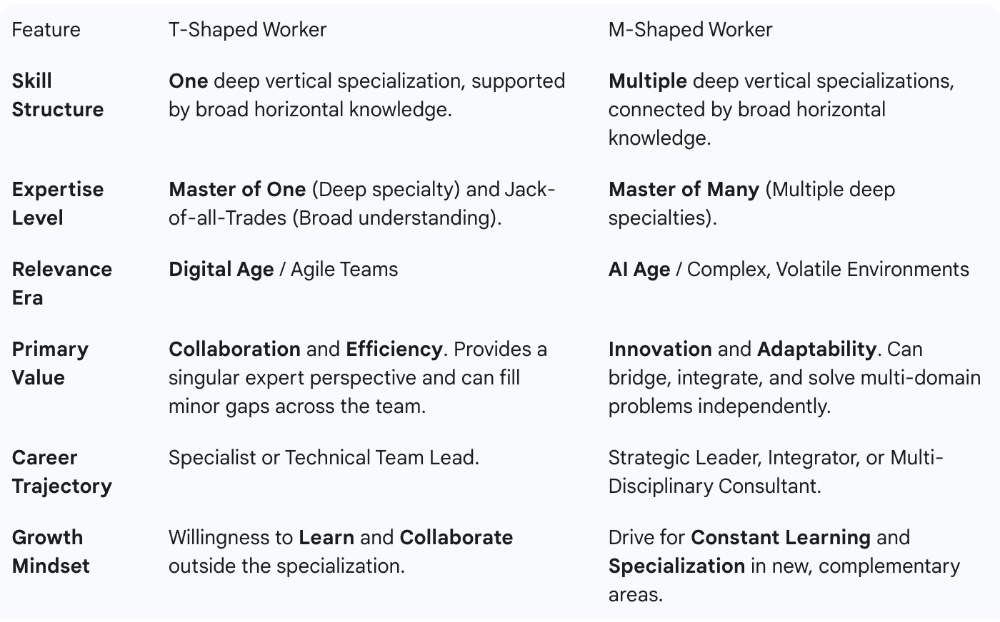
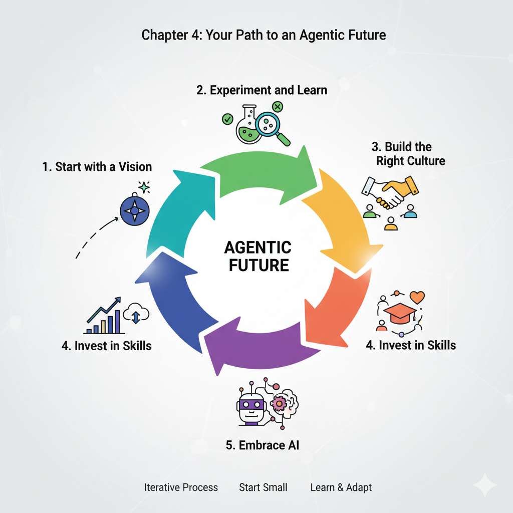
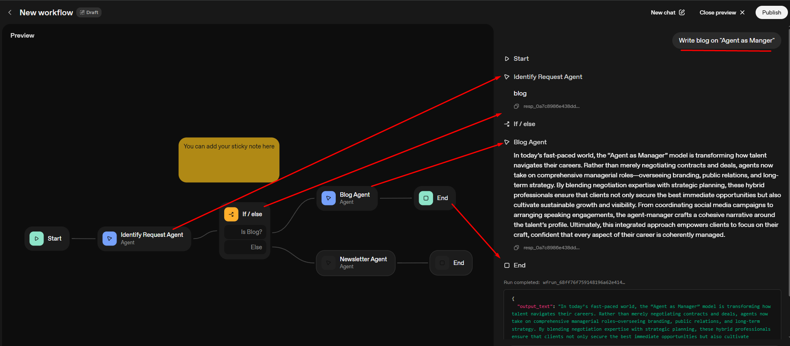
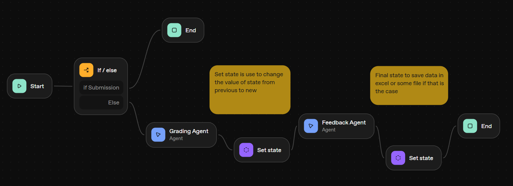
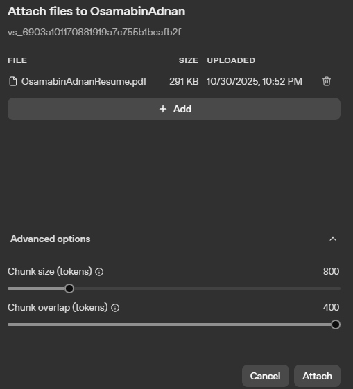

# **No Code Agents with OpenAI AgentKit**

> [**Panaversity YouTube Channel Link**](https://www.youtube.com/playlist?list=PLY-fvIYzjXhcRku9CQnMKSWPQpRhEPqy_)

---

## **✅ Session 01 (15/10/2025)**

### **Introduction**

All detail related to this course:
> [Panaversity GitHub Repo](https://github.com/panaversity/learn-agentic-ai-from-low-code-to-code/blob/main/00_agentic_web/readme.md)

* OpenAI is going to make its platform, on that platform top developer around the world will connect existing application with this platform.
* OpenAI is trying to make search browser type stuff.

### **OpenAI's Vision for an AI-Driven Future Learning Guide**

* All detail related to this topic

> [OpenAI Vision Guide from Repo](https://github.com/panaversity/learn-agentic-ai-from-low-code-to-code/blob/main/00_agentic_web/panaversity-openai-vision-guide.md)

* [Chapter 1: Understanding the AI Revolution](https://github.com/panaversity/learn-agentic-ai-from-low-code-to-code/blob/main/00_agentic_web/panaversity-openai-vision-guide.md#chapter-1-understanding-the-ai-revolution)

* [Chapter 2: OpenAI's Strategic Vision—The Operating System for AI](https://github.com/panaversity/learn-agentic-ai-from-low-code-to-code/blob/main/00_agentic_web/panaversity-openai-vision-guide.md#chapter-2-openais-strategic-vision-the-operating-system-for-ai)

* [Chapter 3: Implications for Stakeholders](https://github.com/panaversity/learn-agentic-ai-from-low-code-to-code/blob/main/00_agentic_web/panaversity-openai-vision-guide.md#chapter-3-implications-for-stakeholders)

* [Chapter 4: Challenges and Critical Considerations](https://github.com/panaversity/learn-agentic-ai-from-low-code-to-code/blob/main/00_agentic_web/panaversity-openai-vision-guide.md#chapter-4-challenges-and-critical-considerations)

* [Chapter 5: Looking to the Future](https://github.com/panaversity/learn-agentic-ai-from-low-code-to-code/blob/main/00_agentic_web/panaversity-openai-vision-guide.md#chapter-5-looking-to-the-future)

---

## **✅ Session 02: Agentic Organization (16/10/2025)**

Discussing Quiz from Repo **[Quiz.md](https://github.com/panaversity/learn-agentic-ai-from-low-code-to-code/blob/main/00_agentic_web/quiz.md)**

- OpenAI introduced two feature in Agent Kit, `Agent builder` and `ChatKit`
    * **Agent builder:** A set of building block to take AI agents from prototype to production. (no code agent)
    * **ChatKit:** A UI which display Agent as a conversational interface

- OpenAI is not yet profitable despite high revenue. They are currently focusing on dominance in market, they are running on investments.

### **Agentic Web:**
- There are 2 ways to access or used agentic web to reach and talk with consumers
    1) Within OpenAI/Chat GPT web, apps are availble to do some work like Spotify available within Chat GPT.
    2) A2A protocol (Agent to Agent) of Google, your engine is comminicating wih another agent of different organization. To implement this you need to be developer.

### **[The Rise of Agentic Organizations: How AI Is Redefining the Future of Work and Business](https://github.com/panaversity/learn-agentic-ai-from-low-code-to-code/blob/main/01_agentic_org/readme.md)**

- You will be able to transform whole company, by redefining work, ways of doing work and business.

---

---

- Sir is trying to teach us about business and how to get business from potential customers. We can tell business owners about different era is mankind history mentioned above.

#### **🏢 Business Model**
* `Craft Era:` People made things by hand and sold directly (like a local baker or tailor).
* `Industrial Era:` Big factories made physical products like cars or soap and sold them through stores.
* `Digital Era:` Products became digital—like apps, social media, and online shopping.
* `AI Era:` AI tools (like smart assistants) help deliver services that are personalized in real time. Work is powered by AI behind the scenes.

#### **👩‍🏭 Operating Model (How Work Is Organized)**
* `Craft:` Small teams like a farmer and their workers.
* `Industrial:` Big hierarchies (lots of layers of bosses and workers doing repetitive jobs).
* `Digital:` Cross-functional teams (people from different departments work together using digital tools).
* `AI:` Flat teams where humans and AI "agents" (smart programs or robots) work side-by-side on tasks from start to finish.

#### **🏛️ Governance (How Decisions Are Made)**
* `Craft:` Local decisions, face-to-face.
* `Industrial:` Long-term planning, rigid rules.
* `Digital:` Agile planning—plans change quickly, and teams adjust as they go.
* `AI:` Decisions happen in real time with AI guidance, but humans stay accountable.

#### **👥 People and Culture**
* `Craft:` Artisans with deep hands-on skill.
* `Industrial:` Workers specialized in one job, following plans.
* `Digital:` **T-shaped** workers (they know one skill deeply, but also understand other areas and collaborate).
* `AI:` Mix of deep and broad skills (**M-shaped** workers), constant learning, and change embraced.

---

---

#### **💻 Technology and Data**
* `Craft:` Hand tools, handwritten notes.
* `Industrial:` Big machines and early computers (mainframes).
* `Digital:` PCs, mobile, internet, cloud storage.
* `AI:` Robots, sensors, drones, massive AI networks that learn from huge amounts of data.

#### **🌟 Iconic Examples**
* `Craft:` Handmade bread, art, local goods.
* `Industrial:` Companies like Ford or Toyota.
* `Digital:` Google, Facebook, Spotify.
* `AI:` Still evolving—no single leader yet.

### **[The Agentic Organization: A Learning Guide to the Future of Business](https://github.com/panaversity/learn-agentic-ai-from-low-code-to-code/blob/main/01_agentic_org/agentic_org_guide.md#chapter-1-the-dawn-of-a-new-era)**

An agentic organization is one in which human workers and AI agents (virtual and physical) are designed to work together, sharing responsibilities, and executing tasks at scale.

#### **[Chapter 1: The Dawn of a New Era](https://github.com/panaversity/learn-agentic-ai-from-low-code-to-code/blob/main/01_agentic_org/agentic_org_guide.md#chapter-1-the-dawn-of-a-new-era)**

- Problems: Classic Clothes vs Innovate Inc.
---

---
- You are coming in `consulting field`, not in software development field. Identify problems of organization and solve it using AI.

#### **[Chapter 2: The Building Blocks of an Agentic Organization](https://github.com/panaversity/learn-agentic-ai-from-low-code-to-code/blob/main/01_agentic_org/agentic_org_guide.md#chapter-2-the-building-blocks-of-an-agentic-organization)**

The McKinsey article that inspired this book identifies five `"pillars"` of the agentic organization: the **business model**, the **operating model, governance**, the **workforce, people, and culture**, and **technology and data**. Let's break down some of the key ideas within these pillars.

* **Empowered Edge:** In a traditional company, power is concentrated at the center. In an agentic organization, power is pushed to the "edge" – to the people and teams who are closest to the customers and the market. This means that employees at all levels are trusted to make important decisions.

* **Decentralized Networks:** Instead of a rigid, top-down hierarchy, agentic organizations are often structured as a network of small, autonomous teams. These teams can be formed and reformed quickly to tackle different projects and challenges.

* **Nimble Resource Allocation:** In a fast-changing world, a company needs to be able to shift its resources (money, people, and time) to where they're needed most. Agentic organizations are great at this. They don't get bogged down in long-term, inflexible plans. They can quickly reallocate resources to new opportunities as they arise.

* **A Culture of Trust and Experimentation:** For an agentic organization to work, there has to be a high level of trust. Leaders have to trust their employees to make good decisions, and employees have to feel safe to take risks and try new things, even if they sometimes fail.

#### **[Chapter 3: AI: The Engine of the Agentic Organization](https://github.com/panaversity/learn-agentic-ai-from-low-code-to-code/blob/main/01_agentic_org/agentic_org_guide.md#chapter-3-ai-the-engine-of-the-agentic-organization)**

We've talked about how the agentic organization is a new way of working, but what's the technology that makes it all possible? The answer is Artificial Intelligence (AI).

For beginners, AI can be a confusing topic. You might think of robots from science fiction movies, but the reality is that AI is already all around us, from the recommendation engines on Netflix to the navigation apps on our phones.

In the context of the agentic organization, we're particularly interested in a type of AI called generative AI. This is the technology that allows computers to create new content, like text, images, and code. You've probably heard of tools like ChatGPT – that's a great example of generative AI in action.

So, how does AI help to create an agentic organization? The `McKinsey article` suggests that AI can play three key roles:

* **Coach:** AI can act as a personal coach for every employee. It can provide them with the information they need to do their jobs, help them learn new skills, and even give them feedback on their performance. For example, a salesperson could use an AI coach to prepare for a meeting with a new client. The AI could provide information about the client's company, suggest talking points, and even simulate the conversation so the salesperson can practice.

* **Collaborator:** AI can also be a powerful collaborator. It can help teams brainstorm ideas, analyze data, and even write reports. This frees up people to focus on the more creative and strategic aspects of their work. For example, a marketing team could use a generative AI tool to come up with ideas for a new advertising campaign.

* **Catalyst:** Finally, AI can be a catalyst for change. It can help to break down the information silos that exist in traditional organizations. When everyone has access to the same information, it's easier for them to collaborate and make good decisions. AI can also automate many of the routine, repetitive tasks that take up so much of our time, freeing us up to focus on more important work.

#### **[Chapter 4: Your Path to an Agentic Future](https://github.com/panaversity/learn-agentic-ai-from-low-code-to-code/blob/main/01_agentic_org/agentic_org_guide.md#chapter-4-your-path-to-an-agentic-future)**

---

---

- This course aims to make you:
    1) No code Agent developer
    2) Business solution provider

## **✅ Session 03: Build your First Agent (22/10/2025)**

- At the start we discussed on [Agentic Organization: Future of Work and Business](https://www.youtube.com/watch?v=Dq2u0_jI4qk)

### **Agentic Mesh**

In the context of an “agentic organisation” (that is, an organisation built to leverage many autonomous AI agents working collaboratively) a **Agentic Mesh** is a key architectural paradigm.

- An Agentic Mesh is the infrastructure layer that connects and manages multiple AI agents across an organization.
- At a high level, an Agentic Mesh is a **governed, interoperable fabric** or infrastructure layer in which many specialised AI agents can register, coordinate, share context, act, and scale across an enterprise. For example:
    * It connects agents (that may use different models, tools, or data sources) into a unified system rather than silos.
    * It embeds governance, observability, and policy controls so that the agents operate in a safe, auditable, compliant way.
    * It supports vendor neutrality and composability: agents and tools can be swapped/added without rebuilding the entire system.
    * It enables multi-agent workflows, where discrete agents can take on subtasks, hand off to other agents, share memory/context, coordinate reasoning and actions.
- The **Agentic Mesh** is the **“nervous system”** of an agentic enterprise: the agents are the neurons, the mesh is the connective tissue, routing layer and governance scaffold.

#### **Why it matters for an agentic organisation**

In an organisation that embraces agentic AI (many autonomous agents collaborating, scaling across functions), you face several challenges. The Agentic Mesh model helps address them:

* **Scaling vs. silos:** Many companies deploy individual AI agents (chatbots, copilots) but they are disconnected. The mesh enables reuse, sharing, and avoids duplication of effort. 
* **Governance and risk:** With many agents acting autonomously, you need policies, audit-logs, observability, access controls. The mesh embeds this.
* **Vendor lock-in and future proofing:** A mesh architecture supports plugging in new models, tools or workflows without rebuilding the stack.
* **Complex workflows:** Business processes are rarely single-step. The mesh allows orchestration of agents across tasks.
* **Democratization of AI & data:** In an agentic organisation, non-technical business users may invoke or compose agents. The mesh helps enable that safely.

#### **Key design principles**

According to sources like McKinsey & Company, some of the key design principles for an Agentic Mesh include:

* **Composability:** Agents, tools, models can be plugged in/removed.
* **Distributed intelligence:** Intelligence isn’t centralised; many agents operate and collaborate.
* **Layered decoupling:** Functions like memory, reasoning, interface, orchestration are separated.
* **Vendor neutrality:** Avoid lock-in; support multiple models/tools.
* **Governed autonomy:** Agents have autonomy but within guardrails, policies, observability.

#### **How it fits into an Agentic Organisation**
Within an agentic organisation (sometimes called the “agentic operating model”), the mesh enables the architecture and operating environment for agents. For instance:

* The organisation’s systems, data, workflows are connected via the mesh, so agents can access enterprise data/functionality in a unified way.
* The mesh allows teams to build and deploy agents more rapidly, reuse existing agents, move from pilot to scale.
* It supports a shift from centralised IT-monoliths to distributed “agentic” components closer to business units, enabling business‐users to leverage AI agents with appropriate guardrails.

> **The Agentic Mesh is the backbone that lets many AI agents work together, governed, and at scale within an organization, like 10K peoples of an organization can talk to each other because of system which is Agentic Mesh.**

### **[Navigating the Crossroads of AI and Human Readiness in IT](https://github.com/panaversity/learn-agentic-ai-from-low-code-to-code/tree/main/02_ai_and_human_readiness#navigating-the-crossroads-of-ai-and-human-readiness-in-it)**
---
**Industries that’ll likely be Replaced by AI First**

---
**Positioning System**

---
### **Pre-Setup Guide**
[Pre-Setup Guide: Getting Ready for Week 2 Session 1](https://github.com/panaversity/learn-agentic-ai-from-low-code-to-code/blob/main/04_no_code_agents/pre-setup.md)

### **What Is an Agent (No Code)?**

[04_no_code_agents](https://github.com/panaversity/learn-agentic-ai-from-low-code-to-code/tree/main/04_no_code_agents)

#### **[Part 1: Understanding Agents (10 minutes)](https://github.com/panaversity/learn-agentic-ai-from-low-code-to-code/tree/main/04_no_code_agents#part-1-understanding-agents-10-minutes)**

[Agents VS Chatbots - Student's Guide](https://github.com/panaversity/learn-agentic-ai-from-low-code-to-code/blob/main/04_no_code_agents/what_is_an_agent.md)

#### **[Part 2: The AgentKit Stack (15 minutes)](https://github.com/panaversity/learn-agentic-ai-from-low-code-to-code/tree/main/04_no_code_agents#part-2-the-agentkit-stack-15-minutes)**

## **✅ Session 04: Build your First Agent (Cont.) (23/10/2025)**

### **What Is an Agent (No Code)? (Cont.)**

[04_no_code_agents](https://github.com/panaversity/learn-agentic-ai-from-low-code-to-code/tree/main/04_no_code_agents)

#### **[Part 3: Building Blocks (Nodes) (15 minutes)](https://github.com/panaversity/learn-agentic-ai-from-low-code-to-code/tree/main/04_no_code_agents#part-3-building-blocks-nodes-15-minutes)**
* Click on link to check content of this page

#### **[Part 4: Hands On Agent Builder - Key Concepts](https://github.com/panaversity/learn-agentic-ai-from-low-code-to-code/tree/main/04_no_code_agents#part-4-hands-on-agent-builder---key-concepts)**

* Start working and understand `AgentKit`.
---

---

#### **[Part 5: Lab Project: Automated Grading and Feedback Agent](https://github.com/panaversity/learn-agentic-ai-from-low-code-to-code/tree/main/04_no_code_agents#part-5-lab-project-automated-grading-and-feedback-agent)**

[View the Class Hands-on Project Details](https://github.com/panaversity/learn-agentic-ai-from-low-code-to-code/blob/main/04_no_code_agents/class_handson_project.md)

* **Live Project: Assignments Grading and Feedback Agentic System**
    - **Step-by-step plan we will follow in Agent Builder.**
        1) **Domain Knowledge: Decompose the Steps of How Assignment Grading & Feedback Works**
        2) **Define What Success Looks Like**
        3) **How to Build It in Agent Builder: A Workflow Plan**
        4) **Create the Start Node and State Variables**
        5) **Plan the Workflow Logic**
        6) **Define the Agent (v0) and Prompt Engineering**
        7) **Decompose into Multiple Agents (The "Agentic" Approach)**

* We are making grading agent
* Sir added `teacher guidelines` from this links and added in start block of agent as a `state variable.`
    - [Teacher Guidelines](https://github.com/panaversity/learn-agentic-ai-from-low-code-to-code/tree/main/assignments/teacher_guidelines)

---

---

## **✅ Session 05- Knowledge Connections (29/10/2025)**

In this class we will learn how we can provide external or internal knowledge to agent.

Repo Link [05-Knowledge-Connections](https://github.com/panaversity/learn-agentic-ai-from-low-code-to-code/tree/main/05_knowledge_connections)

- Any existing system i.e., Graph database, structure database, shared drive having PDF file on it, any external source where your data is present, we have to connect them with AI.
- There are lot of use cases but we'll try to cover establish connection with vector database.

* **Information/Knowledge Types**
    - There are 2 types of information in general:
        1) Such info which doesnt change by itself, a developer need to change it, for instance after certain period of time, that kind of info we can directly give to agent and known as `System Prompt`.
        2) Lot of informations do change on daily, weekly or monthly basis which certain authorities are updating continuously, that kind of knowledge is called `External Knowledge`. To connect with these info we use *external connector*,

* **[Key Terms](https://github.com/panaversity/learn-agentic-ai-from-low-code-to-code/tree/main/05_knowledge_connections#key-terms)**

* **File Search:** A tool that lets agents search through uploaded documents using smart search technology
* **Connector:** A bridge that lets your agent talk to other systems (like Google Drive, SharePoint, or Teams)
* **MCP Servers:** Special tools that help agents connect to different services. It's the defactor Standard to connect Agents with Context like we have standard blueprint for building cars.
* **Vector Store:** A smart filing system that helps agents find documents by meaning, not just keywords
* **Redaction:** Hiding or removing sensitive information before sharing
* **Auditability:** The ability to see a clear record of what happened and who did it

### **[Workshop 1: File Search with Vector Stores](https://github.com/panaversity/learn-agentic-ai-from-low-code-to-code/blob/main/05_knowledge_connections/01_file_search_workshop.md)**

* **Chuck Size:**
    - When we upload file in vector database, it divide text into chunk(token).Chunk size is determine by `Parsed text content extracted from the uploaded files will be split into chunks of the size. Default value: 800 tokens. Minimum: 100 tokens. Maximum: 4096 tokens.`

* **Chunk Overlap:**
    - Adding an overlap of tokens between consecutive chunks can increase the chances of the model contextualizing the information it retrieves properly. This can be any non-negative number but must be lesser than or equal to half of what the defined chunk size is. Default: 400 tokens.
---

---

#### Building a Customer Support Agent

**Duration:** 30 minutes  
**Level:** Intermediate  
**Prerequisites:** Access to OpenAI platform and Agent Builder

---

#### Goal

Create a customer support agent that can search through FAQ documents and answer questions while protecting customer privacy.

#### What You'll Learn

- How to create vector stores in the OpenAI dashboard
- How to upload and index documents
- How to connect File Search tool to vector stores
- How to implement PII protection
- How to test semantic search capabilities

---

#### Setup

- Create a vector store in the OpenAI dashboard
- Upload FAQ documents to the vector store
- Connect File Search tool to the vector store
- Add PII masking guardrail

---

#### Step-by-Step Instructions

##### Step 1: Create a Vector Store in the Dashboard

1. Go to [platform.openai.com](https://platform.openai.com) and sign in
2. Open the "Data" section and choose "Vector stores"
3. Click "Create vector store"
4. Give it a friendly name like "customer-support-faqs"
5. Click "Create"
6. **Important:** Copy the Vector store ID (it starts with vs_...) - you'll need this later

##### Step 2: Upload Documents

1. In your vector store, click "Upload files"
2. Upload your FAQ documents (PDFs work best)
3. Common documents to include:
   - Return policy
   - Shipping information
   - Product manuals
   - Troubleshooting guides
4. Wait for indexing to complete (you'll see a progress bar)
5. The system will show "Indexing complete" when ready

##### Step 3: Create Your Agent

1. Go to [Agent Builder](https://platform.openai.com/playground/agent-builder)
2. Click "Create New Agent"
3. Name it "Customer Support Assistant"
4. Add a basic system prompt like: "You are a helpful customer support agent. Answer questions using the provided documents."

##### Step 4: Connect File Search Tool

1. In your agent workflow, add a "File Search" node
2. In the File Search node settings, paste your Vector store ID
3. The agent will now be able to search through your uploaded documents
4. Save your agent

---

---
##### Step 5: Add PII Protection

1. Add a "Guardrails" node before the File Search
2. Enable "PII Masking" to hide personal information
3. This will automatically hide names, phone numbers, and email addresses
4. Configure the guardrail to block or mask sensitive data

---

---
- **For PII Masking, go to setting and check and uncheck box in order to hide and show details respectively**

---

---

- **Guardrail workflow with agent**
---

---

### **[Workshop 2: Connectors](https://github.com/panaversity/learn-agentic-ai-from-low-code-to-code/blob/main/05_knowledge_connections/02_connectors_workshop.md)

https://youtu.be/XR8i0I0otbE?t=4800