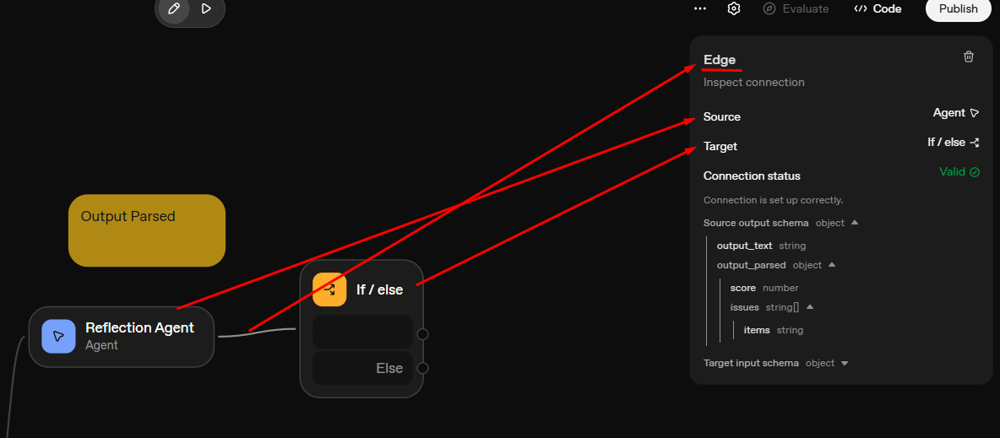
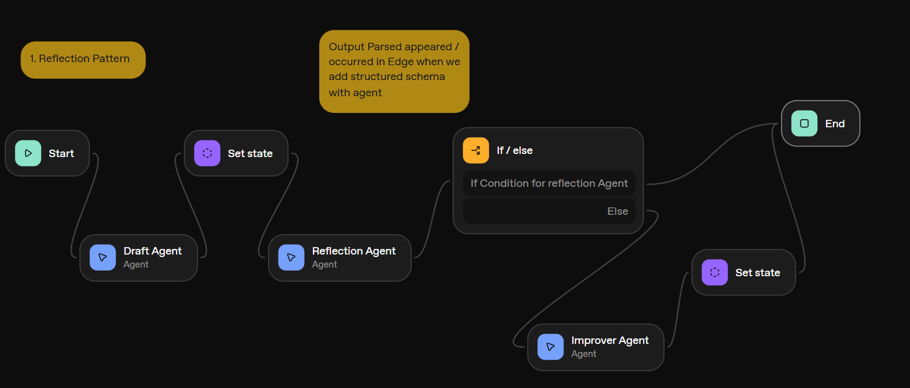
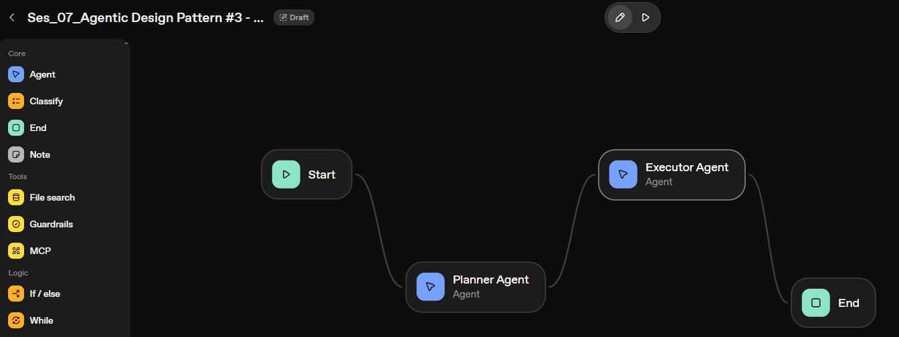

# **✅ Session 07: Implement [Agentic Design Patterns](https://github.com/panaversity/learn-agentic-ai-from-low-code-to-code/tree/main/06_agentic_design_patterns) with OpenAI AgentKit Agent Builder | AI-100 (05/11/2025)**

**The 4 Core Agentic Patterns We'll Learn**
1. **Reflection Pattern** - Agent reviews its own work
2. **Tool Use Pattern** - Agent decides which tools to use
3. **Planning Pattern** - Agent breaks down complex tasks
4. **Multi-Agent Pattern** - Agents collaborate via handoffs

## 1. Agentic Design Pattern #1 - Reflection

**What is Reflection?**
Reflection is when an agent generates a response, then reviews it, and improves it if needed. It's like having a quality control step built into your agent.

**The Process:**
* Agent drafts a response
* Agent reviews the response: "Is this accurate? Complete? Polite?"
* If good → Send to user
* If needs work → Agent improves it

Example Use Case: **[Essay Generator](https://github.com/panaversity/learn-agentic-ai-from-low-code-to-code/blob/main/06_agentic_design_patterns/01_reflection_pattern/readme.md)**

**Output Parsed**
When we click on Edge between reflection schema and if/else block, it will show source output schema in which we have output parsed, output parsed appeared or occurred when we set/attached output schema with our agent

---

---

---

## 2.  Agentic Design Pattern #2 - Tool Use
**What is Tool Use?**
**Tool Use** is when an agent intelligently decides which tools to use based on the user's needs. Instead of hardcoding which tool to use, the agent makes smart choices.

**The Process:**

1. User asks a question
2. Agent analyzes: "What do I need to answer this?"
3. Agent chooses appropriate tools
4. Agent uses tools to gather information
5. Agent synthesizes the results

Example Use Case: **[Personal Assistant](https://github.com/panaversity/learn-agentic-ai-from-low-code-to-code/blob/main/06_agentic_design_patterns/02_tool_use_pattern/readme.md)**

## 3. Agentic Design Pattern #3 - Planning

**What is Planning?**
Planning is when one agent creates a strategic plan by breaking down a complex task into actionable steps, and another agent executes that plan systematically. This pattern separates strategic thinking from execution.

**The Process:**

1. Planner agent receives complex request
2. Planner agent analyzes the task and creates a structured plan with clear steps
3. Executor agent receives the plan
4. Executor agent follows each step systematically
5. Final output reflects completion of all planned steps

Example Use Case: **[Research Report Generator](https://github.com/panaversity/learn-agentic-ai-from-low-code-to-code/blob/main/06_agentic_design_patterns/03_planning_pattern/readme.md)**

---

## 4. Agentic Design Pattern #4 - Multi-Agent

**What is Multi-Agent?**
Multi-Agent systems use multiple specialized agents working together. Each agent has specific expertise and they hand off work to each other based on need.

**The Process:**

1. Router agent analyzes the request
2. Router determines which specialist is needed
3. Request is handed off to specialist
4. Specialist uses their expertise and tools
5. If specialist can't solve it, escalate to human

Example Use Case: **[Task Planning Assistant](https://github.com/panaversity/learn-agentic-ai-from-low-code-to-code/blob/main/06_agentic_design_patterns/04_multi_agent_pattern/readme.md)**

---

## Agentic Pattern Reference Guide  

### Quick Reference: When to Use Each Pattern

| Pattern | When to Use | Key Benefit |
|---------|-------------|-------------|
| Reflection | Quality matters, high stakes | Catches errors before user sees |
| Tool Use | Multiple data sources available | Agent chooses right tool intelligently |
| Planning | Multi-step complex tasks | Breaks down into manageable steps |
| Multi-Agent | Different types of expertise needed | Specialists handle their domain |

### Combining Patterns

**Reflection + Tool Use:**
- Agent picks appropriate tool
- Agent uses tool to gather information
- Agent reflects on the result
- Agent improves if needed

**Multi-Agent + Reflection:**
- Router determines specialist
- Specialist uses tools
- Specialist reflects on response
- Specialist improves if needed

**Planning + Tool Use:**
- Agent creates plan
- Each step chooses appropriate tools
- Agent monitors progress
- Agent adjusts plan based on results

**All 4 Patterns:**
- Complex production system
- Router determines specialist
- Specialist delegates complex tasks
- Specialist plans approach
- Specialist uses tools
- Specialist reflects on results
- Human approval for high-stakes decisions

---

## Lab: Custom Support System Using All 4 Agentic Patterns
* [Customer Support Agent](https://github.com/panaversity/learn-agentic-ai-from-low-code-to-code/blob/main/06_agentic_design_patterns/lab_agentic_system.md)
