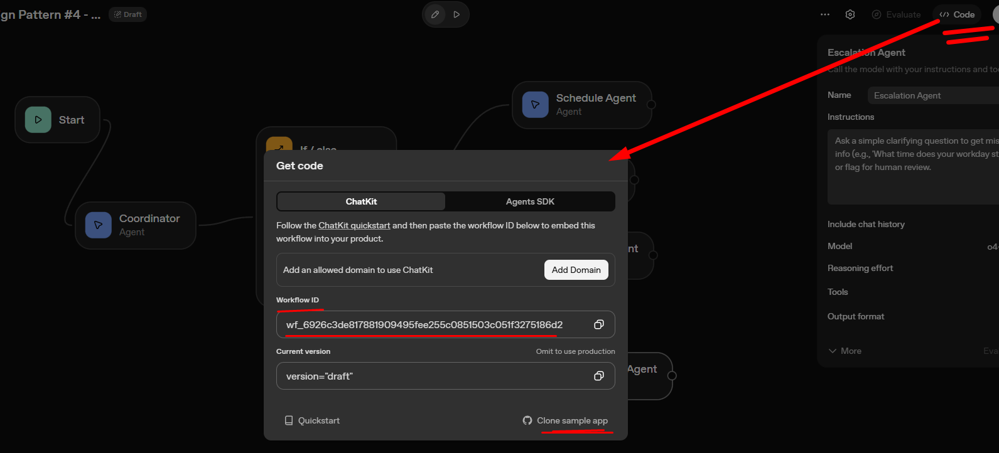
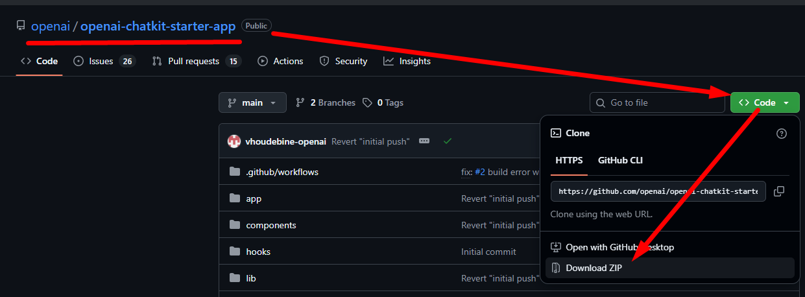
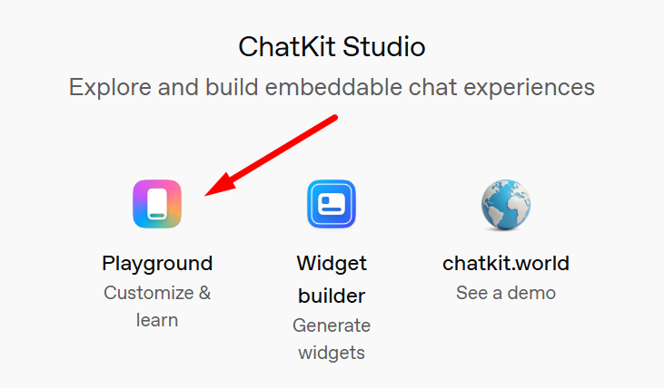

# Session 08- AgentBuilder Deployment and Chatkit UI with OpenAI AgentKit Agent Builder | AI-100 (06/11/2025)

Check **[ChatKit Deployment](https://github.com/panaversity/learn-agentic-ai-from-low-code-to-code/tree/main/07_deploy_chatkit)** for Official Repo, read `readme.md` file for details till deployment.

**Procedure:**
1. Go to Code in your AgentKit and copy **`Workflow ID`** and it for future use



2. In same Get Code window (above picture) when you click on Clone Sample App, you will redirected to Github Repo of Chatkit Starter App Repo link is [openai-chatkit-starter-app](https://github.com/openai/openai-chatkit-starter-app)
    * Click on code within Repo then click on **Download ZIP** to download the file
    
    * After downloading **Extract** these file and **Rename** it respect to your agent name
    * Install npm in it, command `npm install`
    * Make **`.env`** file in the project directory, although `.env.example` file already present there, you can remove it
    * You have to add `OPENAI_API_KEY` and `NEXT_PUBLIC_CHATKIT_WORKFLOW_ID` in it.
    * Below is the complete configuration of Chatkit UI project
    ```bash
    chatkit-starter-app/
    ├── app/
    │   ├── api/
    │   │   └── create-session/      # Backend endpoint for sessions
    │   │       └── route.ts
    │   ├── layout.tsx               # Main layout
    │   └── page.tsx                 # Main page
    │
    ├── components/
    │   └── ChatKitPanel.tsx          # The ChatKit component
    │
    ├── lib/
    │   └── config.ts                # Configuration
    │
    ├── public/                       # Images, assets
    │
    ├── .env.example                  # Template for environment variables
    ├── package.json                  # Dependencies
    ├── tsconfig.json                 # TypeScript config
    └── next.config.ts                # Next.js config
    ```
    * To design interface, we have to go Chatkit Studio [Chat Studio](https://chatkit.studio/)
    * In order to customize and learn go to **Playground** option in Chat Studio
    ---
    


