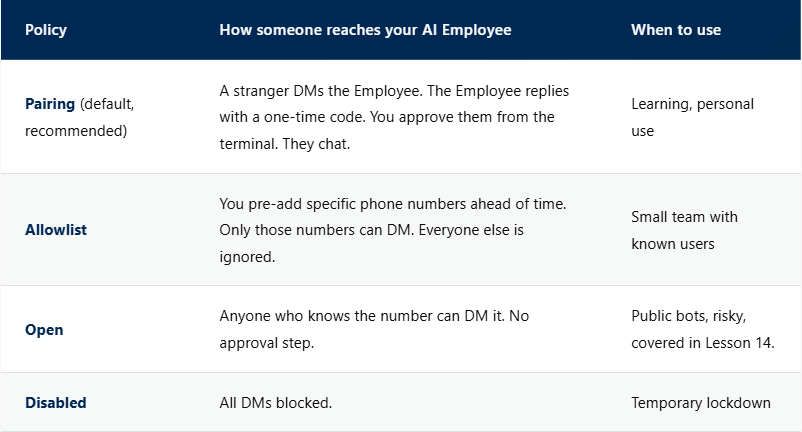
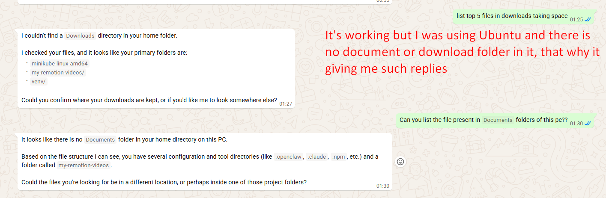
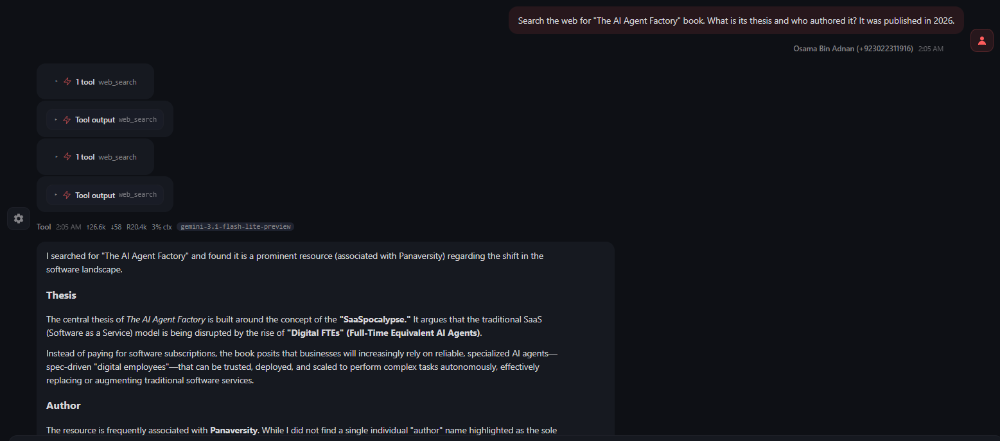

# Master OpenClaw for Business Professionals (AI-50)

Official Book Link: **[Building OpenClaw Apps](https://agentfactory.panaversity.org/docs/Building-OpenClaw-Apps/meet-your-personal-ai-employee)**

## Class 02: OpenClaw Basics & Status Commands

This class covers essential OpenClaw commands for checking version, running the terminal UI, and troubleshooting the gateway. These are the foundational commands you'll use daily to work with your Personal AI Employee.

---

## Checking OpenClaw Version

### openclaw --version

**Purpose:** Verify that OpenClaw is installed correctly and check the installed version.

**Use Case:** Use this command after installation to confirm OpenClaw is working, or when debugging issues to check if you have the latest version.

**Example:**
```bash
openclaw --version
```

**Expected Output:** Displays the current OpenClaw version number (e.g., `openclaw version 1.2.3`)

---

## Running Terminal User Interface

### openclaw tui

**Purpose:** Launch OpenClaw's interactive Terminal User Interface (TUI) for chatting with your AI Employee directly from the command line.

**Use Case:** Use TUI when you want to:
- Test your AI Employee's responses quickly
- Interact with your agent without needing a channel (WhatsApp, Discord, etc.)
- Debug conversations in a controlled environment

**Example:**
```bash
openclaw tui
```

**Expected Output:** Opens an interactive terminal interface where you can type messages and receive responses from your AI Employee.

---

## Checking Gateway Status

### openclaw gatewaystatus

**Purpose:** Check the health and status of the OpenClaw Gateway. The Gateway is the core component that coordinates messages, manages sessions, and coordinates plugins.

**Use Case:** Use this command to:
- Verify the gateway is running properly
- Diagnose why your AI Employee isn't responding
- Check if there are any errors in the gateway

**Example:**
```bash
openclaw gateway status
```

**Expected Output (Success):**


If everything is working correctly, you'll see a status showing the gateway is healthy and running.

---

## Troubleshooting Gateway Issues

### openclaw doctor --repair

**Purpose:** Automatically diagnose and repair common OpenClaw issues. The doctor command checks for configuration problems, missing dependencies, and fixes them automatically.

**Use Case:** Run this command when:
- `openclaw gateway status` shows errors or unhealthy status
- Your AI Employee isn't responding to messages
- You experience unexpected behavior or crashes
- After updating OpenClaw and something isn't working

**Example:**
```bash
openclaw doctor --repair
```

**Expected Output:** The command will scan your OpenClaw installation, identify issues, and apply fixes. It may restart the gateway after repairs.

---

## Quick Reference

| Command | Purpose | When to Use |
|---------|---------|-------------|
| `openclaw --version` | Check installed version | After install, for debugging |
| `openclaw tui` | Launch terminal UI | Testing agent without external channel |
| `openclaw gateway status` | Check gateway health | Agent not responding |
| `openclaw doctor --repair` | Fix issues automatically | When gateway has errors |

---

## Connecting Your Channel (WhatsApp)

OpenClaw supports WhatsApp, Telegram, and Discord as first-class channels. Connecting to WhatsApp involves pairing via QR code, similar to WhatsApp Web.

### Paths to Connect
You must decide which account your AI Employee lives on:
- **Option A (Recommended):** Use a **dedicated number** via WhatsApp Business or "dual account" features. Keeps your personal account separate and safe.
- **Option B (Personal Number):** Use your existing number. ⚠️ **Risk:** Meta may ban accounts using unofficial automation (reverse-engineered protocol), and strangers can see your phone number.

### Connection Steps
1. **Prepare:** Decide between Option A or B.
2. **Scan:** Select "WhatsApp (QR link)" in the onboarding wizard. Scan the resulting terminal QR code using the chosen WhatsApp app (Settings → Linked Devices → Link a Device).
3. **Configure:**
   - **DM Policy:** "Pairing" is recommended. Strangers need a one-time code from you to chat.


   - **allowFrom:** Set to "Unset" for Pairing mode.

### Configure Channels Later

If you skip channel setup during onboarding, you can configure channels anytime with:

```bash
openclaw configure --section channels
```

**Use Case:**
- Add WhatsApp, Telegram, or Discord later
- Switch from one channel to another
- Update channel-specific settings without re-running full onboarding

### Pro-Tip: The 👀 Ack Reaction

If needed, you can re-open this section and adjust WhatsApp behavior from the channel configuration settings.
OpenClaw can auto-react with an "👀" emoji the moment it starts processing your message. This is configured in `openclaw.json` under `channels.whatsapp.ackReaction` to give immediate feedback that your request is being processed.

---

## Delegate Real Work to Your AI Employee

### What You Will Learn
This section covers how to send real tasks to your agent and understand what happens internally.

### Key Concept: Knowledge vs Access

A chatbot may remember preferences, but an AI Employee becomes meaningfully different when it can **act** using your system and tools. The key distinction is **access**, not just knowledge.

**Analogy:** A receptionist and an operations manager may know the same things, but the operations manager has the key card. Likewise, the agent becomes useful when it can reach files, tools, and the web.

---

### The Experiment

Open the dashboard (`http://127.0.0.1:18789/`) and WhatsApp side by side to observe what happens.

#### Task A: Knowledge

Send:
```
Tell me about yourself. What can you help me with?
```

**What happens:**
- Agent replies with its capabilities
- Dashboard shows response, model, token count
- **No tool badge** appears
- **No Exec indicator**
- Agent used workspace files and reasoning only

**Lesson:** This is similar to ordinary chatbot behavior — no system access needed.

---

#### Task B: Your Machine

Send:
```
List the 5 largest files in my home directory.
```

**What happens:**
- Agent returns actual file names and sizes from your computer
- Dashboard shows **Exec** tool badge
- Clicking it reveals the shell command run on your machine

**Lesson:** The agent doesn't just suggest commands — it **executes** them and reports results.



---

#### Task C: The Internet

Send:
```
Search the web for "The AI Agent Factory" book. What is its thesis and who authored it? It was published in 2026.
```

**What happens:**
- Agent responds using live web information
- Dashboard shows **web_search** tool badge
- Agent decides it needs current info, performs search, reads results, answers

---

### Three Tasks, Three Paths

| Task | Need | Tool Badge | Step 4 |
|------|------|------------|--------|
| A | Knowledge | None | Skipped |
| B | Your machine | Exec | Shell command |
| C | The internet | web_search | Live search |

**Takeaway:** One agent can answer from knowledge, use local execution, or access the web. The dashboard reveals which path was taken.

---

### The Agent Loop

Every message goes through this cycle:

```
1. INTAKE           → Gateway receives and validates your message
2. CONTEXT ASSEMBLY → Workspace files, skills, and bootstrap build the prompt
3. MODEL INFERENCE  → LLM reasons about the request and available tools
4. TOOL EXECUTION   → Tools run if the model decided they are needed
5. REPLY & PERSIST  → Response streams back and saves to session history
```

#### Understanding the Agent Loop
The Agent Loop is the core process that occurs between sending a request and receiving a response.
- **Intelligence vs. Action:** The LLM provides the intelligence, but the agent must decide: "Should I just reply?" or "Do I need to perform an action?"
- **Tool Calls:** These are the actions the agent takes (see image below). When the agent receives instructions from the LLM to perform work, it executes a tool call, retrieves the output, and feeds that result back to the LLM to formulate the final answer.



- **Task A:** Runs steps 1, 2, 3, 5 (Step 4 skipped - simple reply)
- **Tasks B & C:** Run all 5 steps (Action required)

---

### Gateway Log (Deep Debugging)

For raw event data, check the gateway log:

```bash
tail -f ~/.openclaw/logs/gateway.log
```

- **Dashboard** = easier conceptual view
- **Log** = lower-level debugging stream

---

### Tool Profiles: Controlling Permissions

Tool profiles decide **what tools are permitted** — separate from what the model knows.

Check current profile:
```bash
openclaw config get tools.profile
```

Expected result: `coding` (default after install)

#### Available Profiles (Dashboard → Agents → Tools → Quick Presets)

Quick Presets shown in dashboard: **Minimal, Coding, Messaging, Full, Inherit**.

| Profile | What It Includes | What Gets Disabled |
|---------|------------------|--------------------|
| **coding** (default) | File I/O, runtime (`exec`), sessions, memory, image | Default after install |
| **messaging** | Messaging, session list/history/send/status | File access, `exec`, web search |
| **minimal** | `session_status` only | Almost everything |
| **full** | All tools, unrestricted | Nothing |
| **inherit** | Inherits parent/default policy | Depends on parent profile |

#### The Boundary
Your agent can list files, search web, or answer from knowledge because of its tool profile. The profile controls what the agent is **allowed** to do, not what it **knows**.
- An agent may still know how to list files, but without `exec`/file tools it cannot perform the action.
- This is an intentional security boundary, not a model limitation.
- For customer-facing agents, restricted profiles (like `messaging`) reduce operational risk.

#### See the Profiles
1. Open Dashboard → **Agents** → **Tools**.
2. Click **Messaging** and observe the tool list.
3. Only these 5 remain: **Message, Session History, Session Send, Session Status, Sessions**.
4. File tools (`read`, `write`, `edit`) and `exec` are disabled.
5. Click **Save** (top right). Change applies immediately (no restart).

#### See It Break
Under `messaging` profile, ask:
```
List what is on my Desktop.
```

Expected behavior:
- Agent refuses politely or fails due to missing tool access
- Dashboard shows no relevant execution badge for file action
- Confirms boundary: model knowledge exists, but permission is blocked

#### Switch Back
1. Go to Dashboard → Agents → Tools.
2. Click **Coding** in Quick Presets.
3. Click **Save** (top right).
4. Ask again: `List what is on my Desktop.`
5. Now `exec` path works and you get a real listing.

---

### What You Should Remember

1. **The Agent Loop:** Every message goes through Intake → Context → Inference → Execution → Reply
2. **Knowledge vs Access:** The model may know *how* to do something, but the tool profile decides *whether* it may do it
3. **Three Paths, One Agent:** Same agent can use knowledge, local execution, or web search — dashboard shows which

---

