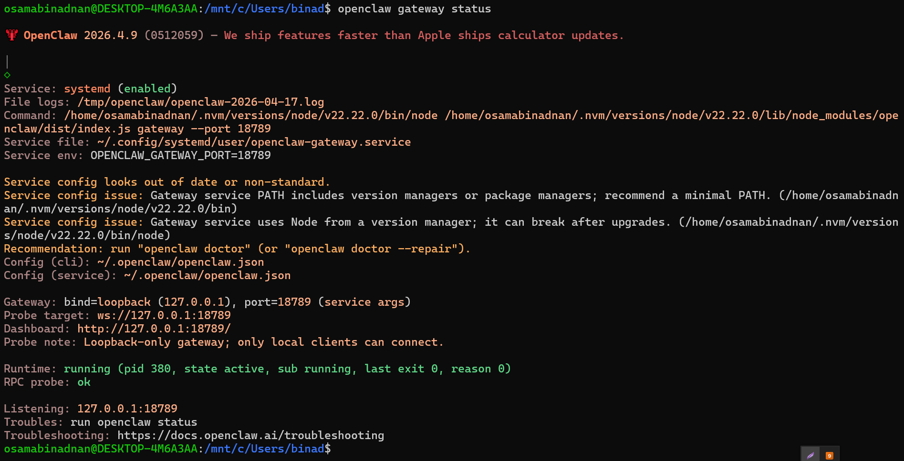

# Master OpenClaw for Business Professionals (AI-50)

Official Book Link: **[Building OpenClaw Apps](https://agentfactory.panaversity.org/docs/Building-OpenClaw-Apps/meet-your-personal-ai-employee)**

## Class 02:

- To check version of openClaw:

```bash
openclaw --version
```

- To run openClaw terminal user interface:

```bash
openclaw tui
```

- To check the status of openClaw or if any error occurred:

```bash
openclaw gatewaystatus
```
If everything is fine, it will show below status:



---

- If any error coming in gatewaystatus, then run below command to fix it:

```bash
openclaw doctor --repair
```