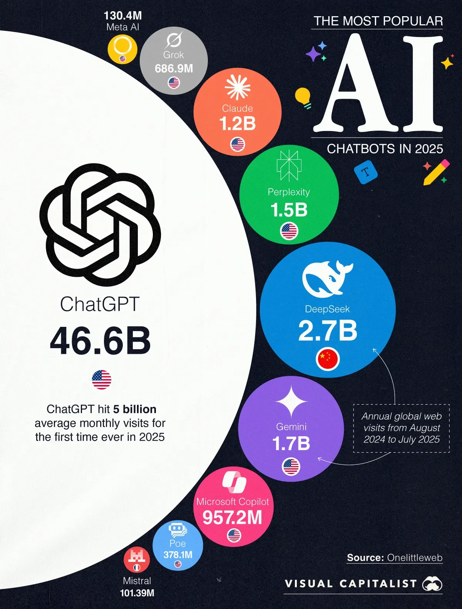

# **Prompt and Context Engineering**

## **Class 01: Prompt and Context Engineering Introduction**

- **Prompt engineering:** craft the exact instruction (the prompt) you give an LLM so it returns the output you want.
- **Context engineering:** design and manage the surrounding information (examples, system messages, memory, tool outputs, documents) that the model uses when it runs.

---


---
* **Key Takeaways**
    - With 46.59B visits, ChatGPT accounts for more than 83% of total traffic among the top 10 chatbots.
    - The second most-used chatbot, DeepSeek at 2.74B visits, has barely 6% of ChatGPT’s traffic.
    - While traffic is concentrated, the list includes a mix of U.S., Chinese, and European players.

* When we are doing prompt engineering, we will try our prompt on 4 places
    - ChatGPT (To make report after search from web, Sir use it)
    - Gemini (context window is short in free tier)
    - Claude (expensive but best, Sir Zia used it for coding, tutorial)
    - Grok (Sir used Grok for authenticate and creditable infor)

### **Which is the best LLM?**
See how leading models stack up across text, image, vision, and beyond. This page gives you a snapshot of each Arena:
[Imarena](https://lmarena.ai/leaderboard)

### **Understand the Power of Prompts: Context Engineering for Agentic AI Developers, Image and Video Generation, UX/UI Design and UI Development**

To understand the power of LLMs and prompt engineering go through these tutorials:

* **[Complete Guide to Context Engineering for AI Agents](https://github.com/panaversity/learn-n8n-agentic-ai/blob/main/00_prompt_engineering/context_engineering_tutorial.md)**
* **[Nano Banana Tutorial](https://github.com/panaversity/learn-low-code-agentic-ai/blob/main/00_prompt_engineering/image_generation/readme.md)**
* **[Google's Veo 3: A Guide With Practical Examples](https://github.com/panaversity/learn-low-code-agentic-ai/blob/main/00_prompt_engineering/video_generation/readme.md)**
* **[UX Design by Prompting](https://github.com/panaversity/learn-low-code-agentic-ai/tree/main/00_prompt_engineering/ux_design)**
* **[UI Development by Prompting](https://github.com/panaversity/learn-low-code-agentic-ai/tree/main/00_prompt_engineering/ui_development)**

* **[Google's Veo 3: Official Website](https://labs.google/flow/about)**, sign in to proceed
* **[Text to UI/UX design](https://uxpilot.ai)**, sign in to proceed
* **[Text to Frontend](https://lovable.dev)**, sign in to proceed

- In Prompt engineering, you need to upgrade your English writting skills because prompt engineering is a iterative process.

### **Use these Prompt Engineering Tools to Learn (Playgrounds)**
* https://platform.openai.com/chat/ (ChatGPT, https://chat.com is another URL)
* https://aistudio.google.com/ (Gemini)
* https://console.anthropic.com/ (Claude)

### **Prompt Coach**
Here’s a reusable “Prompt Coach” prompt you can keep handy. You’ll paste this into ChatGPT (or any LLM), then just drop in your messy idea, and it will rewrite it into a polished, effective prompt for you:

Copy Paste this in your LLM:
```bash
You are my Prompt Coach. I will give you a rough or unclear prompt. 
Your task is to:
1. Clarify it
2. Add missing context
3. Structure it for best results
4. Suggest 2–3 alternative versions (different styles: simple, detailed, structured)

Here’s my rough prompt: [INSERT YOUR PROMPT HERE]
```
### **What is Prompt Engineering?**
Prompt engineering is the art and science of crafting instructions that guide AI language models to produce desired outputs. Think of it as learning to communicate effectively with AI systems to achieve specific goals.

**Why is it important?**

* You don't need to be a programmer to use AI effectively
* Good prompts can dramatically improve AI performance
* It's an iterative skill that improves with practice
* It's becoming essential for productivity in many fields

#### **Prompt engineering vs. context engineering**
- **Prompt engineering** = crafting the *instruction* you give the model.
- **Context engineering** = curating the *information* the model can see when following that instruction.

#### **Quick contrast**

| Aspect          | Prompt engineering                                                       | Context engineering                                                                      |
| --------------- | ------------------------------------------------------------------------ | ---------------------------------------------------------------------------------------- |
| Goal            | Tell the model *how* to behave and *what* to produce                     | Give the model the *facts/examples* it should rely on                                    |
| Levers          | Wording, structure, roles, constraints, output schema, few-shot examples | Retrieval (RAG), documents, knowledge bases, tools/APIs, memory, state across turns      |
| Typical changes | “Be concise. Return valid JSON with fields X/Y/Z.”                       | “Attach the company glossary, latest policy PDF, and retrieved passages for this query.” |
| Failure mode    | Vague instructions → messy/incorrect format                              | Missing/irrelevant info → hallucinations/outdated answers                                |
| Ownership       | UX/prompt designers, app devs                                            | Data/ML/platform teams (pipelines, indexing, chunking, evals)                            |

#### **How they work together**

* Start with a **good prompt**: clear task, constraints, and an **output contract** (e.g., JSON schema).
* Then **ground it with context**: supply only the *most relevant* passages, tables, and tool results.
* The prompt guides *behavior*; the context supplies *knowledge*. You usually need both.

#### **Concrete examples**

1. **Invoice → JSON extractor**

* *Prompt engineering*: “Extract fields {vendor, date, total}. Return JSON only. If a field is missing, use null.”
* *Context engineering*: Provide a few labeled examples and attach the vendor’s invoice spec retrieved via embeddings.

2. **Policy Q\&A bot**

* *Prompt engineering*: “Answer using the attached passages; if unsure, say ‘Not in policy.’ Cite section IDs.”
* *Context engineering*: RAG over your policy repo (chunking, metadata filters like `department=HR`, freshness boosts), plus a recency cache for updates.

3. **Agentic workflow**

* *Prompt engineering*: Tool-use instructions and function signatures.
* *Context engineering*: Feed tool responses (DB rows, API payloads) back into the context window each step; maintain short-term memory/state.

#### **Practical tips**

* Keep prompts **short, specific, and testable**; define output schemas.
* Prefer **few-shot** examples only when they generalize; otherwise move them into **retrieval**.
* For context: optimize **chunking**, **ranking**, **deduping**, and **token budgets**; log what was retrieved for each answer.
* Add **citations** and “answer only from context” instructions when correctness matters.
* Evaluate both layers separately: prompt A/B tests and retrieval quality (precision/recall, groundedness).

**One-liner:** Prompt engineering is *how you ask*; context engineering is *what you show*. Combine them for reliable, scalable LLM apps.

### Understanding Large Language Models

#### How LLMs Work (The Basics)

Large Language Models are prediction engines that:
- Take text input (your prompt)
- Predict the next most likely word/token
- Continue this process to generate complete responses
- Base predictions on patterns learned from training data

#### Key Concept: Autocompletion
LLMs don't "understand" in the human sense—they're sophisticated autocomplete systems. Your prompt sets up the context for what should come next.

### Essential Configuration Settings

Before diving into prompt techniques, understand these key parameters that control AI behavior:

#### Temperature (0-1)
- **Low (0-0.3)**: Focused, consistent, deterministic responses
- **Medium (0.4-0.7)**: Balanced creativity and consistency
- **High (0.8-1.0)**: Creative, diverse, but potentially unpredictable

**When to use:**
- Temperature 0: Math problems, factual questions
- Temperature 0.7: Creative writing, brainstorming
- Temperature 0.9: Poetry, experimental content

#### Output Length/Token Limits
- Controls maximum response length
- Higher limits = more computational cost
- Set appropriately for your task needs

#### Top-K and Top-P (Nucleus Sampling)
- **Top-K**: Limits choices to top K most likely tokens
- **Top-P**: Limits choices based on cumulative probability
- Work together with temperature to control randomness

**Recommended starting points:**
- Conservative: Temperature 0.1, Top-P 0.9, Top-K 20
- Balanced: Temperature 0.2, Top-P 0.95, Top-K 30
- Creative: Temperature 0.9, Top-P 0.99, Top-K 40

## **Class 02: Prompt and Context Engineering Introduction (Cont.)**

`Action` => connect with `MCP Server` => `Multi Models` => `Text + Images + Videos`

### **Fundamental Prompting Techniques**

#### 1. Zero-Shot Prompting

The simplest approach—just ask directly without examples.

**Example:**
```
Classify this movie review as positive, negative, or neutral:
"The film was visually stunning but the plot felt rushed."
```

**When to use:**
- Simple, well-defined tasks
- When the model has clear knowledge of the domain
- Quick one-off requests

#### 2. One-Shot Prompting

Provide a single example to guide the response format.

**Example:**
```
Translate English to French:

English: "Hello, how are you?"
French: "Bonjour, comment allez-vous?"

English: "Where is the library?"
French:
```

#### 3. Few-Shot Prompting

Provide multiple examples to establish a clear pattern.

**Example:**
```
Convert customer feedback to structured data:

Feedback: "Great service, but food was cold"
JSON: {"service": "positive", "food": "negative", "overall": "mixed"}

Feedback: "Amazing experience, will definitely return"
JSON: {"service": "positive", "food": "positive", "overall": "positive"}

Feedback: "Terrible food and rude staff"
JSON:
```

**Best practices:**
- Use 3-5 examples for most tasks
- Include diverse examples
- Mix up the classes in classification tasks
- Ensure examples are high-quality and consistent

#### 4. System Prompting

Set overall context and behavior guidelines.

**Example:**
```
You are a helpful travel guide. Provide practical, accurate information about destinations. Always include:
- Key attractions
- Local customs to be aware of
- Budget considerations
- Best time to visit

User: Tell me about visiting Tokyo.
```

#### 5. Role Prompting

Assign a specific character or expertise to the AI.

**Example:**
```
Act as an experienced software architect. I need help designing a scalable web application for 1 million users. What architecture patterns should I consider?
```

**Effective roles:**
- Subject matter expert (doctor, lawyer, teacher)
- Creative roles (writer, designer, poet)
- Analytical roles (data analyst, consultant)
- Communication styles (friendly tutor, formal advisor)

#### 6. Contextual Prompting

Provide specific background information relevant to the task.

**Example:**
```
Context: You're writing for a tech blog aimed at beginners who have never coded before.

Write a 200-word explanation of what an API is, using simple language and practical examples.
```
https://youtu.be/9VmcEktv-vo?t=2220