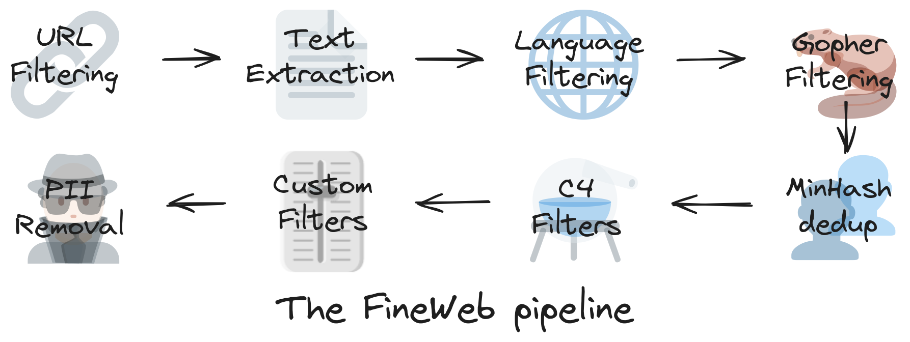
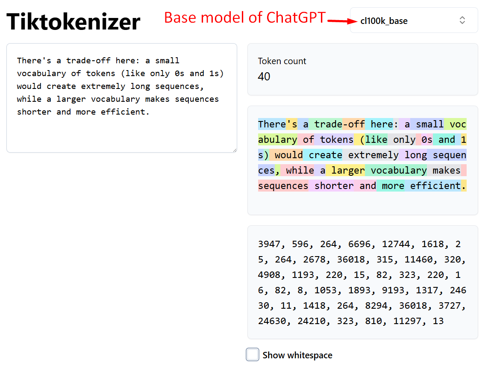

# **How AI Like ChatGPT is Built: A Step-by-Step Guide**

Link of [Deep Dive into LLMs like ChatGPT](https://www.youtube.com/watch?v=7xTGNNLPyMI) YouTube video

## **Introduction: The Magic Behind the Text Box**

You type a question into an AI chat window, press enter, and watch as a remarkably human-like response appears. But what are you talking to, exactly? What is happening behind that simple text box that allows a machine to write poetry, debug code, or explain quantum physics?

This article will demystify that magic. We will embark on a journey through the entire pipeline of how a large language model (LLM) is built, framing it as a three-stage process of learning from a textbook. We'll start with a raw "internet simulator" that has read all the background material, move to an expert imitator that has studied all the worked examples, and end with a genuine problem-solver that has learned how to think by doing the practice problems for itself.

--------------------------------------------------------------------------------

### **1. Stage 1: The Foundation — Pre-training a "Base Model"**

The first stage is like building a vast library and having an AI read every single book. This is the Exposition phase of our textbook analogy, where the model builds its core knowledge by absorbing the patterns, facts, and nuances of human language on a global scale. It is a massive, computationally expensive process that forms the foundation for everything to come.

#### **1.1. Step 1: Download and Process the Internet**

The journey begins by gathering an immense amount of text from publicly available sources. A major starting point is Common Crawl, an archive of billions of web pages. The goal of this data collection is threefold:

* **Huge Quantity:** The model needs to see trillions of words to learn the near-infinite statistical patterns of language. More data means more patterns. To ground this, the massive FineWeb dataset, containing 15 trillion tokens, is only about 44 terabytes—a size that could fit on a single modern hard drive.
* **High Quality:** Raw internet data is messy. It's aggressively filtered to remove spam, malware, and low-quality content, ensuring the model learns from well-written and informative text.
* **Large Diversity:** To be broadly knowledgeable, the model needs text from a wide variety of topics, including science, history, art, and everyday conversation.

This raw data is heavily processed to extract just the main text (removing ads and navigation bars), filter by language, and remove personally identifiable information (PII).

#### **1.2. Step 2: From Text to "Tokens"**

An AI doesn't see words or characters the way we do. Instead, it breaks text into small, manageable chunks called `tokens`. You can think of tokens as  **atoms of text.** This process of converting text into a sequence of token IDs is called **`tokenization`**.

There's a trade-off here: a small vocabulary of tokens (like only 0s and 1s) would create extremely long sequences, while a larger vocabulary makes sequences shorter and more efficient. Models like GPT-4 use a vocabulary of around 100,000 unique tokens, which can represent common words, parts of words, or characters.

- In tokenization, convert text into sequences of symbols `(token)`
- Start with stream of bytes (256 tokens)
- All tokens represent `text chunks`, they are all like atoms of these sequences and numbers are just unique IDs
- Run the `Byte Pair Encoding algorithm` (iteratively merge the most common token pair to mint new token)

Example: ~5000 text characters
* ~= 40,000 bits (with vocabulary size of 2 tokens: bits 0/1)
* ~= 5000 bytes (with vocabulary size of 256 tokens: bytes)
* ~= 1300 GPT-4 tokens (vocabulary size 100,277)

#### **1.3. Step 3: The Training Game — Predicting the Next Token (Neural Network Training)**

> In this step, we want to model the statistical relationships of how these tokens follow each other in the sequence, we take windows of token from data fairly randomly, window length can range anywhere between 0 to some maximum size of our chosen, for e.g., token window of 8000 tokens.

- Processing of long window sequences would be very computationally expenses.
- We pick small set of token, as you see in below picture, these four `tokens are context and they feed into neural network as input`.

- With a massive dataset of token sequences, the training can begin. The fundamental task during pre-training is incredibly simple:` predicting the next token in a sequence`.

    * **Input of Neural Network:** Sequences of tokens of variable length anywhere between 0 to maximum size (like 8000 tokens)
    * **Output of Neural Network:** Next token in the sequence, what's come next?

- As per above picture, our vocabulary has 100,277 possible tokens, the neural network output exactly that many numbers and all those numbers correspond to that many tokens (i.e., 100277 tokens) as coming next in the sequences, so it's making guesses about what comes next

- In the beginning, neural network is randomly initialized, so as the probabilities in the very beginning of the training are also going to be kind of random

    * probability of 19438 (" Direction"): `4%`
    * probability of 11799 " Case": `2%`
    * probability of 3962 " Post": `3%`

- Imagine the entire 15-trillion-token training set as a single, giant piece of text.. The model is shown a "window" of tokens (the context) and its only job is to guess the single token that comes next. The training process iteratively `"nudges" (a light touch or push.)` the model's billions of internal parameters—think of them as tiny adjustment knobs—so that its predictions get slightly better each time, aligning with the statistical patterns of language found on the internet.

- `We have mathematical process to make update in neural network like a way of tuning it`, so that correct answer has higher probability, so if I make update in neural network now, the next time i feed above particular sequence of four tokens in neural network, it will be slightly adjusted and change the probability depend. 
- This is the way of `nudging` of slightly updating the neural network to basically given the higher probability to the correct token that comes next in the sequence.

    * probability of 19438 (" Direction"): `2%`
    * probability of 11799 " Case": `1%`
    * probability of 3962 " Post": `4%`

- This process happens at the same time for all tokens in the entire dataset. In practice we sample little windows, little batches of windows and then every single one of these tokens.
- We want to adjust our neural network so that the probability of that token become slightly higher and this all happens in parallel in large batches of tokens. This is the process of training neural network, its a sequence of updating it so that it predictions match up the statistics of what actually happens in your training set. Its probabilities become consistent with our statistical pattern of how these tokens follow each other in a data.

    ##### **Neural Network Internals**
    ---
    

    ---

    - `Input sequence` mixed with `giant mathematical expression` together with `parameters or weights` of neural network
    - Modern neural network has billion of parameters and in the beginning they are randomly set
    - Because parameters are randomly set, you can expect this neural network will make random predictions and it does
    - Iteratively updating the network (training a neural network), the setting of parameter get adjusted such that the output of neural network becomes consistent with the pattern seen in our training set.
    - Training of neural network means `discovering a setting of parameters` that seems to be consistent with the statistics of the training set.
    - Neural Network Architecture Reasearch is a subject to design effective mathematical expression having convenient characteristics.
    - [Neural Network 3d Visualization](https://bbycroft.net/llm)

1.4. The Result: An "Internet Document Simulator"

After months of training and millions of dollars in computational cost, the result is a base model. This is not yet a helpful assistant. It is an "internet document simulator" or a "glorified autocomplete." It holds an immense amount of knowledge compressed into its parameters—like a "lossy zip file of the internet"—but it doesn't understand instructions. It can complete text, but it doesn't know how to answer questions.

This knowledgeable but unhelpful base model is the raw material for the next stage, where it will learn how to be a useful assistant by studying worked examples.

--------------------------------------------------------------------------------

2. Stage 2: Creating a Conversationalist — Supervised Fine-Tuning (SFT)

This stage transforms the raw base model into an AI that can follow instructions and hold a conversation. This is the Worked Examples section of our textbook. Here, the model learns to imitate an expert. This process is computationally much cheaper and faster, often taking hours or days instead of months.

2.1. The Goal: A New Dataset for a New Skill

To teach the model how to act like an assistant, we swap the massive internet dataset for a new, much smaller, and highly curated dataset composed entirely of high-quality conversations.

This is a critical point: the training algorithm is the exact same (predicting the next token), but changing the data fundamentally changes the model's behavior. Instead of learning to complete internet pages, it now learns to complete conversations in the style of a helpful assistant.

2.2. Who Writes the "Ideal" Responses?

This conversational dataset is created by human labelers. These aren't just random people; they are often skilled experts in their domain (e.g., programmers for coding tasks, writers for creative tasks). They are given specific instructions—for example, to write responses that are "helpful, truthful, and harmless"—and are tasked with writing ideal assistant responses to a wide variety of prompts.

When you interact with a model like ChatGPT, you are, in a sense, interacting with a statistical simulation of these people.

"it's almost as if you're asking a human labeler and imagine that the answer that is given to you is some kind of a simulation of a human labeler."

Now that the model can imitate a helpful human, the next stage teaches it how to discover solutions and "think" for itself by solving practice problems.

--------------------------------------------------------------------------------

3. Stage 3: Teaching the AI to "Think" — Reinforcement Learning (RL)

This final stage elevates the model from an expert imitator to a genuine problem-solver. This is where it does the Practice Problems at the end of the chapter. It's not just imitating a solution anymore; it's discovering for itself how to arrive at the correct answer.

3.1. RL in Action: Guess and Check for Verifiable Problems

Reinforcement learning works best for problems with clear, verifiable answers, like math or coding challenges. The process is a massive-scale version of "guess and check":

1. The model is given a single problem (e.g., a math question).
2. It generates many different potential solutions—sometimes thousands for one problem.
3. An automated system checks which of these solutions arrived at the correct final answer.
4. The model is then trained only on its own successful attempts.

This is a transformative step. Why not just have a human write the best solution? Because a human labeler cannot know the most efficient reasoning path for the AI's unique, alien cognition. What seems simple to us might be a huge leap for the model, and vice-versa. Through RL, the model must discover what works for itself, reinforcing the thought patterns that reliably lead to correct answers.

3.2. The Emergent Skill of "Thinking"

A remarkable outcome of RL is that models learn to create long, step-by-step reasoning paths, often called "Chains of Thought." This is an emergent property. No human explicitly teaches the model to do this.

Through reinforcement, the model discovers on its own that it achieves higher accuracy when it breaks a problem down, re-evaluates its steps, retraces its logic, backtracks from errors, and reframes the problem. This process mirrors a person's internal monologue when working through a difficult problem, and it is a strategy the AI learns for itself because it works.

Now that we understand how the model is built, we can better understand its unique behavior and how to interact with it effectively.

--------------------------------------------------------------------------------

4. Understanding Your AI Companion: Key "Psychological" Quirks

AI models don't think like humans. Their capabilities are not a solid block but more like Swiss cheese—incredibly powerful in most areas, but with seemingly random holes. Understanding their unique cognitive quirks can help you get better results and make sense of their occasional strange behavior.

4.1. The Truth About Hallucinations

Hallucinations—when an AI confidently states incorrect information—happen because the model is built to imitate the confident style of its training data. But how do you teach it to say "I don't know"?

The key insight is to connect the model's internal state to its verbal output. You can imagine that somewhere inside the network, a neuron lights up when the model is uncertain. However, by default, that neuron isn't wired to the words "I don't know." The model will simply make its best guess in a confident tone, just like its training examples.

To fix this, we explicitly create training examples where the correct answer is to admit uncertainty. This teaches the model to connect its internal state of "not knowing" to the token sequence for "I'm sorry, I don't have that information." This wiring is a crucial step in making the model more truthful.

4.2. Working Memory vs. Long-Term Memory

An LLM has two distinct types of knowledge. Understanding this is key to getting high-quality outputs.

Memory Type	Analogy	Description
Parameters	Vague, Long-Term Recollection	Knowledge learned during pre-training and stored in the model's weights. Like something you read a month ago; the details might be fuzzy.
Context Window	Active, Working Memory	The text currently in your conversation prompt. Information here is directly accessible, in-focus, and not a vague recollection.

Practical Takeaway: For the highest quality results on a specific topic, paste the relevant information directly into the prompt. This places it in the model's "working memory," allowing for far more accurate and detailed responses.

4.3. Why AIs Can Struggle with "Simple" Tasks

A core reason for many strange failures is simple: models need tokens to think.

Complex calculations cannot be done in a single computational leap. The reasoning must be spread out over many tokens. For example, if you ask a model "Emily buys 3 apples and 2 oranges..." and demand the answer in a single token, it might succeed. But if you make it "Emily buys 23 apples and 17 oranges..." with more complex numbers, it will likely fail. It needs the "space" of multiple tokens to write out the intermediate steps and arrive at the correct answer.

Because the model sees the world as these tokens, not as individual letters, it also struggles with tasks that are trivial for humans, like counting the characters in a word or accurately reversing a string. It doesn't have direct access to letters—only to the token representations it was trained on.

--------------------------------------------------------------------------------

5. Conclusion: From Internet Simulator to Thinking Partner

The journey to create an AI like ChatGPT is a methodical, three-stage process, much like learning from a textbook. It begins with pre-training, where a base model reads the "Exposition" of the internet to gain knowledge. It is then transformed through supervised fine-tuning, where it studies "Worked Examples" from human experts to become a helpful conversationalist. Finally, reinforcement learning allows it to do the "Practice Problems," discovering for itself how to reason and solve complex challenges.

These models are not magical beings. They are complex systems whose knowledge, personality, and unique cognitive abilities are shaped, step-by-step, by the data they train on. Understanding this process reveals not just how they work, but how we can work with them as increasingly powerful partners in thought.

**Links of this video**
* [ChatGPT](https://chatgpt.com/)
* [FineWeb (pretraining dataset)](https://huggingface.co/spaces/HuggingFaceFW/blogpost-fineweb-v1)
* [Tiktokenizer](https://tiktokenizer.vercel.app/)
* [Transformer Neural Net 3D visualizer](https://bbycroft.net/llm)
* [llm.c Let's Reproduce GPT-2](https://github.com/karpathy/llm.c/discussions/677)
* [Llama 3 paper from Meta](https://arxiv.org/abs/2407.21783)
* [Hyperbolic, for inference of base model](https://app.hyperbolic.xyz/)
* [InstructGPT paper on SFT](https://arxiv.org/abs/2203.02155)
* [HuggingFace inference playground](https://huggingface.co/spaces/huggingface/inference-playground)
* [DeepSeek-R1 paper](https://arxiv.org/abs/2501.12948)
* [TogetherAI Playground for open model inference](https://api.together.xyz/playground)
* [AlphaGo paper (PDF)](https://discovery.ucl.ac.uk/id/eprint/10045895/1/agz_unformatted_nature.pdf)
* [AlphaGo Move 37 video](https://www.youtube.com/watch?v=HT-UZkiOLv8)
* [LM Arena for model rankings](https://lmarena.ai/)
* [AI News Newsletter](https://buttondown.com/ainews)
* [LMStudio for local inference](https://lmstudio.ai/)