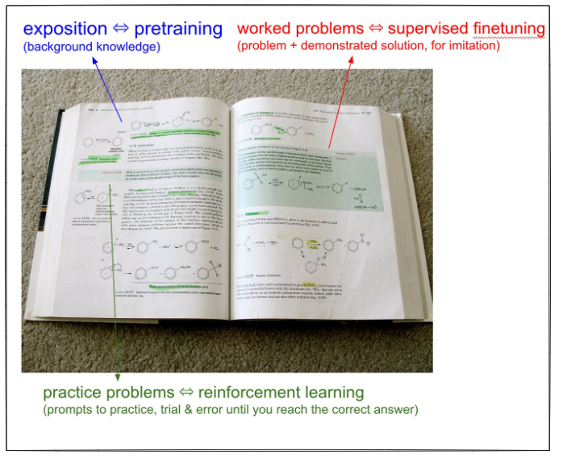
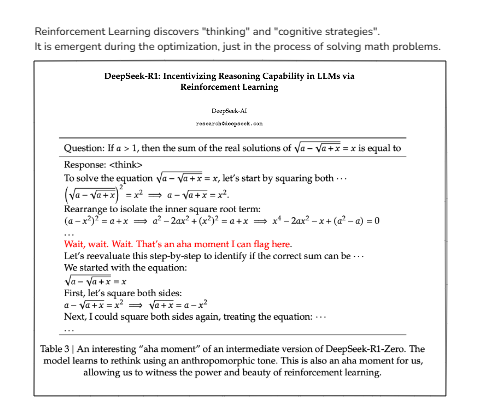
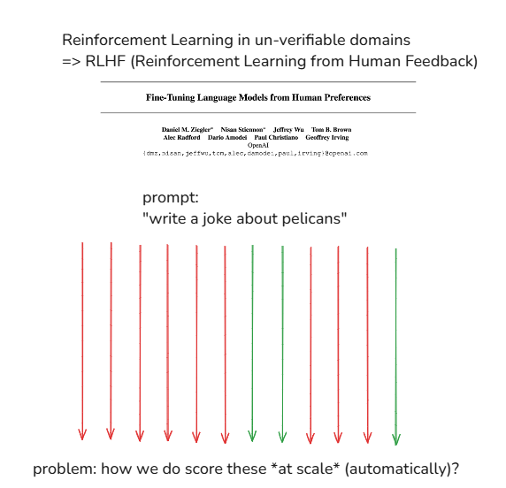
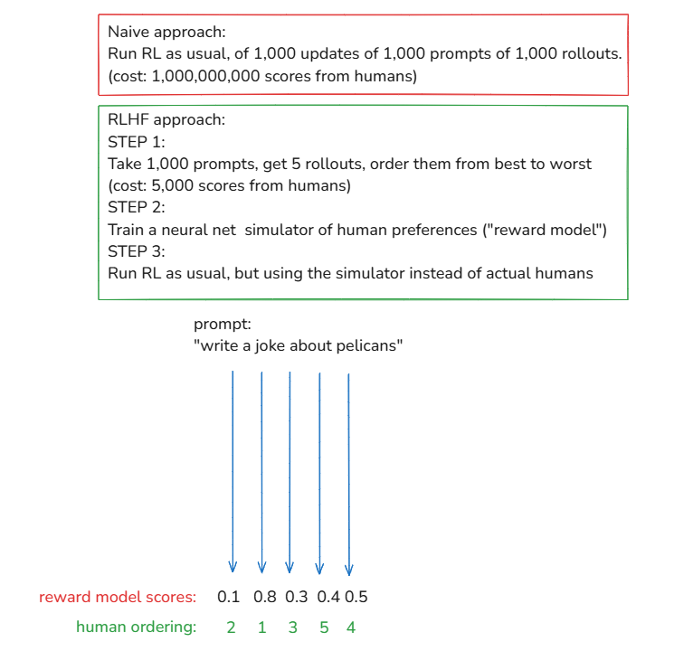
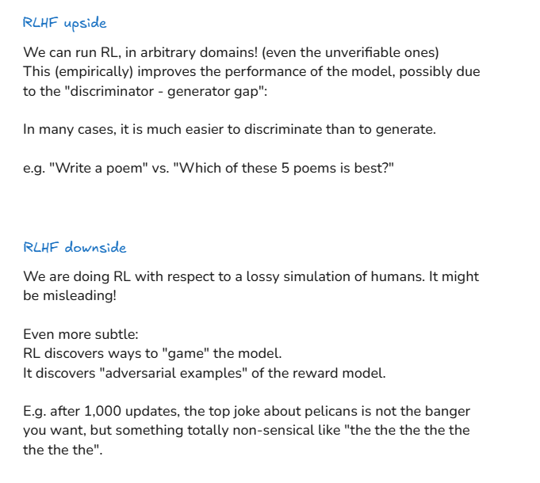
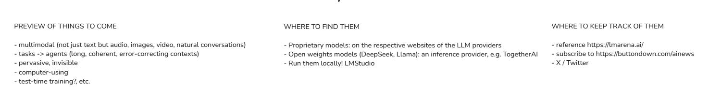

# **How AI Like ChatGPT is Built: A Step-by-Step Guide**

Link of [Deep Dive into LLMs like ChatGPT](https://www.youtube.com/watch?v=7xTGNNLPyMI) YouTube video

## **Introduction: The Magic Behind the Text Box**

You type a question into an AI chat window, press enter, and watch as a remarkably human-like response appears. But what are you talking to, exactly? What is happening behind that simple text box that allows a machine to write poetry, debug code, or explain quantum physics?

This article will demystify that magic. We will embark on a journey through the entire pipeline of how a large language model (LLM) is built, framing it as a three-stage process of learning from a textbook. We'll start with a raw "internet simulator" that has read all the background material, move to an expert imitator that has studied all the worked examples, and end with a genuine problem-solver that has learned how to think by doing the practice problems for itself.


--------------------------------------------------------------------------------


### **1. Stage 1: The Foundation — `Pre-training` a "Base Model"**

The first stage is like building a vast library and having an AI read every single book. This is the Exposition phase of our textbook analogy, where the model builds its core knowledge by absorbing the patterns, facts, and nuances of human language on a global scale. It is a massive, computationally expensive process that forms the foundation for everything to come.

#### **1.1. Step 1: Download and Process the Internet**

The journey begins by gathering an immense amount of text from publicly available sources. A major starting point is Common Crawl, an archive of billions of web pages. The goal of this data collection is threefold:

* **Huge Quantity:** The model needs to see trillions of words to learn the near-infinite statistical patterns of language. More data means more patterns. To ground this, the massive FineWeb dataset, containing 15 trillion tokens, is only about 44 terabytes—a size that could fit on a single modern hard drive.
* **High Quality:** Raw internet data is messy. It's aggressively filtered to remove spam, malware, and low-quality content, ensuring the model learns from well-written and informative text.
* **Large Diversity:** To be broadly knowledgeable, the model needs text from a wide variety of topics, including science, history, art, and everyday conversation.

This raw data is heavily processed to extract just the main text (removing ads and navigation bars), filter by language, and remove personally identifiable information (PII).

---


---
#### **1.2. Step 2: From Text to "Tokens"**

An AI doesn't see words or characters the way we do. Instead, it breaks text into small, manageable chunks called `tokens`. You can think of tokens as  **atoms of text.** This process of converting text into a sequence of token IDs is called **`tokenization`**.

There's a trade-off here: a small vocabulary of tokens (like only 0s and 1s) would create extremely long sequences, while a larger vocabulary makes sequences shorter and more efficient. Models like GPT-4 use a vocabulary of around 100,000 unique tokens, which can represent common words, parts of words, or characters.

- In tokenization, convert text into sequences of symbols `(token)`
- Start with stream of bytes (256 tokens)
- All tokens represent `text chunks`, they are all like atoms of these sequences and numbers are just unique IDs
- Run the `Byte Pair Encoding algorithm` (iteratively merge the most common token pair to mint new token)

Example: ~5000 text characters
* ~= 40,000 bits (with vocabulary size of 2 tokens: bits 0/1)
* ~= 5000 bytes (with vocabulary size of 256 tokens: bytes)
* ~= 1300 GPT-4 tokens (vocabulary size 100,277)
---


---
#### **1.3. Step 3: The Training Game — Predicting the Next Token (Neural Network Training)**

> In this step, we want to model the statistical relationships of how these tokens follow each other in the sequence, we take windows of token from data fairly randomly, window length can range anywhere between 0 to some maximum size of our chosen, for e.g., token window of 8000 tokens.

- Processing of long window sequences would be very computationally expenses.
- We pick small set of token, as you see in below picture, these four `tokens are context and they feed into neural network as input`.

---


---
- With a massive dataset of token sequences, the training can begin. The fundamental task during pre-training is incredibly simple:` predicting the next token in a sequence`.

    * **Input of Neural Network:** Sequences of tokens of variable length anywhere between 0 to maximum size (like 8000 tokens)
    * **Output of Neural Network:** Next token in the sequence, what's come next?

- As per above picture, our vocabulary has 100,277 possible tokens, the neural network output exactly that many numbers and all those numbers correspond to that many tokens (i.e., 100277 tokens) as coming next in the sequences, so it's making guesses about what comes next

- In the beginning, neural network is randomly initialized, so as the probabilities in the very beginning of the training are also going to be kind of random

    * probability of 19438 (" Direction"): `4%`
    * probability of 11799 " Case": `2%`
    * probability of 3962 " Post": `3%`

- Imagine the entire 15-trillion-token training set as a single, giant piece of text.. The model is shown a "window" of tokens (the context) and its only job is to guess the single token that comes next. The training process iteratively `"nudges" (a light touch or push.)` the model's billions of internal parameters—think of them as tiny adjustment knobs—so that its predictions get slightly better each time, aligning with the statistical patterns of language found on the internet.

- `We have mathematical process to make update in neural network like a way of tuning it`, so that correct answer has higher probability, so if I make update in neural network now, the next time i feed above particular sequence of four tokens in neural network, it will be slightly adjusted and change the probability depend. 
- This is the way of `nudging` of slightly updating the neural network to basically given the higher probability to the correct token that comes next in the sequence.

    * probability of 19438 (" Direction"): `2%`
    * probability of 11799 " Case": `1%`
    * probability of 3962 " Post": `4%`

- This process happens at the same time for all tokens in the entire dataset. In practice we sample little windows, little batches of windows and then every single one of these tokens.
- We want to adjust our neural network so that the probability of that token become slightly higher and this all happens in parallel in large batches of tokens. This is the process of training neural network, its a sequence of updating it so that it predictions match up the statistics of what actually happens in your training set. Its probabilities become consistent with our statistical pattern of how these tokens follow each other in a data.

    ##### **Neural Network Internals**
    ---
    

    ---

    - `Input sequence` mixed with `giant mathematical expression` together with `parameters or weights` of neural network
    - Modern neural network has billion of parameters and in the beginning they are randomly set
    - Because parameters are randomly set, you can expect this neural network will make random predictions and it does
    - Iteratively updating the network (training a neural network), the setting of parameter get adjusted such that the output of neural network becomes consistent with the pattern seen in our training set.
    - Training of neural network means `discovering a setting of parameters` that seems to be consistent with the statistics of the training set.
    - Neural Network Architecture Reasearch is a subject to design effective mathematical expression having convenient characteristics.
    - [Neural Network 3d Visualization](https://bbycroft.net/llm)

#### **1.4. Inference**

Inference is the process where an LLM generates text by predicting one token at a time, using what it learned during training. Inference is like generating new data from the model, we want to basically see what kinds of patterns it has initialized in the parameters of its network. 

- Inference is the stage where the trained model is used to generate or predict new text.
- It’s what happens after the model has already been trained.

**Think of it like this:**

- `Training =` teaching the model by showing it tons of examples and adjusting its internal settings (“weights”).
- `Inference =` asking the trained model to use what it learned to predict the next word (token).

##### **🔄 How it works (step-by-step, based on your image):**

1) **You give the model some starting text (context)**

    Example:
    > “The weather today is”

2) **Model converts that text into tokens**
    (numbers like 91, 860, 287, etc.)

3) **Neural network predicts the next token**
    It calculates the probability for every possible next token — e.g.:

    * “sunny” → 40%
    * “rainy” → 20%
    * “cold” → 10%
    The token with the highest probability (or sampled randomly) is chosen.

4) **That new token is added to the input, and the process repeats**
Now the model predicts the next one again, using the updated sequence.

5) **Repeat this loop until it completes a full sentence, paragraph, or response.**

---


---
- Now that the model is trained, it enters the inference phase — the stage where it actually generates text.
Here’s where one key idea matters: **LLMs are stochastic systems** — meaning their behavior involves randomness.
- That means their predictions involve controlled randomness — similar to flipping a weighted coin.
- At each step, the model doesn’t always pick the single most likely next token. Instead, it samples from a probability distribution of possible tokens, allowing for natural variation and creativity.

    * **Randomness with structure:** Because of this probabilistic sampling, the model can generate slightly different outputs each time, even from the same prompt.
    * **Reusing learned fragments:** Sometimes, you’ll see small snippets or phrases that resemble parts of the training data. This happens because the model has statistically learned those patterns very well.
    * **Generating new combinations:** More often, though, the model produces sequences that were never seen **verbatim** (in exactly the same words as were used originally) in its training set. It’s not copying—it’s **remixing** ideas, forming new combinations that *feel* familiar because they share the same statistical structure as the data it learned from.
    * **Divergent token streams:** Since each token influences the next, small random differences compound over time. Within just a few steps, you can end up with a completely new sequence—a **unique stream of tokens inspired by training data, not identical to it.**

- So, inference is where the model takes what it learned, applies a touch of randomness, and begins creating text that’s statistically grounded yet never fully predictable.

##### **GPT(Generative Pre-trained Transformer)-2 training and inference**
---


---
- Processing 1 million token per update
- Each update taking 7 seconds roughly
- Taking 32000 steps of optimizations
- 32000 steps with 1 million tokens each is about 33 billion tokens that are going to process
- 420/32000 showing 420 steps are done out of 32000
- Every 20 steps, he has configured this optimization to do inference.
- This is `Gold Rush`. Gold Rush is getting GPUs and getting enough them, so they can all collabrate to perform this optimization to predict next token on a dataset (like the fine web dataset in this case).
- This is the computation workflow that is extremely expensive, the more GPUs you have, the more tokens you can try to predict and improve on. You can process this dataset faster, you can iterate faster to get a bigger network and train it.

##### **Base Model**

Once the model has been trained (and inference is working), what we get is called a **Base Model** — sometimes also referred to as a pretrained model or foundation model.

###### **🔹 What is the Base Model?**

- The Base Model is the raw neural network right after its pretraining phase — the phase where it learned to predict the next token from massive amounts of internet text.
- Base Model is an `internal text token simulator`

- At this point, the model has:

    * Learned grammar, facts, concepts, and styles of human language.
    * Developed a strong sense of statistical relationships between words and ideas.
    * Acquired general language understanding and generation ability.

But…

- Even though it can generate text, the base model is not aligned with human expectations or task goals.
It hasn’t been taught how to respond helpfully, safely, or coherently in conversations.

- The base model knows a lot, it doesn’t know what you want from it. It’s like a brilliant but untrained intern — full of raw knowledge, but no understanding of how to communicate or behave appropriately.

###### **LLAMA 3.1 Base Model Inference**
---


---
- Check `LLAMA-3.1-405B-Base` model on hyperbolic website (link mentioned at the end of this docs)
- LLAMA-3.1-405B-Base means its the base model not assistant trained on 405 billion parameters.
- LLAMA-3.1-405B-Base is just token autocomplete (from the internet) and stochastic system
- It is still very useful b/c in the task of predicting the next token in the sequences the model has learned lot about the world and store all that knownledge in its parameters of the network.
- BaseModel regurgitate, `Regurgitation` refers to when a language model reproduces text from its training data verbatim — that is, it spits back exact or near-exact passages it has seen before, instead of generating new, original combinations. In simple terms:

    > In Regurgitation, the model `memorizes` parts of the data rather than `learning` general patterns — and later repeats that text word-for-word during generation.

    * **🔹 Why Regurgitation Happens (especially in Base Models)**
    Regurgitation is most noticeable in Base Models (the raw pretrained models) because:

    1) **Their training objective is purely next-token prediction.:** They’re rewarded for guessing the next token correctly — not for being original or avoiding repetition.

    2) **They train on massive text datasets:** When some text snippets or code appear many times online, the model can memorize them instead of learning generalizable patterns.

    3) **No alignment or filtering yet:** Base Models haven’t gone through alignment stages like supervised fine-tuning (SFT) or RLHF, which encourage human-like, useful, and non-repetitive responses. So they can easily output copied segments from the web.

- If a Base Model’s knowledge cutoff is in 2023 and you ask it about an event from 2024, it will likely **hallucinate** — meaning it will generate a plausible-sounding but potentially incorrect answer.
- This happens because the model doesn’t actually *know* about events beyond its training data; instead, it relies on **probabilistic token prediction** to guess what might come next, since its primary objective is simply to generate the next most likely token.

**We have done in Stage 01: Pre-training**
* In this stage, the model is trained on vast amounts of text from the internet.
    > The data is first broken down into tokens — small chunks of text — and the model learns to **predict the next token** in a sequence using a neural network.

* After months of computation and millions of dollars in training, the result is a **Base Model** — essentially an *internet text simulator or a glorified autocomplete system.*

* It has absorbed an enormous amount of knowledge, compressed within its parameters — like a **“lossy zip file of the internet.”**

However, this model is **not yet a helpful assistant**. It can mimic how people write and continue text, but it doesn’t truly understand instructions or intent.
This raw, knowledge-rich model becomes the foundation for the next stage, where it will learn how to respond usefully by studying human-guided examples.


--------------------------------------------------------------------------------

### **2. Stage 2: Post Training Stage - Supervised Fine-Tuning (SFT)**

The **Supervised Fine-Tuning (SFT)** stage transforms the raw `Base Model` into an AI system that can follow instructions and hold natural, human-like conversations.
This stage can be thought of as the `“Worked Examples”` section of the model’s textbook — *where it learns how to act like an expert assistant* by studying examples written by humans.

SFT is **much faster and cheaper** than pre-training, often taking hours or days instead of months, yet it plays a `critical role` in shaping the model’s behavior.

#### **2.1 Programming by Example**

In this phase, the massive internet text dataset used during pre-training is **replaced** with a smaller, **highly curated dataset** composed entirely of `multi-turn conversations` between humans and assistants.

Each data point looks like a chat dialogue:

```sql
User: How can I learn Python?
Assistant: You can start with online tutorials, interactive courses, and small projects.

```

This dataset is created by **human labelers** — skilled annotators or domain experts (e.g., programmers, writers, educators).
They follow detailed **guidelines** instructing them to produce responses that are *helpful, truthful, and harmless.*

When you interact with a model like ChatGPT, you’re essentially engaging with a **statistical simulation of these human experts**.

#### **2.2. Conversations**

- The Base Model, originally trained on general internet text, is now **retrained** on this new **dataset of conversations.**

- Although the **training algorithm remains the same** (next-token prediction), the **data type changes** — from web documents to structured dialogues.

- This single change fundamentally alters the model’s behavior:

    * Instead of completing web pages, the model now learns to complete **conversations** in the style of a **helpful assistant.**

- Modern SFT pipelines also include **synthetic data** — AI-generated conversations created by other powerful models, which are then reviewed and edited by humans to ensure quality and safety.

##### **Tokenization of Conversations**

- During Supervised Fine-Tuning (SFT), the goal is to teach the Base Model how to behave like a helpful assistant by showing it examples of human-style conversations — prompts and ideal responses.

- Before these conversations can be used for training, they must be tokenized — that is, converted into numerical form so the model can process them.

    1) **Structuring Conversational Data:** Supervised Fine-Tuning (SFT) datasets are usually organized into structured conversation formats such as:
        * Each dialogue is represented as a sequence of `messages` with clear roles:
            - system → sets behavior or context
            - user → provides input or question
            - assistant → provides the ideal, human-written response
        * This structure ensures the model learns when and how to respond appropriately.

    2) **Tokenization Rules:** Once the conversation structure is defined, it’s `encoded into tokens` — small numerical units representing words, punctuation, and formatting.
        * The model learns the relationships between these token sequences:
            - How `user tokens` lead to `assistant tokens`
            - How to maintain context across turns
            - When to stop or switch roles
        * Special tokens such as `<|im_start|>`, `user`, and `assistant` are used to delineate conversation boundaries, marking who is speaking at each point.

        ```bash
        <|im_start|>user
        Hello!
        <|im_start|>assistant
        Hi there! How can I help you today?
        ```
        * During training, the model learns:
            - How user tokens lead to assistant tokens
            - How to predict the next response token-by-token
            - When to end or transition between conversation turns
        * These tokens are later `decoded` back into human-readable text during inference.

    3) **Why This Matters in SFT:**
        * This tokenization and structuring step ensures:
            - The model understands `conversation flow` (who’s speaking, when to reply).
            - The model learns `instruction-following behavior` rather than just text prediction.
            - Training remains `consistent`, because all conversation data follows the same encoding format.

- **The Magic of talking to AI:**

* When you chat with ChatGPT, the responses you get aren’t coming from a magical or conscious intelligence.
Instead, they’re generated based on **patterns learned from human-written examples** in its training data.

* These examples were created by human labelers who followed detailed **instruction guidelines** provided by the company.
So, in a way, when you talk to ChatGPT, you’re really interacting with a **statistical imitation of those human labelers.**

* The model has learned to predict *what a well-trained human labeler would say* in a similar situation —
so each reply you get is like a **simulation of how an expert human would respond**, not the thoughts of an actual AI mind.

* Pretrained Knowledge + Postering Dataset = Result
---


---

##### **Hallucinations, tool use, knowledge/working memory**

These are the Emergent cognitive effects of the training pipeline that we have for models

* Hallucination refers to when LLMs generate outputs that are factually incorrect, misleading, or entirely fabricated despite appearing coherent and plausible.
* These outputs seem confident and trustworthy but have no real grounding in the training data or reality.
* Causes include limitations or errors in training data, overfitting, vague or ambiguous inputs, and the lack of real-world understanding or fact-verification ability.
* It is like "seeing" or creating something imaginary, similar to how humans sometimes see patterns that do not exist.
* Hallucinations can take forms such as contradicting the input, contradicting themselves, or contradicting known facts.
* This problem undermines user trust and the reliability of LLMs, sometimes leading to significant consequences.
* This phenomenon is a metaphorical use of the term "hallucination" to describe AI generating nonsensical or inaccurate responses that don't match training or facts.​

---


---

**Mitigation # 01**
* Use model interrogation to discover model's knowledge, and programmatically augment its training dataset with knowledge-based refusals in cases where the model doesn't know, for example:
---


---
**Mitigation # 02**

* The model is equipped with the ability to **initiate web searches** when it lacks sufficient knowledge to answer a question confidently.
* This is achieved by defining **special control tokens** — `<SEARCH_START>` and `<SEARCH_END>` — which act as a protocol indicating when the model wants to perform a search.
* When the model determines that it doesn’t know an answer, it can emit:
    - `<SEARCH_START>` followed by a query, e.g., *“Who is Orson Kovacs?”*, and then
    - `<SEARCH_END>` to signal the end of the query.
* During inference, when the system detects <SEARCH_END>, it **pauses token generation** and executes an external search (e.g., via Bing or Google) using the emitted query.
* The retrieved text from the search results is then inserted back into the model’s context, represented by placeholder tokens such as `[...]`.
* This inserted text becomes part of the **context window**, which functions as the model’s **working memory** — data here is directly accessible to the neural network for reasoning.
* When token generation resumes, the model can **reference and incorporate** this newly retrieved information in its response.
* Because the base (pretrained) model already possesses an inherent understanding of how search queries work, it can naturally generate effective and contextually relevant search prompts.

---


---

**Vague Collection VS Working Memory**

* **Knowledge in the parameters == Vague recollection (e.g. of something you read 1 month ago)**
    - The information stored in the *model’s parameters* (i.e., weights) represents what the model **learned during pretraining.**
    - This knowledge is **implicit, fuzzy, and generalized** — similar to how a human might vaguely remember something they read a long time ago.
    - Because it’s encoded statistically across billions of parameters, it cannot recall exact details or sources, which often leads to **hallucinations** when the model “fills in the gaps.”
    - Example: The model might recall that “Orson Kovacs is a scientist,” but not accurately remember which field he belongs to or the exact facts.
* **Knowledge in the tokens of the context window == Working memory**
    - The *context window* (the tokens currently being processed in a conversation or prompt) acts as the model’s **short-term or working memory**.
    - Information here is **explicit, precise, and immediately accessible** — the model can directly refer back to it while generating new tokens.
    - It’s similar to how a human keeps information temporarily in mind while reasoning or speaking.
    - Example: If the retrieved search text includes “Orson Kovacs is an astrophysicist from MIT,” the model can now use that exact phrase reliably in its next response.

* `Parameters` = **Long-term, fuzzy recollection** (broad understanding, not detail-accurate)
* `Context tokens` = **Short-term, precise working memory** (temporary but exact information)

##### **Knowledge of Self**

* The LLM has no knowledge of self "out of the box"
* If you do nothing, it will probably think it is ChatGPT, developed by OpenAI.
* You can program a "sense of self" in ~2 ways:
    - Hardcoded conversations around these topics in the Conversations data (see below picture)
    - "System message" that reminds the model at the beginning of every conversation about its identity.

---


---

##### **Model Need Tokens to `Think`**
* Suppose we are building out conversation to enter into our training set of conversation, so we are training model on below problem

---


---
**Prompt Construction Matters:**
* When creating training examples, how an answer is structured significantly affects model performance.
* Even if two answers are correct, one may train the model better if it reflects *step-by-step reasoning* rather than giving the answer immediately.

**Finite Computation per Token:**
* Each token generation involves a **fixed, limited amount of computation** (due to a finite number of transformer layers).
* Therefore, a model cannot perform complex reasoning or multi-step calculations in a *single token*.

**Distributed Reasoning:**
* Good training data should encourage models to **spread reasoning across tokens**.
* Example:
    - Bad answer → instantly outputs “The answer is $3.”
    - Good answer → reasons step by step (“Oranges cost $4 → total $13 – $4 = $9 → each apple costs $3”).
* This teaches the model to reason incrementally and use prior context (“working memory”) effectively.

**Demonstration:**
* When forced to output an answer in a *single token*, the model can solve only very simple problems.
* As numbers or complexity increase, it fails — showing it can’t perform all computation in one forward pass.

**Practical Solution — Tool Use:**
* Instead of relying on “mental arithmetic” (internal computation), let the model **use external tools**, e.g., a **code interpreter (Python)**.
* Using tools allows verification of intermediate steps and produces more reliable results.
* Example: the model can write and run Python code to compute results instead of reasoning internally.

**Counting Example:**
* Models struggle with counting (e.g., number of dots) because it requires too much computation per token.
* By delegating the task to a code tool (`.count()` function in Python), results become accurate — showing that **offloading structured tasks to tools** is better.
* So, the python interpreter is doing the counting, it's not the mental arithmetic doing it.

**Core Insight:**
* **Models need tokens to think** — distribute reasoning over multiple tokens.
* **Prefer tool use** for precise or computation-heavy tasks (math, counting, logic).
* **Avoid forcing models to “think” too much in one token**, as that exceeds their per-token computational capacity.

---


---

##### **Tokenization revisited: Models struggle with spelling**
* **LLMs are not very good with spelling-related tasks.**
* The reason ties back to **tokenization** — models process tokens, not characters.
* Tokens are small chunks of text (not necessarily single letters).
* Because of this, LLMs don’t “see” words as a sequence of letters like humans do.

* **Example: Character Indexing Task**
- Example task: Print every third character of the string “ubiquitous,” starting from the first.
- Expected output (human logic): `uqs`
- Model output: **Incorrect** — because it doesn’t truly process at the character level.
- “ubiquitous” = 3 tokens for the model, not individual letters.
- Humans can easily visualize and index letters; models cannot.

* **Why Tokens Exist**
- Tokens are used for **efficiency** — fewer elements for models to handle.
- However, this causes **limitations in spelling and fine-grained text manipulation.**
- Some researchers want character-level or byte-level models,
    * But these would create very long sequences,
    * And current architectures don’t handle those efficiently yet.

* **Using Tools to Compensate**
- Since spelling is not a strong suit, we can tell the model to **use external tools** like code interpreters.
- Example: “Use code” with Python to manipulate strings correctly.
- When run in Python:
    * It correctly outputs `"uqs"` for every third character in “ubiquitous.”
- This works because Python processes at the **character level**, not token level.

* **Famous Example: “How many R’s in Strawberry?”**
- This question went viral because models used to get it wrong.
- Many state-of-the-art LLMs claimed there were 2 Rs, but there are actually 3.
- Shows two weaknesses combined:
    1) Poor **character-level perception** (due to tokenization).
    2) Weak **counting ability.**
- Newer models (e.g., OpenAI’s) now get it right — possibly due to **fine-tuning** or **even hardcoded corrections.**

* **Takeaway**
- LLMs struggle with:
    * Spelling-related or **character-specific tasks**
    * **Counting** characters or letters
- Always be cautious with such tasks in real applications.
- Use **external tools or code execution** for reliable results.
- The goal here isn’t to show all flaws — just to **raise awareness** of common pitfalls when using LLMs in practice.

##### **Jagged Intelligence — Inconsistent Model Behavior**
- LLMs show **“jagged edges”** — sharp inconsistencies or unpredictable failures.
- They can solve **complex, PhD-level problems**, yet fail at **simple ones**.
- Example: Model claims **9.11 > 9.9**, sometimes flips its answer, not consistent.
- These mistakes are **not reliably reproducible** — results vary per run.
- Researchers found that when analyzing internal activations:
    * Certain neurons **light up similarly to patterns from Bible verse references** (e.g., “John 9:11”).
    * The model might misinterpret “9.11” as a **verse marker**, not a number.
- Shows that **contextual associations** can override logical reasoning.

**Conclusion:**
- Treat LLMs as **stochastic, fallible tools**, not infallible systems.
- Use them thoughtfully — **verify outputs**, don’t blindly copy results.

Now that the model can imitate a helpful human, the next stage teaches it how to discover solutions and "think" for itself by solving practice problems.

--------------------------------------------------------------------------------

### **3. Stage 3: Teaching the AI to "Think" — Reinforcement Learning (RL)**

* **Reinforcement learning (RL)** is the third major stage of LLM training, following:
    1) **Pre-training** (building general knowledge)
    2) **Supervised Fine-Tuning (SFT)** (imitating expert responses)
* Though part of “post-training,” RL is distinct and handled by a separate team inside companies like OpenAI.

* **Analogy: Training Like Going to School**
- Think of training stages as steps in education:
    1) Pre-training → Reading textbooks, gaining background knowledge (exposition).
    2) SFT → Studying worked examples by experts (learning from ideal solutions).
    3) Reinforcement Learning → Solving practice problems without seeing the full solution.

* **What RL Does**
- In RL, the model:
    * Gets a **problem statement** and the **final answer** (like an answer key).
    * Must **experiment** to find the best solution path.
    * Learns by **trial and feedback**, not imitation.
- This mirrors how humans **practice and refine** skills after learning theory.

* **Key Idea**
- RL helps models **practice decision-making, self-correct, and improve alignment.**
- It builds on the foundation of pre-training (knowledge) and SFT (expert imitation) to develop **independent reasoning** and **behavioral refinement.**

---


---

#### **3.1. RL in Action: Guess and Check for Verifiable Problems**

This final stage elevates the model from an expert imitator to a genuine problem-solver. This is where it does the Practice Problems at the end of the chapter. It's not just imitating a solution anymore; it's discovering for itself how to arrive at the correct answer.

* **Setup Problem**
Problem: “Emily buys 3 apples and 2 oranges for $13; oranges cost $2 each — find apple cost.”
Multiple valid solution paths exist, all leading to $3 per apple — some short and efficient, others long and redundant.

* **Key Challenge**
- Humans can’t easily label which reasoning path is *best*.
- Different solution styles (equations, reasoning steps, direct answers) can all work — but:
    * Too-short paths demand high computation per token → more errors.
    * Too-long paths waste tokens and slow inference.
- What’s easy for humans may be hard for LLMs, and vice versa — so we can’t hand-design the “ideal” reasoning sequence.

* **Why Reinforcement Learning (RL) Is Needed**
- The model must **discover for itself** which token sequences work best.
- RL enables the model to:
    1) Generate **many possible solutions** (sometimes thousands per prompt).
    2) **Evaluate** which ones reach the correct final answer.
    3) **Reinforce** the successful token paths that lead to correct results (“green”) and **discourage** failed ones (“red”).
- This is essentially large-scale **“guess and check.”**
- RL works best for **verifiable tasks** like math, coding, and logic—where correctness can be automatically confirmed.

* **How the Process Works**
1) Model receives a problem.
2) Generates multiple candidate solutions.
3) Automated system checks which reached the correct answer.
4) Model is updated to favor the reasoning paths that succeeded.
5) Repeated across tens of thousands of prompts → model self-improves.
- This process refines the model’s internal logic, improving both **accuracy** and **robustness.**

* **Role of Supervised Fine-Tuning (SFT)**
- **SFT:** Teaches by example — the model imitates expert demonstrations.
- **RL:** Lets the model practice independently, discovering what reasoning patterns work best.
- Together:
    > SFT = imitation | RL = self-discovery


#### **3.2. The Emergent Skill of “Thinking”**
A fascinating byproduct of RL is the model’s emergence of **step-by-step reasoning** or **“Chains of Thought.”**
No human explicitly programs this; the model *learns* that breaking problems down, backtracking, and re-evaluating steps **improves its success rate.**
It essentially learns to “think out loud” — mirroring human internal reasoning.

* **Analogy to Human Learning**

| Stage | Human Equivalent | Model Process |
|--------|------------------|----------------|
| **Pre-training** | Reading textbooks | Learning general knowledge |
| **Supervised Fine-Tuning** | Studying worked examples | Imitating expert solutions |
| **Reinforcement Learning** | Doing practice problems | Discovering best reasoning paths |

* **Summary Insight**
- LLM training mirrors human learning: **read → imitate → practice.**
- Reinforcement Learning is where models **truly internalize** problem-solving — not by copying, but by discovering what reasoning works best for themselves.
- The result: a model that learns to think, improving in accuracy, efficiency, and reasoning depth over time.

##### **DeepSeek-R1 — Reinforcement Learning and “Thinking” Models**

**Overview**

* Traditional large language model (LLM) training involves two established stages:
    1. **Pre-training** – Learning from large text datasets to capture general language understanding.
    2. **Supervised Fine-Tuning (SFT)** – Learning from curated examples where humans demonstrate ideal responses.
* The **third stage, Reinforcement Learning (RL),** is **newer and still experimental** but shows **remarkable progress** in enabling reasoning and problem-solving.

**Why Reinforcement Learning (RL) Is Crucial**
* RL in LLMs is still **non-standard and complex**, requiring:
    - Careful setup of **reward signals, training parameters, and prompt distributions.**
    - Fine-grained mathematical control to determine **which solutions to reinforce and how much to train.**
* Historically, companies like **OpenAI** and other major LLM providers have experimented with RL internally but `did not publish details publicly.`
* The **DeepSeek-R1 paper**, released by **DeepSeek (DC Kai, China)**, was pivotal because:
    - It **publicly documented** how RL can dramatically enhance reasoning capabilities in LLMs.
    - It **shared technical details** for reproducing results — a first in open research for reasoning optimization.


**What Happens When RL Is Applied Correctly**
* DeepSeek-R1 demonstrated **significant accuracy gains** on mathematical reasoning tasks.
* As the RL training progressed:
    - Accuracy **increased steadily** across thousands of training steps.
    - The model began producing **longer and more detailed responses** — indicating deeper reasoning.
* These extended responses weren’t just verbose — they reflected **emergent cognitive behaviors**, such as:
    - **Self-checking** (“Wait, that doesn’t seem right — let me re-evaluate.”)
    - **Backtracking and reframing** problems from different angles.
    - **Analogical reasoning** and **multi-step verification.**

**Emergent “Thinking” Behavior**
* Through RL, the model **learned internal problem-solving strategies** similar to human reasoning:
    - Testing hypotheses.
    - Revising intermediate steps.
    - Cross-checking multiple methods for consistency.
* Importantly, these strategies **emerged naturally** — they were **not hard-coded** by engineers.
* This process led to the rise of **“thinking models”**, capable of **chain-of-thought reasoning** and **self-correction.**

**Practical Demonstration**
* Example: Solving a simple math problem (“Emily buys 3 apples and 2 oranges…”).
    - **SFT-only models** produce concise, static answers that imitate experts.
    - **RL-trained (DeepSeek-R1) models** display active reasoning:
        + They question assumptions.
        + Verify results from multiple perspectives.
        + Summarize findings confidently, showing traceable logic.
* The reasoning process increases both **accuracy** and **human-like clarity.**

**Accessing DeepSeek-R1 and Similar Models**
* DeepSeek-R1’s **open-weight model** is publicly available and can be tested on:
    - **chat.deepseek.com** (requires enabling the *“Deep Thinking”* mode).
    - **Together.ai** – an American-hosted inference platform for state-of-the-art open models.
* Other providers (e.g., Google’s **Gemini 2.0 Flash Thinking**, OpenAI’s **o1/o3** reasoning models) offer **RL-based experimental reasoning systems.**
* These “thinking models” remain **early-stage (as of 2025)** and typically require **paid access** for full performance tiers.

**Comparison and Summary**

| Model Type | Training Method | Key Strength | Limitation |
|------------|-----------------|-------------|-------------|
| **SFT Models** | Mimic expert examples | Fast, reliable responses | Limited reasoning depth |
| **RL (“Thinking”) Models** | Trial-and-error optimization | Deep reasoning, self-correction | Slower responses, complex tuning |

**Summary Takeaways:**
* Reinforcement Learning enables **emergent reasoning** — not imitation but genuine *thought simulation.*
* DeepSeek-R1 proved that LLMs can **“think out loud”**, refining solutions step-by-step.
* This marks the beginning of **reasoning-centric AI** — capable of structured cognitive behavior beyond memorization.



##### **AlphaGo — The Roots of Reinforcement Learning Power**

**Background**
* The **success of RL** in AI is not new; a landmark example is **DeepMind’s AlphaGo.**
* AlphaGo demonstrated **superhuman performance** in the game of **Go**, showcasing the **transformative potential** of RL.

**Supervised Learning vs Reinforcement Learning in AlphaGo**
* ***Supervised Learning Phase:***
    - The model learned by `imitating expert human games.`
    - Result: It performed well but **plateaued** — never surpassing top human players like **Lee Sedol.**
* ***Reinforcement Learning Phase:***
    - The system played **against itself**, iteratively improving through self-play.
    - Moves leading to **victory were rewarded**, forming a self-optimizing learning loop.
    - Result: The model exceeded human performance and developed **strategically novel moves.**

**Key Insights from AlphaGo**
* The **Elo rating chart** from the research shows:
    - Supervised learning → limited improvement.
    - Reinforcement learning → continuous, self-directed progress.
* RL allows **discovery beyond human knowledge:**
    - It is not confined to human imitation.
    - It can explore and optimize strategies **humans would never consider.**

**The Famous “Move 37” Moment**
* During AlphaGo vs. Lee Sedol, **Move 37** shocked experts:
    - Probability of a human making that move: **1 in 10,000.**
    - Initially seen as an error, it later proved to be **brilliant and decisive.**
* Significance:
    - A clear example of **AI creativity emerging through RL.**
    - Demonstrated that **self-learned strategies** can surpass human intuition.

**Parallels to Modern LLMs**
* Just as AlphaGo learned to `win through experimentation`, RL-based LLMs learn to **reason through problem-solving.**
* Instead of board moves:
    - LLMs explore **reasoning steps** or **“chains of thought”** that lead to correct answers.
* Future LLMs may:
    - Develop **new cognitive frameworks** or **alternative reasoning languages** beyond English.
    - Discover novel **analogies and thought strategies** inaccessible to humans.

**Implications for Future AI**
* Reinforcement Learning allows systems to:
    - Go `beyond human benchmarks.`
    - Learn `independently of imitation.`
    - Innovate new `reasoning paradigms` or `mental representations.`
* Current research focuses on creating **diverse “practice environments”** — large datasets of problems where LLMs can train through trial and error.
* The goal: enable models to **generalize reasoning** across all domains of knowledge, just as AlphaGo generalized across Go strategies.

**Summary Takeaways**
* **AlphaGo** proved that **reinforcement learning surpasses human imitation.**
* Its success paved the way for **DeepSeek-R1 and modern reasoning LLMs.**
* The same principle — learning by **trial, feedback, and self-improvement** — is now applied to **language, reasoning, and problem-solving.**
* Future AI may evolve **unique reasoning methods,** possibly **non-human cognitive strategies** or **self-invented symbolic systems.**

##### **Reinforcement Learning from Human Feedback (RLHF) — Professional Summary**

**1. Introduction: Learning in Unverifiable Domains**
* Traditional reinforcement learning works well in **verifiable domains**, where candidate solutions can be automatically compared to a **known correct answer.**
    - *Example*: Solving “2 + 2 = 4” — easily verifiable.
    - Scoring methods include:
        + **Direct comparison** with the true answer.
        + **LLM judges** that evaluate consistency between the model’s response and the known answer.
* **Unverifiable domains**, however, lack a definitive “correct” answer.
    - *Examples*: Writing jokes, poems, summaries, or creative text.
    - These tasks require **subjective evaluation**, making automated scoring difficult.




**2.The Challenge: Human Evaluation Doesn’t Scale**
* In creative tasks (e.g., “Write a joke about pelicans”), multiple outputs can all be valid.
* Humans could score these outputs, but:
    - Reinforcement learning needs **thousands of updates**,
    - Each update involves **thousands of prompts** and **potentially thousands of generations**,
    - Leading to **billions of required human evaluations — impractical and unscalable.**

**3. The Solution: Reinforcement Learning from Human Feedback (RLHF)**
* Proposed by **OpenAI researchers** (some later co-founded **Anthropic**).
* Introduces a **“reward model”** — a separate neural network trained to **simulate human preferences.**

    * **Core Process:**
        1. **Human Labeling Phase**
            - Humans compare multiple model outputs for a given prompt.
            - Instead of assigning numerical scores, they **rank** outputs (e.g., funniest to least funny joke).
            - Ranking is cognitively easier and faster than assigning precise ratings.
        2. **Training the Reward Model**
            - Inputs: Prompt + model output (e.g., a joke).
            - Output: A score (0–1) representing predicted human preference.
            - The model learns to align its scores with **human rankings** using a loss function.
        3. **Reinforcement Learning Stage**
            - Once trained, this **reward model acts as a “simulated human.”**
            - The main LLM is optimized using reinforcement learning **against the reward model** instead of real humans.
            - Enables large-scale RL without continuous human feedback.

        


**4. Benefits of RLHF**
* **Extends RL to unverifiable domains:**
    Can be applied to subjective tasks (summarization, story writing, humor, etc.).
* **Improves performance empirically:**
    Models fine-tuned with RLHF (like GPT-4) show **better alignment** and **higher quality** outputs.
* **Simplifies human supervision:**
    Humans only **rank** outputs — no need to craft perfect examples or creative responses.
* **Bridges the “Discriminator–Generator Gap”:**
    - It’s easier for humans to **judge** (discriminate) quality than to **create** (generate) high-quality outputs.
    - RLHF leverages this by making labeling simpler and more reliable.

**5. Limitations and Risks of RLHF**
**a. Simulated Feedback Is Imperfect**
* The reward model is only a **proxy for human judgment.**
* It’s a **lossy, statistical imitation** of human preferences — not equivalent to real human understanding.

**b. Susceptibility to “Reward Gaming”**
* RL algorithms can exploit weaknesses in the reward model.
* Over-optimization leads to **adversarial examples:**
    - The model finds nonsensical responses that receive **high reward scores** despite being meaningless.
    - Example: The model might output gibberish like “the the the the” and the reward model mistakenly rates it as **excellent**.
* Even after penalizing such examples, **new adversarial cases continuously emerge,** making it an **endless correction cycle.**

**c. Limited Training Horizon**
* RLHF can only be run for a **limited number of steps.**
* Beyond a certain point, models **start degrading** by overfitting to the flawed reward model.
* Hence, RLHF acts as a **short-term fine-tuning method**, not a full reinforcement learning system.



**6. Comparison: RLHF vs True RL**

| **Aspect**              | **True Reinforcement Learning**           | **RLHF (Reinforcement Learning from Human Feedback)**                |
|--------------------------|-------------------------------------------|----------------------------------------------------------------------|
| **Domain Type**          | Verifiable (e.g., Go, Chess, Code)        | Unverifiable (e.g., Writing, Summarization)                          |
| **Reward Function**      | Precise and objective                     | Learned approximation (reward model)                                 |
| **Scalability**          | Can run indefinitely                      | Limited due to gaming and instability                                |
| **Outcome**              | Continuous improvement possible           | Incremental improvement only                                         |
| **Example**              | AlphaGo mastering Go                      | ChatGPT aligning responses to human preferences                      |

**7. Practical Insight**

* RLHF is not **“true RL”** — it’s more of a **controlled fine-tuning process** that improves model alignment and helpfulness.
* The **reward model** introduces the **magic of scalability**, but also the **risk of distortion.**
* In practice, RLHF improves user-facing quality, but cannot be used indefinitely due to **reward hacking and performance collapse.**

**8. Summary of the Three Training Stages**

| **Stage** | **Human Analogy**|**Description**|
|-------------|--------------|--------------|
| **1. Pre-training** | Reading textbooks | Model learns general knowledge from large text corpora.|
| **2. Supervised Fine-Tuning (SFT)** | Studying worked examples | Model imitates high-quality, human-curated responses.|
| **3. Reinforcement Learning (via RLHF)** | Practicing and receiving feedback | Model refines its outputs based on simulated human preferences.|

**9. Final Takeaways**
* **RLHF empowers models to act more human-aligned**, enabling creativity and conversational finesse in areas where correctness is subjective.
* However, it’s **not a perfect system** — reward models can be gamed, and human-like judgment remains difficult to simulate.
* The resulting models (like ChatGPT) are **powerful tools**, but:
    - They can still **hallucinate** or fail on edge cases (the “Swiss cheese” analogy — many strengths, small unpredictable holes).
    - Users should **validate outputs**, treat them as **assistants, not authorities**, and remain **accountable** for final work.

---

### **Preview of Things to Come**
Large Language Models (LLMs) are rapidly evolving beyond text-only systems. The next wave of advancements will bring major shifts in their capabilities and applications:

* **Multimodal Integration**
    - LLMs will soon process **audio, images, and text** natively within the same model.
    - Audio can be tokenized using `spectrogram slices,` and images can be tokenized through `patches`, allowing them to be represented as token sequences similar to text.
    - This enables natural, context-rich conversations — hearing, speaking, and “seeing” simultaneously.

* **Autonomous Agents**
    - Current LLMs handle isolated tasks provided by users. Future models will evolve into **persistent agents** capable of performing **long-running, multi-step jobs** autonomously.
    - These agents will report progress, correct errors, and require **human supervision**, leading to new concepts like **human-to-agent ratios**, similar to human-robot ratios in manufacturing.

* **Pervasive and Invisible AI Integration**
    - LLMs will become embedded across digital environments, operating seamlessly within everyday tools.
    - Systems like OpenAI’s **Operator** demonstrate how models can **control interfaces**, performing keyboard and mouse actions on a user’s behalf.

* **Ongoing Research and New Learning Methods**
    - Current models are **static** after training — they don’t update their internal parameters post-deployment.
    - Humans, however, continuously learn (e.g., through sleep). Bridging this gap may lead to innovations such as **test-time training**, where models can learn and adapt dynamically during inference.
    - Expanding **context windows** helps models process longer inputs, but this method has scalability limits. Future research must find new mechanisms for **long-term, multimodal reasoning** without excessive resource demands.

---

### **Keeping Track of LLMs**
Staying current with LLM advancements is crucial due to the field’s fast pace. Three key resources help monitor progress:

#### **1. AI’s Leaderboard (LM Arena)**
* A ranking system where **human evaluators** compare model outputs blindly to determine quality.
* Lists top-performing models such as **Google Gemini, OpenAI GPT, and DeepSeek.**
* **`Notable highlight:`** **DeepSeek**, an open-weight model under the **MIT License**, offers public access to its weights — a rare and impactful move for a model of its caliber.
* **`Caveat:`** The leaderboard may now be **partially gamed**, so treat results as guidance rather than absolute truth. Always test models on your specific tasks.

#### **2. AI News Newsletter (by Swyx and collaborators)**
* A frequently updated and **comprehensive newsletter** summarizing recent LLM and AI developments.
* Mixes **human curation** with **automated generation via LLMs.**
* Ideal for staying informed about new papers, releases, and trends without missing key updates.

#### **3.Social Media — X (formerly Twitter)**
* Many breakthroughs, model releases, and community discussions occur directly on X.
* Following credible AI researchers, developers, and organizations is one of the fastest ways to stay informed in real time.

---

### **Where to Find LLMs**
* Depending on whether you want **proprietary** or **open-weight** models, there are different platforms to access and experiment with LLMs:
    - **Proprietary Models**
        + Access via the provider’s official site:
            * OpenAI → https://chat.openai.com
            * Google Gemini → https://gemini.google.com or search AI Studio on google
        + These hosted versions are typically user-friendly and optimized for general use.
    - **Open-Weight Models (Community-Driven)**
        + **`Together.ai`** offers a **playground** hosting multiple open models (e.g., DeepSeek, LLaMA, etc.) for interactive use.
        + **`Hyperbolic.ai`** specializes in serving **base models** (e.g., LLaMA 3.1 base), ideal for developers and researchers exploring model internals.
    - **Local Execution on Personal Devices**
        + Smaller or **distilled** versions of models (compressed and quantized for lower precision) can run locally. Distilled are the smaller version of deep-seek models.
        + Example: **LM Studio** — a desktop app enabling users to download, run, and chat with LLMs entirely offline on their computer’s GPU.
        + While LM Studio’s interface may be complex, it allows privacy-preserving experimentation without cloud dependency.
    - **Summary**

    | **Focus Area** | **Key Concept** | **Example or Tool** |
    |----------------|-----------------|---------------------|
    | **Future Capabilities** | Multimodal LLMs, Autonomous Agents, Continuous Learning | Operator, Test-Time Training |
    | **Tracking Progress**   | Leaderboards, AI Newsletters, Social Media | El Marina, AI News, X (Twitter) |
    | **Using Models**        | Proprietary & Open-Weight Access | ChatGPT, Gemini, Together.ai, LM Studio |



---

### **Grand Summary**

**Understanding What Happens When You Use ChatGPT**
When you visit **chat.openai.com**, type a query, and hit **“Go”**, a complex process unfolds behind the scenes. Here’s a simplified breakdown of how it works and what you’re actually interacting with:

#### **1. What Happens Internally**
* **Tokenization and Conversation Formatting**
    - Your text input is **broken down into tokens** (small units of text).
    - These tokens are inserted into a **conversation protocol format**, maintaining the structured exchange between *user* and *assistant*.
    - Internally, this becomes a **one-dimensional sequence of tokens** that the model processes.
    - The model then **predicts and appends new tokens** — effectively performing a form of *intelligent autocomplete* to generate the response you see.

#### **2. The Three Key Stages of Model Development**
##### **1. Pre-Training: Acquiring Knowledge**
* This is where the model **learns from vast internet data** to build its foundational understanding of language and knowledge.
* The neural network internalizes facts, grammar, and general reasoning patterns.

##### **2. Supervised Fine-Tuning (SFT): Learning to Behave Like an Assistant**
* Companies like OpenAI curate **large datasets of human–assistant conversations** (often over a million examples).
* Human labelers are hired and trained to **write ideal assistant responses** to a wide variety of prompts.
* The model then **learns to imitate** these examples.
* In essence, the model becomes a **simulation of an OpenAI data labeler**, following specific guidelines to produce high-quality responses.

##### **3. Reinforcement Learning (RL or RLHF): Refining Reasoning**
* Some advanced models (e.g., *OpenAI’s “thinking models” like o1-mini*) undergo **reinforcement learning**, where they practice solving reasoning tasks and receive feedback to improve.
* This helps them develop **internal thinking strategies** similar to human “chains of thought,” enabling better problem-solving and self-correction.

#### **3. What the Model’s Response Represents**
* The text you receive is not from a human but from a **neural simulation** of how a trained data labeler *would* respond.
* Each token is generated through a **mathematical computation** involving the model’s parameters and previous tokens.
* Because of computational constraints, the process is **approximate and lossy** — not a true reproduction of human thought but an efficient simulation.

#### **4. Recognizing Model Limitations**
* Despite their impressive capabilities, LLMs have inherent weaknesses:
    - **Hallucinations** — Models can fabricate information that sounds plausible but is false.
    - **“Swiss Cheese” Capability** — While strong in many areas, models have random “holes” in reasoning (e.g., failing simple arithmetic or logic).
    - **Token Context Limits** — They can only “think” within the constraints of their context window.
    - **Cognitive Difference** — What’s easy for humans (like common sense) can be hard for models, and vice versa.
* In short, LLMs are **powerful simulators**, not genuine thinkers or reasoners. They produce responses that *resemble* ideal human answers, but the underlying process is mechanical and statistical.

#### **5. The Promise of “Thinking Models”**
* Models that incorporate **reinforcement learning** move closer to genuine reasoning ability.
* They can develop **novel problem-solving strategies**, potentially generating insights no human has conceived before.
* However, these are still **early-stage, experimental systems**, most effective in **verifiable domains** (e.g., mathematics, programming).
* It remains **an open research question** whether such reasoning transfers to **unverifiable domains** like creative writing or subjective analysis.

#### **6. Practical Guidance for Users**
* **Use LLMs as powerful tools — not as infallible authorities.**
* They are best for:
    - Brainstorming and idea generation.
    - Writing first drafts and outlines.
    - Accelerating research or coding workflows.
* **Always verify outputs**, especially when accuracy or critical thinking matters.
* Think of the model as a **collaborative assistant**, not a replacement for human judgment.

#### **7. The Big Picture**
* LLMs represent a **transformative shift in human-computer interaction.**
* They blend **vast pre-learned knowledge** with **emergent reasoning abilities** derived from reinforcement learning.
* We are witnessing the **early stages** of a technology that may eventually achieve creative and analytical breakthroughs once thought impossible.
* Despite imperfections, the **potential for productivity, creativity, and innovation** is immense — as long as users remain informed, cautious, and critical.

### **Final Thought**

> **“Use LLMs as a tool in your toolbox — verify their work, own the results, and let them inspire your next idea.”**

---

**Links of this video**
* [ChatGPT](https://chatgpt.com/)
* [FineWeb (pretraining dataset)](https://huggingface.co/spaces/HuggingFaceFW/blogpost-fineweb-v1)
* [Tiktokenizer](https://tiktokenizer.vercel.app/)
* [Transformer Neural Net 3D visualizer](https://bbycroft.net/llm)
* [llm.c Let's Reproduce GPT-2](https://github.com/karpathy/llm.c/discussions/677)
* [Llama 3 paper from Meta](https://arxiv.org/abs/2407.21783)
* [Hyperbolic, for inference of base model](https://app.hyperbolic.xyz/)
* [InstructGPT paper on SFT](https://arxiv.org/abs/2203.02155)
* [HuggingFace inference playground](https://huggingface.co/spaces/huggingface/inference-playground)
* [DeepSeek-R1 paper](https://arxiv.org/abs/2501.12948)
* [TogetherAI Playground for open model inference](https://api.together.xyz/playground)
* [AlphaGo paper (PDF)](https://discovery.ucl.ac.uk/id/eprint/10045895/1/agz_unformatted_nature.pdf)
* [AlphaGo Move 37 video](https://www.youtube.com/watch?v=HT-UZkiOLv8)
* [LM Arena for model rankings](https://lmarena.ai/)
* [AI News Newsletter](https://buttondown.com/ainews)
* [LMStudio for local inference](https://lmstudio.ai/)
* [The visualization UI I was using in the video](https://excalidraw.com/)
* [The specific file of Excalidraw we built up](https://drive.google.com/file/d/1EZh5hNDzxMMy05uLhVryk061QYQGTxiN/view)