# Class 14: Docker (cont.) 18th Jan 2026

## Table of Contents
- [Overview](#overview)
- [Prerequisites](#prerequisites)
- [Project Structure](#project-structure)
- [Quick Start](#quick-start)
- [Docker Compose](#docker-compose)
- [Docker Networks](#docker-networks)
- [.dockerignore File](#dockerignore-file)
- [Environment Variables](#environment-variables)
- [Docker Volumes](#docker-volumes)
- [How Docker Engine Works](#how-docker-engine-works)

## Overview
This project contains educational materials for a Docker class held on January 18th, 2026. The focus is on Docker Compose and advanced Docker concepts, including multi-container applications, networking, volumes, and Docker engine internals.

## Prerequisites
Before working with these examples, ensure you have:
- Docker installed (version 20.10 or higher)
- Docker Compose installed (version 2.0 or higher)
- Basic understanding of containerization concepts
- Terminal/command line proficiency

## Project Structure
```
├── README.md                     # Current file
├── docker-compose.yaml          # Multi-container application configuration
├── .dockerignore               # Files to exclude from Docker builds
├── fastapi-docker/             # FastAPI application directory
│   ├── Dockerfile              # Dockerfile for FastAPI app
│   └── ...                     # Application code
├── nextjs-docker/              # Next.js application directory
│   ├── Dockerfile              # Dockerfile for Next.js app
│   └── ...                     # Application code
└── assets/                     # Images and diagrams for documentation
```

## Quick Start
1. Clone or download this repository
2. Navigate to the project directory
3. Run the multi-container application:
   ```bash
   docker-compose up -d
   ```
4. Access the applications:
   - FastAPI: http://localhost:8000
   - Next.js: http://localhost:3000
5. Stop the application:
   ```bash
   docker-compose down
   ```

## Docker Compose
**Docker Compose** is a tool (built by the Docker team) that makes it much easier to work with applications that need **multiple Docker containers** to run together.

While plain Docker is great for running **single containers**, real-world apps usually consist of several pieces that need to talk to each other:

-   Web server / backend API
-   Database (PostgreSQL, MySQL, MongoDB…)
-   Cache (Redis)
-   Message queue (RabbitMQ)
-   Frontend (React/Vue/etc.)
-   Reverse proxy (nginx/traefik)

Manually starting 4–6 containers with the right networks, ports, volumes, environment variables, startup order, etc. is painful and error-prone.

**Docker Compose** solves this by letting you describe your **entire application stack** in **one file** (usually called `compose.yaml` or `docker-compose.yml`).

It basically translates high-level declarations into many `docker` CLI commands, so you don't need to remember all these commands, you just need to remember: `docker-compose up` and `docker-compose down`.

### Main Responsibilities of Docker Compose
- Create/Start/Stop/Restart multiple containers together
- Create the required networks
- Create and attach volumes
- Set environment variables, ports, dependencies.
- Build image when needed (via `build`: section)

### Docker Compose File
On root level make file, you will make `docker-compose.yaml` file. This file contains all the information and configuration about your application stack in a **YAML** format.

```yaml
    # Docker Compose Version
    version: '3.8'

    # The services in your project
    services:
      # FastAPI Application
      fastapi:
        build:
          context: ./fastapi-docker # Path to your Dockerfile
          dockerfile: Dockerfile # Name of your Dockerfile
        container_name: fastapi-docker-container # Name of the container
        ports:
          - "8000:8000" # Expose port 8000 on the host to port 8000 in the container
        restart: unless-stopped # Restart the container if it stops, you can declare policies in it like, restart it at 12:05 AM because a new codebase is updated at 12:00 AM etc.
        networks: # Doing a communication between containers
          - app-networks
    
      # Next.js Application
      nextjs:
        build:
          context: ./nextjs-docker # Path to your Dockerfile
          dockerfile: Dockerfile # Name of your Dockerfile
        container_name: nextjs-docker-container # Name of the container
        ports:
          - "3000:3000" # Expose port 3000 on the host to port 3000 in the container
        restart: unless-stopped # Restart the container if it stops, you can declare policies in it like, restart it at 12:05 AM because a new codebase is updated at 12:00 AM etc.
        networks: # Doing a communication between containers
          - app-networks

    # Networks
    networks:
      app-networks:
        driver: bridge
```

- `restart: unless-stopped:` Restart the container if it stops, you can declare policies in it like, restart it at 12:05 AM because a new codebase is updated at 12:00 AM etc.

#### Docker Networks Driver (Bridge)
- **The "bridge" driver** is the **default and most commonly used network driver** in Docker.
- It creates a **virtual private network** (like a software switch/bridge) inside your Docker host, allowing containers to talk to each other while staying isolated from the rest of your host's networks (and usually from the outside world unless you explicitly publish ports).
- Docker uses **network drivers** to provide the actual network implementation for containers, enabling them to communicate with each other, the host, and external networks. The appropriate driver depends on the specific use case, such as single-host communication or multi-host clusters.

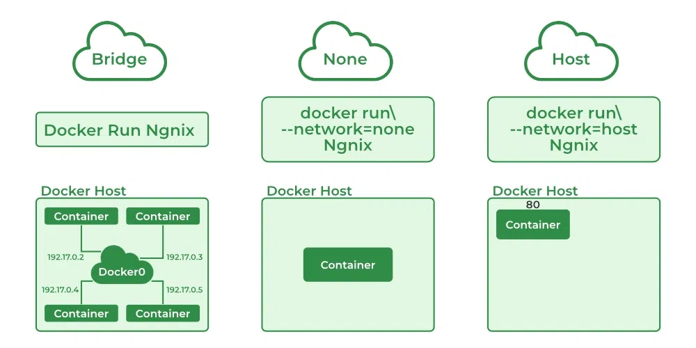

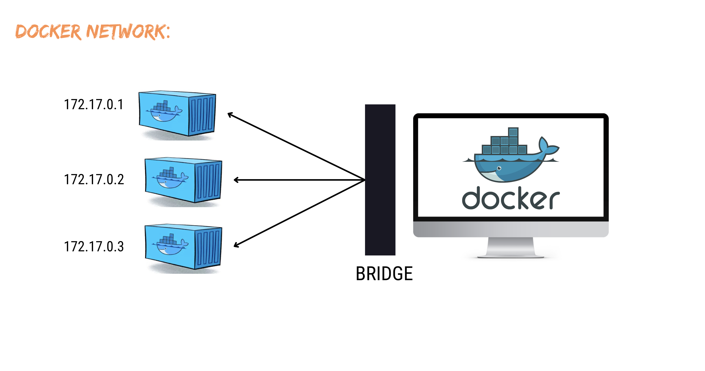

- See above picture, we have 3 containers having three different ports, but if they want to communicate with each other in order to share data, then we need to create a network to communicate with each other. **`Bridge`** is a part of network provided by `Docker Engine` so we can communicate between containers with each other.

#### Docker Compose Commands
- When you run `docker-compose up`, it starts all the containers defined in the `docker-compose.yaml` file.

```bash
# Start all containers
docker-compose up -d

# Stop all containers
docker-compose down
```

- Both application will accessible at `http://localhost:8000` and `http://localhost:3000` at same time, see below images for logs, docker desktop and browser.

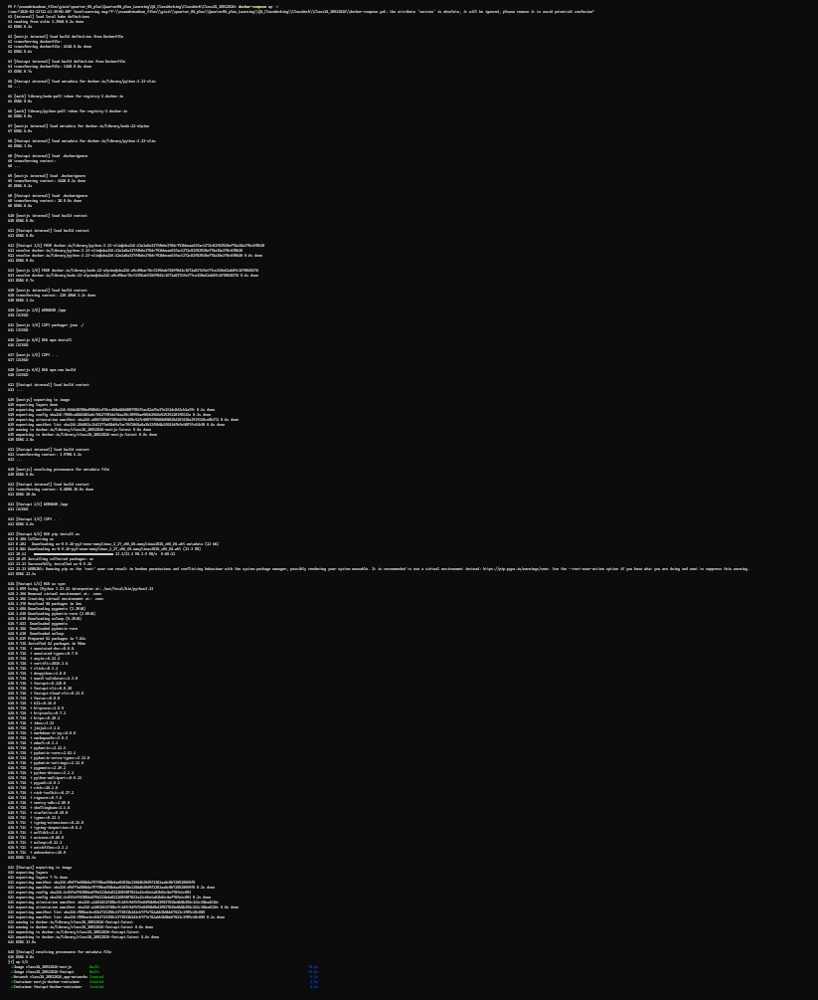

---

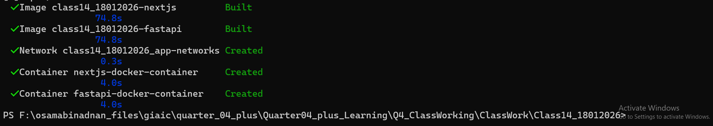

---

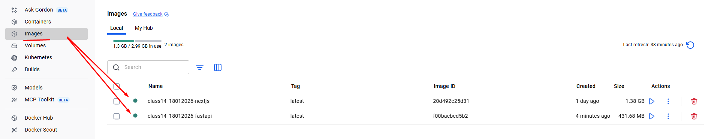

---

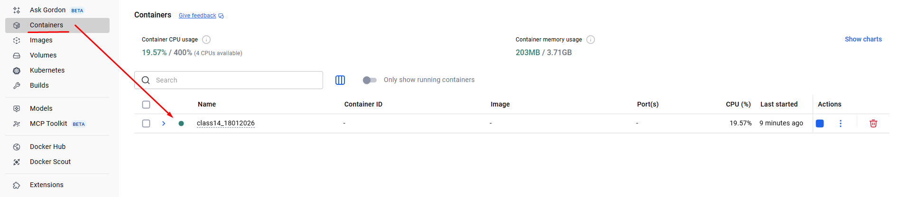

---

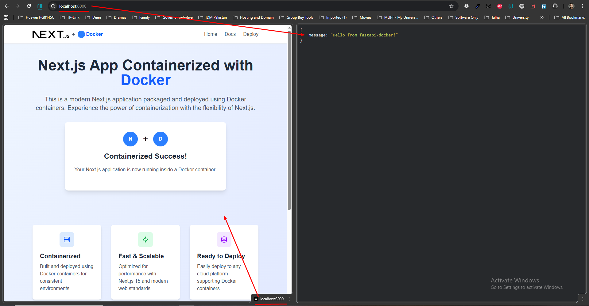

---

- When you run `docker-compose-down`, it stops all the containers defined in the `docker-compose.yaml` file.

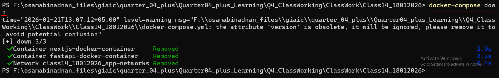

- This means that by using `docker compose` we can run multi containers application together by using single command.
- See below flowchart diagram for better understanding.

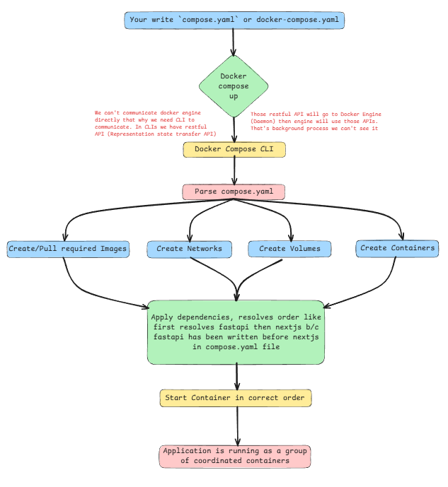

## .dockerignore file
**.dockerignore file** is a simple text file (placed in the same directory as your Dockerfile) that tells Docker **which files and directories to exclude** when it sends the build context to the Docker daemon.

- When you run:

```bash
docker build -t myapp .
```

Docker sends **everything** in the current directory (.) + all subdirectories to the daemon — even files you don't need in the image (`.git`, `node_modules`, logs, temp files, tests, etc.).

→ This makes builds:

-   Much slower
-   Use more bandwidth/disk
-   Sometimes fail (if huge folders exceed limits)
-   Include sensitive files by mistake

`.dockerignore` prevents that — similar to how `.gitignore` works for Git.

---

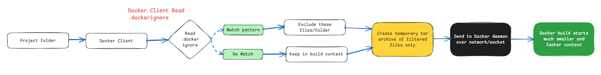

---

## Environment Variables in Docker Build Command

```bash
# Build the Docker image with environment variables
docker build -t ENV=.env nextjs-docker-image .
```

## Docker Volumes
**Docker volumes** are the **preferred way** to handle **persistent data** in Docker containers. Containers are ephemeral by design — when you delete or recreate a container, anything written to its writable layer (inside the container) is lost unless you persist it externally.

- **Docker Volume** is a mechanism to **persist and share data** generated by containers **outside the container’s lifecycle**.
- Containers are `ephemeral` (lasting for a very short time), but volumes keep data safe even if a container is removed.
- Volume are the only recommended way to get durable data out of containers.

### Why Docker Volumes?
-   Persist data (DB files, uploads, logs)  
-   Share data between containers
-   Decouple data from container image
-   Better performance than container filesystem

### Types of Docker Storage

#### 1️⃣ **Named Volume**
- Volume with an explicit name
- Managed by Docker
- Reusable across containers
- **Docker engine makes volume for you and all store data for you**

```bash
docker volume create mydata
docker run -v mydata:/app/data myapp
```
- ✅ Persistent  
- ✅ Easy to manage  
- ✅ Best for production
- ✅ Long-lived data, DBs, important files

#### 2️⃣ **Anonymous Volume**
- Volume **without a name**   
- Created automatically by Docker
- Hard to reuse or track
- **Temporary data which create then deleted**
    
```bash
docker run -v /app/data myapp
```
- ⚠ Persistent but **not easily reusable**  
- ⚠ Can cause unused volume buildup  
- ❌ Not recommended for long-term use
- ✔ Temporary container private data

#### 3️⃣ **Bind Mount**
- Direct mapping of **host path → container path**
- Depends on host filesystem
- **You bind your file system of computer with the container**

```bash

docker run -v /host/path:/app/data myapp
```
- ✅ Persistent  
- ❌ Host-dependent  
- ❌ Not portable  
- ✔ Good for development
- ✔ Development, config Injection

#### 4️⃣ **tmpfs Mount**
-   Stored in **RAM**
-   Deleted when container stops
    
```bash

docker run --tmpfs /app/cache myapp
```

- ❌ Not persistent  
- ✅ Very fast  
- ✅ No disk I/O  
- ✔ Good for secrets & cache

### Quick Comparison

| Type | Persistent | Host Dependent | Docker Managed | Best Use |
| --- | --- | --- | --- | --- |
| Named Volume | ✅   | ❌   | ✅   | Production data |
| Anonymous Volume | ✅   | ❌   | ✅   | Temporary data |
| Bind Mount | ✅   | ✅   | ❌   | Local development |
| tmpfs Mount | ❌   | ❌   | ❌   | Secrets, cache |

Sir's recommend Article for Docker Volumes: [Docker Volumes: Efficient Data Management in Containerized Environments](https://semaphore.io/blog/docker-volumes)

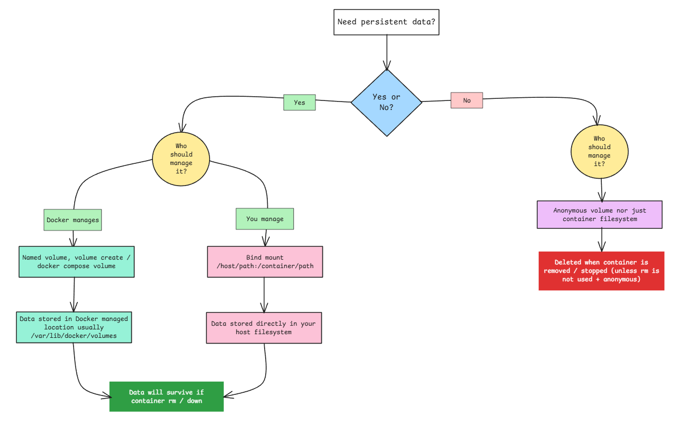

## How Docker Engine really works?
Here’s a cleaner, more accurate, and properly structured version of the Docker Engine flow:

```ascii
┌───────────────────────────────────────┐
│            You (User)                 │
│   docker run -d -p 80:80 nginx        │
│   docker build .    docker compose up │
└───────────────────┬───────────────────┘
                    │
                    ▼   (CLI → Daemon communication)
          ┌───────────────────────────────┐
          │        Docker CLI             │
          │   (docker, docker compose)    │
          └───────────────┬───────────────┘
                          │
            REST API (Unix socket or TCP)
                          ▼
          ┌─────────────────────────────────────┐
          │         Docker Daemon               │
          │              dockerd                │   ← runs as root or with privileges
          │   (orchestration, networking,       │   ← Docker Engine also known as `containerd` or `runc`
          │    volumes, BuildKit, plugins, ...) │   ← runc is your container runtime
          └───────────────────┬─────────────────┘
                              │
               delegates most container work
                              ▼
          ┌─────────────────────────────────────┐
          │            containerd               │   ← core container runtime (CNCF project)
          │   (image pull/unpack, snapshots,    │
          │    lifecycle, supervision, gRPC API)│
          └───────────────────┬─────────────────┘
                              │
                   creates bundle & starts
                              ▼
          ┌─────────────────────────────────────┐
          │      containerd-shim-runc-v2        │   ← per-container long-lived parent
          │   (keeps stdio, exit code, signals) │
          └───────────────────┬─────────────────┘
                              │   fork + exec
                              ▼
          ┌─────────────────────────────────────┐
          │               runc                  │   ← OCI-compliant low-level runtime
          │        (executes container once)    │
          └───────────────────┬─────────────────┘
                              │   raw Linux syscalls
                              ▼
┌─────────────────────────────────────────────────────────────┐
│                      Linux Kernel                           │
│  ┌──────────────┐  ┌──────────────┐  ┌─────────────────┐    │
│  │ Namespaces   │  │  cgroups v2  │  │ seccomp / LSM   │    │
│  │ • pid        │  │ • CPU        │  │ • AppArmor      │    │
│  │ • net        │  │ • memory     │  │ • SELinux       │    │
│  │ • mnt        │  │ • io         │  │                 │    │
│  │ • uts, ipc   │  │ • devices    │  └─────────────────┘    │
│  │ • user       │  └──────────────┘                         │
│  │ • time       │                                           │
│  └──────────────┘                                           │
│           │                                                 │
│           ▼        OverlayFS / snapshotter                  │
│     Layered filesystem (image layers + writable layer)      │
│                                                             │
│           │                                                 │
│           ▼        Networking (iptables/nftables/eBPF)      │
│          NAT, port publishing, bridge/overlay networks      │
└─────────────────────────────────────────────────────────────┘
                              │
                              ▼
                    Container starts
          ┌─────────────────────────────────────┐
          │          Your Container             │
          │     (nginx -g 'daemon off;')        │
          └─────────────────────────────────────┘
```
### Core Workflow:
Here is a **brief, clear, step-by-step core flow** explanation that follows exactly the diagram you provided:

1.  **User** You type a command (docker run, docker build, docker compose up, etc.)
2.  **Docker CLI** The docker or docker compose binary parses your command → converts it into an API request → sends it to the Docker daemon via Unix socket (/var/run/docker.sock) or TCP
3.  **Docker Daemon (dockerd)** Receives the request (runs with elevated privileges) Performs high-level orchestration:
    -   checks authorization
    -   handles networking setup
    -   manages volumes
    -   coordinates BuildKit (for builds)
    -   calls plugins if needed → delegates the actual container creation work to **containerd**
4.  **containerd** Core runtime (independent CNCF project)
    -   pulls image from registry if missing
    -   unpacks layers
    -   prepares snapshot (using overlayfs or similar)
    -   creates OCI runtime bundle (config + root filesystem)
    -   sets up supervision → starts the container by asking the shim to launch **runc**
5.  **containerd-shim-runc-v2** Long-lived per-container parent process
    -   forks and executes **runc**
    -   remains running as the real parent of the container process
    -   forwards stdin/stdout/stderr
    -   handles signals and exit code → allows dockerd/containerd to restart without killing running containers
6.  **runc** OCI-compliant low-level runtime (runs once and exits) Uses raw Linux syscalls to:
    -   create all namespaces
    -   apply cgroups limits
    -   set up security (seccomp, AppArmor/SELinux)
    -   pivot to the container root filesystem (overlayfs layers)
    -   configure networking rules → executes the container’s entrypoint (e.g. nginx -g 'daemon off;')
7.  **Linux Kernel** Enforces true isolation and control:
    -   **Namespaces**: pid, net, mount, uts, ipc, user, time
    -   **cgroups v2**: CPU, memory, I/O, device limits
    -   **Security modules**: seccomp filters, AppArmor/SELinux
    -   **Filesystem**: OverlayFS / snapshotter → efficient image layers + writable copy-on-write layer
    -   **Networking**: iptables/nftables/eBPF → NAT, port publishing, bridge/overlay networks
8.  **Container starts** The actual application process (nginx, your app, etc.) is now running inside its isolated environment, managed by the shim

**Summary in one sentence:** The Docker CLI talks to dockerd → dockerd delegates to containerd → containerd uses a shim to launch runc → runc asks the Linux kernel to create an isolated process with namespaces, cgroups, layered filesystem, and controlled networking → your container runs.

That is the **core execution flow** shown in the diagram.


