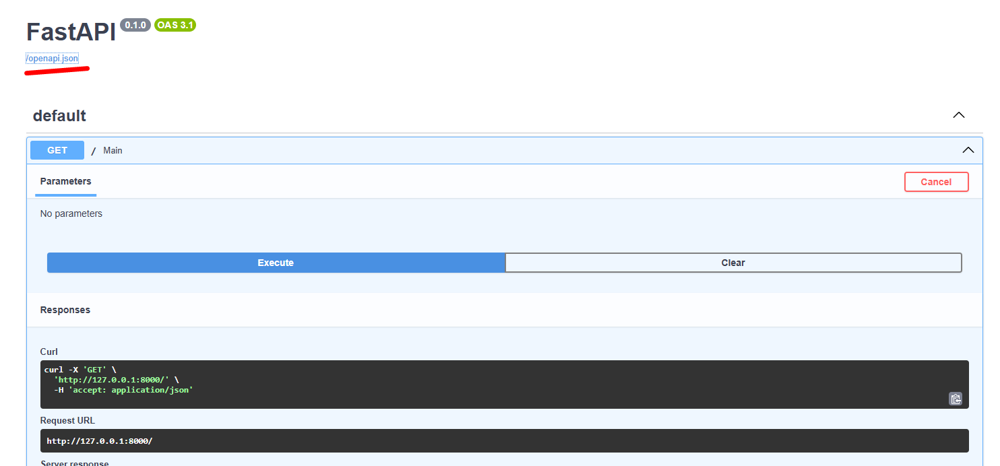
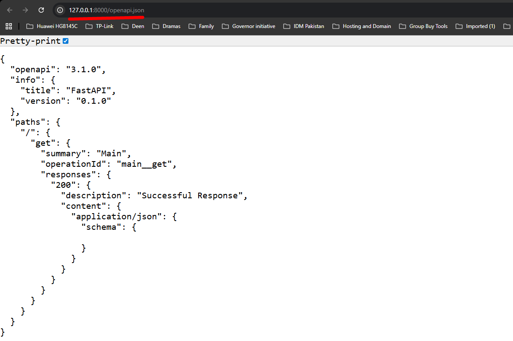

# Week 01: API & Backend Foundations with FastAPI

**Check [Week1_FastAPI.pdf](Week1_FastAPI.pdf) docs**

- 402 status code -> Payment Required (errors), check this app for more detail about how agent will use payment gateways [x402](https://www.x402.org/)
-  You should study `Rust` and `Go` in order to because good open source developer.
- **Swagger** provide UI to APIs
- Every API has schema which follows some standard, FastAPI auto generate schema.
- Open API is a schema format, FastAPI uses different packages/libraries like Startlit to generate schema.
- Platform level integrations take place because of schema.
- On your local host server open `/openapi.json`, see below picture
---

---

- You will see schema of your APIs in json format, see below picture

---

---

- We use this framework because of schema, you saw in above picture.
- Framework does abstraction, it hides code level stuff
- You can also write `fastapi dev yourfilename.py`, and run FastAPI server.