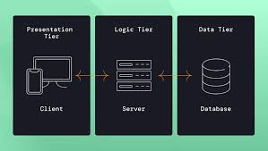
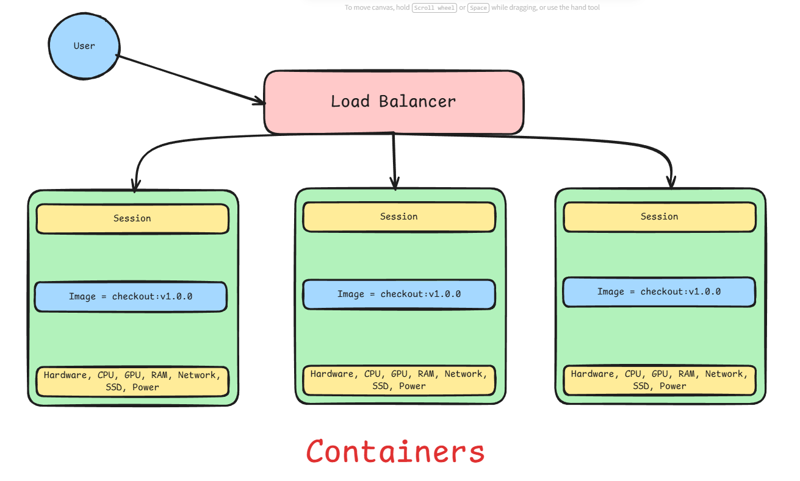

# Class 12: Sir Ameen Lecture on Docker (Sunday 6-9 PM 4th January 2026)

For `good product` planning is important and for good planning, **`good architecture`** is important. Architecture will be strong when you know the answers of questions related to achitecture.

Suppose we have to make Ecommerce application:

- First we have to see, what business we have in ecommerce application?
- A simple code of FastAPI which has been written in pyhton is business or not?
- Below is 3 tier architecture:

- Presentation layer is running on Client, on user device.
- Backend has many name like `business domain`, `backend`, `server`, `logic tier` etc. 
- Database is to save backend business logics. It uses to persist data.

As per above picture, **Logic tier is business** which are writing business in Python using FastAPI framework. That means simple code of FastAPI which has been written in pyhton **is business**.

## Bounded Context or Context Boundary:

**what is the business in banking?**
Now we will see `what is the business in banking`??
- User On Boarding (Account Opening)
- User Enrolling (Account Activation)
- Fund Transfer
- Bill Payment
- Consumer Loan
- Account Reconciliation
- Account Statement - reports

All mentioned above tare business in the back domain. In the context of business we called above mentioned business as `Ubiquitous Language` of business. *A **Ubiquitous Language** is a shared, common vocabulary developed by a software development team (developers, domain experts, stakeholders) for a specific project, ensuring everyone uses the same precise terms for concepts in the business domain*. 

**what is the business in ecommerce?**
Now we will see `what is the business in ecommerce`??
- Add to Cart
- Checkout
    - Payment initiate
    - Payment process
    - Payment success
    - Payment failure
    - Payment refund
- Shipment
- etc.

There are several business for ecommerce but we are using just three here. The business mentioned above for ecommerce are seprate business to each other and they have strong and weak boundaries. like:

- Add to Cart and Checkout has **strong boundaries**.
- Payment initiate and Payment process has **weak boundaries**.
- Add to Cart, Checkout, Shipment has `bounded context`, we have this and that in Add to Cart and this and that in Checkout, same is the case in Shipment.
- `Bounded content` means that business has context in it.

> A **Bounded Context** in Domain-Driven Design (DDD) is a specific boundary within a larger system where a particular domain model, its terms (ubiquitous language), and rules are consistent and apply, preventing ambiguity and managing complexity by defining clear, independent areas for different business aspects, like "Customer" in Sales vs. "Customer" in Shipping. It acts as a "safe zone" for models, allowing them to evolve separately while defining how they interact with other contexts, which is crucial for designing scalable microservices.

## Architecture of Application

### Monolithic Architecture
Now if this application is running on some cloud than **why will be the architecture of it**??
- User is consider as frontend.
- Our FastAPI backend project have all these 3 business logics.
- User request is coming on endpoint of these businesses via http request.
- In a monolithic architecture, business boundaries—or bounded contexts—are tightly coupled, meaning they are highly interconnected and dependent on one another.
- There are pron and con of monolithic architecture.

#### Challenges
Challenges of monolithic architecture approach are:
- **Sprint:** In limited time, you have to make features in a short period of time.
- **Team velocity:** Team velocity will disturb. Different team members are working on different parts of the application, which makes difficult to integrate and test, like suppose you are working on Add to cart business and if any problem will come in Checkout, your code will disturb too.

#### Modular Monolithic Architecture

- Modules are the building blocks of a monolithic architecture, like coding Add to cart business, Checkout business and Shipment business in modules.
- Different Modules are independent of each other and loosely coupled.
- Using Modules, we can easily solve Team velocity issue.

### Microservices Architecture

#### 1. Orchestrator
- In microservices architecture, business boundaries—or bounded contexts—are loosely coupled, meaning they are less interconnected and dependent on one another.
- In microservices architecture, we make separate projects, `Add to cart, Checkout and Shipment`, all having seperate databases, *because as per my business requirements, when your business tier comes into play you should have database to store your data and then get from there*.
- There is `rule of microservice`, if you made seperate service then database of that service should be separate.
- Now the `question` is **Why we made only three microservices**?? Because we have strong bounded context in these three microservices. We saw where are strong boundaries between the businesses then made them as microservices.
- Suppose user comes to add to cart then from add to cart to checkout then to shipment, `this process break the architecture of microservices` because if anything failed whole application will be down.
- There are steps in this work and when steps are come into place that is called `workflow`.
- But we need some `manager` who will manage this workflow without breaking the architecture of microservices. For this purpose we need another layer which is **orchestration**.
- ***Orchestrator will manage whole workflow, user talk will Orchestrator and Orchestrator will make workflow and responsible to give work to whom it pertains.***
- Suppose when a user interacts with the Orchestrator, it first assigns the task of adding items to the cart. After the item is successfully added, the Orchestrator triggers the checkout process. Checkout has a loosely bounded context, such as handling the payment status (success or failure). The resulting status is then returned to the Orchestrator. If the payment is successful, the Orchestrator proceeds to initiate shipment; otherwise, it notifies the user that the payment has failed.
- Now here comes the concept of upstream and downstream. It means that if my server is requesting to your server then my server is `Upstream` and your server receiving my request and response then your server is `Downstream`.
- In short:
    - Requesting server is `Upstream`.
    - Receiving and responsing server is `Downstream`.
- Orchestrator is `Upstream` when requesting to microservices and `Downstream` when receiving response from microservices.
- Microservices are `Upstream` when requesting to Orchestrator and `Downstream` when receiving response from Orchestrator.
- Orchestrator follows `http` protocol when making call/request, we are imaging that `restful` API is used made on FastAPI.
- Restful API is run oneway , `it means that it request, get update response right away and THE END.` https calls has strong level, it stateless.
- **Question is how much Orchestrator will wait to receive response from checkout microservice regarding payment status?** Right away, or after few seconds or minutes. After multiple call orchestrator get answer of either failure or success.
    - In the case of success it called Orchestrator calls Shipment microservice.
    - **What did the Orchestrator do to get the payment status?** The Orchestrator repeatedly sends requests to the Checkout service over the HTTP protocol. Since HTTP is stateless, the payment status service does not track how many times the Orchestrator has called it to retrieve the status. The payment status service is unconcerned with the number of requests; if the status is available, it returns a response to the Orchestrator, otherwise it simply does nothing (or returns an appropriate response).
    - Resultant Orchestrator is `Strongly Consistent (updated data require)` but we have to handle `Availability Issue (wait for accurate data)`
- `This microservices architecture has one advantage and one drawback.`
    - Data is strongly consistent.
    - But we have availability issue.

- **When happen when in Microservices architecture, the shipment service suddenly stop working. Did the whole application break?** No, only shipment service is down but rest application like `Add to cart, Checkout and Shipment` will work fine. Same is the case for Add to cart and Checkout.
- **But what if the Orchestrator is down?** Then whole application will be down. This is `single point of failure`. We are dependent on it, this is the major flaw of microservices architecture.

#### 2. Event Broker (Architecture is Microservices) also called Choreography
> In `application architecture`, an **Event Broker** is a core component of `event-driven architecture (EDA)`. It acts as an **intermediary that receives, routes, filters, and delivers events** from producers to consumers in a **decoupled, asynchronous** manner.

- Event Broker opens topic of events
- User add to cart, then move to checkout, and make payment, both occasion http protocol used, then payment status will be store in `payment status topic` using **event**
- As soon as event received by Event Broker, *payment status service has becomes **producer** for event broker*.
- Now Event Broker service has event, and the **consumer** of that event is `Shipment`, event by push or pull go to Shipment microservice to confirm that payment is received.
- If shipment (consumer) is down, still payment status (producer) event will be sent to Event Broker. Then when Shipment service comes up, it will receive event from Event Broker and process it.
- **Event which produced by payment status is weakly consistent data.** Because data is of even few seconds old then it also matters and it is not strong consistent.
- This is called **Event Driven Architecture (EDA)**. *Architecture is Microservices but conversation flow is Event Driven.*
- There is `no upstream and downstream` in event driven architecture.

##### Transaction
- In an event broker, a **transaction** is a mechanism that ensures event state consistency when producing or consuming events.
- Transaction Typically covers:
    - Event production (publish event)
    - Event consumption (process event + acknowledge/commit)
- **What happens if a transaction fails? How rollback works?**
- If **event production fails**
    - Event is **not committed**   
    - Broker **does not make it visible** to consumers
    - Producer may **retry**

- If **event consumption fails**
    - Event is **not acknowledged / offset not committed**
    - Broker **redelivers the event**
    - Consumer must be **idempotent**
    
- **Rollback behavior (important point)**
    - ⚠️ **Event brokers do NOT rollback business state automatically**

*In orchestrator architecture, orchestrator is managing whole workflow, roll back will also be managed by orchestrator*. But in *event driven architecture*, **topic is managing roll back.** It will send message in topic about shipment failure. Consumer will read message from topic and refund money to user.
- *`Couplying` between event broker and microservices has been done via event* that why it event driven approach
- http is `synchronous`, event-driven is `asynchronous`.

> So, when we need **strong consistency**, we typically use **HTTP-based synchronous communication**. When **eventual consistency** is acceptable, we use an **event-driven architecture**.

With `HTTP`, the client often has to call the service repeatedly until it receives the required response. In contrast, with an `event-driven architecture`, the request is published once and the response is delivered asynchronously when it becomes available, achieving eventual consistency.

> This Event Broker concept is also called **Choreography** because it follows the **Transaction pattern of Choreography**. It is a type of **workflow** that uses **events** to coordinate the execution of **microservices**.
>> In `event driven architecture`, Transaction pattern of Choreography updates event and read topic via async communication.
>> In `orchestrator architecture`, single orchestrator is driving everything, upstream and downstream server are running

Doesn't matter, which architecture you are making it's not philosophy or rule written in book. **Architecture is always depend on time.** , at that you are making it, What are circumtances, What tech is available, What is your goal in future, What do you want to achieve in future, How you want to run business etc.

- **To build an architecture you should know below about business:**
    - Primary User
    - Secondary User
    - Third User
    - Bounded Context
    - Core Operation of your Business, like in Ecommerce, Checkout, and Shipment are core operation.
    - How much downtime you can bear if your core operation(s) is(are) down.
        - Like temporary down, temporary business loss are offordable, we will Reply it like if someone had product in their cart then it will not be lost, we will reply it and bring him to Checkout page.
    
- On Scalability `Strongly consistent` is not possible, example is google map, million of peoples use daily, it is not possible to send million http requests at same time. That's why `event driven architecture` is used in google map and downtime is offordable there.

**Pros and Cons**
- No single point of failure in event driven architecture.
- No chain failure in event driven architecture.

- `asynchronous` and `synchronous` communication pertains to `event` and `http` respectively. It not related to `Orchestrator` because you place orchestrator on workflow.

## Layers

### Cloude
- We have following layer to run application on Cloud:

### Scalability
- Scalability means increasing and descreasing resources of application in order to achieve high performance.
    - Vertical Scaling: Increase specs of single server
    - Horizontal Scaling: Increase number of servers

#### Fault Tolerance
> Fault Tolerance means a system continues to operate correctly even when parts fail, and scalability increases fault tolerance by removing single points of failure.

1. **Load Balancer**
- Fault Tolerance is **Masking**
- In horizontal scaling, Fault Tolerance is achieved by using **Load Balancer**.
- Load Balancer distributes sessions among systems. If one is server is full/down, then load balancer will redirect request to another server.
- Load Balancer is actually `Masking` the failure

Fault Tolerance has some other features as well apart from Load Balancer:
- Auto Scaling
- Replication: Make replicate servers of same specs. It is manual approach, everytime system engineer is required to add new server.

2. **Auto Scaling (with Image Building)**
- Auto Scaling is hard to achieve
- We burn and make image of our own native system application (which running on our system perfectly) and make it single entity.

- This image is just data in layer.
- To run this image, we break our system into 2 parts:
    - Make one spec for Image `(Image spec)`
    - Make one spec for run specs `(Runtime spec)`
- Image spec is called `Image` and Runtime spec is called `Container`.

3. **Replication (with Auto Scaling)**
*When we achieve in this:*
- When we want to make `replication`, **we will up the replication same container** because we have image in container which is immutable and image will only change when we make new image.
- This **replication achieve auto scaling** easily.

- Now with Load Balancer we will use **Containers**, see below picture

##### Docker
To do above working work, we need tool called **Docker**
- See command of Docker in Sir Ameen Alam Github [CNC-Docker](https://github.com/Ameen-Alam/CNC-Docker/blob/master/hands-on-command-journey.md)

##### Resilience
**Resilience** is the system’s ability to **absorb failures, adapt under load, and recover quickly while continuing to scale**.

> If **fault tolerance** is _surviving failure_,  
> **resilience** is _adapting and recovering from failure while scaling_.

- Resilience emphasizes on correction of failure without hiding it.
- Fault Tolerance emphasizes on masking failure.
- Resilience is Auto healing, restart, retry, exponential backoff

**Circuit Breaker**
- Circuit Breaker is a component of Resilience.
- To achieve Resilience, we need to use Circuit Breaker, and we need to write code in our application like Try/Catch block to achieve Resilience.
- If there is a problem in your application, then circuit breaker will block the request because of code you have written in your application.
- You should add `fallback` to your application so user know at first place that service is not available.

> Resilience in distributed systems uses a **Circuit Breaker** to detect failing services and temporarily stop calls, preventing `cascading failures`, while a **Fallback** provides an alternative response (like default data) when the breaker trips or the service fails, ensuring graceful degradation and application stability instead of outright crashing.

**If there is not `Resilence` = `Fault tolerance` will not achieve/succeed.**
- Fault Tolerance is only achieved when we have `Resilience` in our application.

## Words and Glossaries to remember:
- Bounded Context
- Ubiquitous Language
- Monolithic Architecture
- Highly Coupled
- Sprint
- Team velocity
- Microservices Architecture
- Workflow
- Orchestration
- Upstream
- Downstream
- Restful API
- Strongly Consistent
- Availability Issue
- Single Point of Failure
- Event Broker
- Producer
- Consumer
- Event Driven Architecture (EDA)
- Transaction
- Rollback
- Couplying
- Choreography

