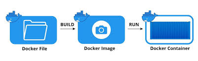
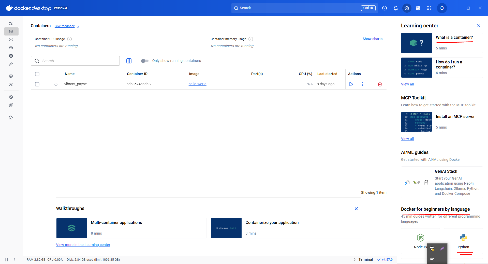

# Class 12: Cloud Native Development (Sir Asharib Session)

- Install Docker Desktop on your system.

- In order to containeriz you app (for example next.js app), then you need to make file in your codebase name `DockerFile`.
- **DockerHub** is a platform from which you can get and push your images so other developers can use them. DockerHub is like a codebase for images.
- We make isolated environment for Docker file, it is like specific point in our system where we stored and it is working seperately from system.
- The concept of `containerization` is implemented through the Docker Engine, and containers run on top of the Docker Engine.
- Best Guide to learn container is in Docker Desktop application, see `What is a continer?`

**DockerFile --> Images --> Container**

- Building stage we define in Docker file, run that image to see everything in action.

