# Class 13: Docker and Containerization 11/01/2026

Before making any application, first you need to plan it, ask yourself what you want to do and how you want to do it. You can take help from ChatGPT or any other AI tool, that is called `Plan` mode.

For example, if we want to make Next.js + Shopify Ecommerce application, we first prompt to chatgpt and share you app statements:

> I want to make a Next.js + Shopify Ecommerce application. List different features of it and share different architectural details of it so I can use it in my project.

## Brief History of Cloud Native Deployment

### 1990-2000 Era: Tradition Deployment

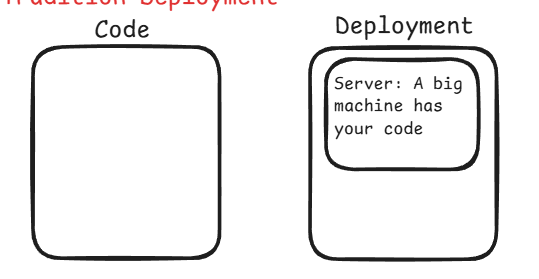

### After 2000 - Virtual Machine: It like running many systems in single big system

- But this approach is not scalable, if user increases

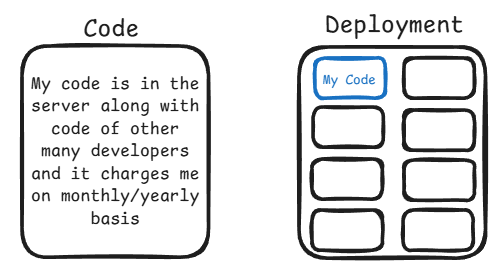

### After 2010 Amazon: Cloud - Rent a Server (Pay per use)

- Amazon realize that many developers make products but they unable to deploy it
- Amazon offered scalable service and make AWS Cloud
- Now developer can deploy their product on scalable server by purchasing it
- AWS product multiple tools in order to provide you database
- But still scalability is a big challenge in term of Management


### In 2013: Docker Arrive

- Docker solve this scalability problem by introduce container and technology is called `Containerization`
- Containerization means that your tools, libraries, operating system will be managed by Docker's container
- When you will learn how containers run and manage then we will be abled to deploy our application on cloud that can scale to million of users and everything will be on `auto management`.

## Docker and Containerization

- For docker hello world, go to docker hub [hello-world](https://hub.docker.com/_/hello-world)
- We can pull the image from docker hub, on above link below command is present which will pull the image from docker hub

```bash
docker pull hello-world
```

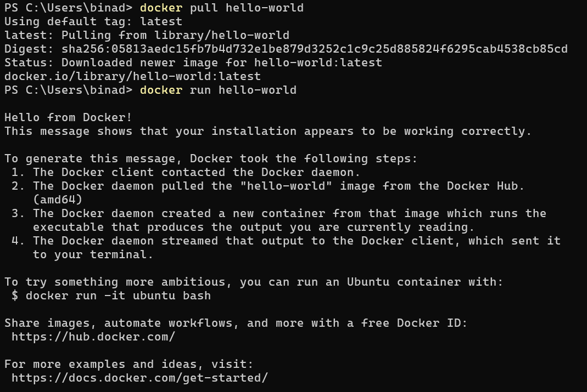

- `Docker daemon` is Docker Engine, it tech will help docker to containerize images and running that containers

- You can learn Docker by this platform named `Oboe`, Official [Oboe](https://oboe.com) Link
- For Docker, you can learn by this [Docker Fundamental](https://oboe.com/learn/docker-fundamentals-1ch8sf8) Link

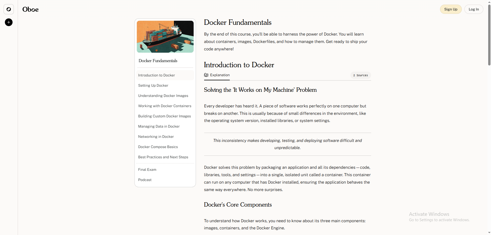

### Running Container Command

#### 1. **`detach`**

- When ever you see this word `detach` that means you are running the container in background
- You can write `--detach` or simple `-d`

```bash
docker run --detach
```

#### 2. **`publish`**

- Whenever you see this word `publish` that means on what port you want to run your container
- You can write `--publish` or simple `-p`

```bash
docker run -d -p
```

#### 3. **`ports`**

- Usually we have 2 ports: sytem port and container port
- 8000 is your system port and 80 is container port, nginx web server default port is 80, that is why we use 80 here

```bash
docker run -d -p 8000:80
```

#### 4. **`name`**

- You give name to your web server which is `webserver`
- `webserver` is your container name

```bash
docker run -d -p 8000:80 --name webserver
```

#### 5. **`image name and run command`**

- There is no `nginx` image on our docker dashboard.
- nginx is a web server, by using it we can live our application on internet
- So when we run above command, it will `pull` the nginx image from docker hub or docker registry.

```bash
docker run -d -p 8000:80 --name webserver nginx
```

- When you run code, below logs appears

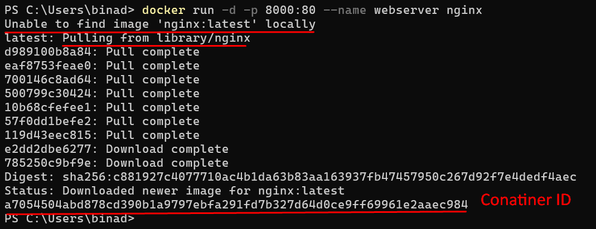

- When we pulled our image, it will appear in Docker Dashboard and **Container ID** assign to it
- Now go to localhost on port 8000, you will see below image, it means nginx server is successfully installed and running

##### Localhost

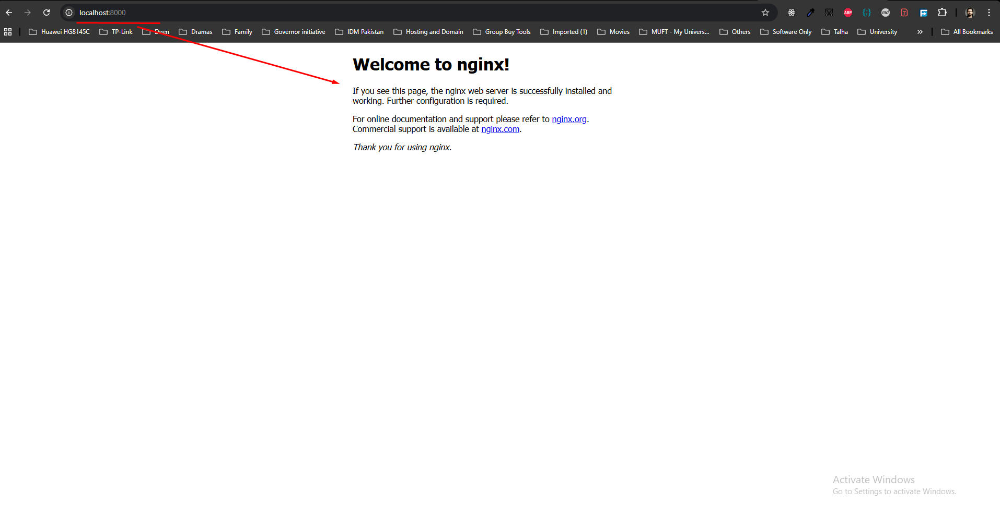

- See below docker desktop images and container, you will see it

##### Docker Desktop Images

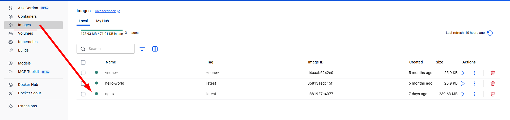

##### Docker Desktop Container

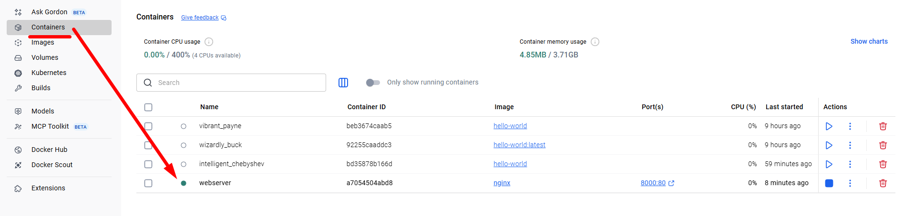

- Container is like codebase which is running in isolated environment
- Now the 8000 system port is server, to stop container, we need to run below command

#### 6. **`stop the container`**

```bash
# stop with container name `webserver`
docker stop webserver
```
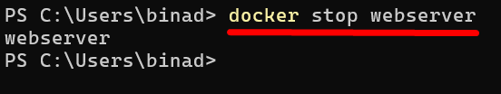

- Again you want to start your container, you need to run below command

#### 7. **`start the container`**
```bash
# start with container name `webserver`
docker start webserver
```

#### 8. **`remove the container`**

```bash
# remove with container name `webserver`
docker rm webserver
```

### Containerization of Our Codebase

- We made simple **fastapi-docker** and **nextjs-docker** folder in `Assignment\Class13_11012025` folder
- Now we will add **Dockerfile** in both fastapi-docker and nextjs-docker folders

#### Dockerfile (nextjs-docker)
- In docker file, we give step by step executable instruction to docker daemon
- We have some special commands and we should know about them.
- Below is the list of special commands for `nextjs-docker` Dockerfile

- **`FROM`**: 
    - From use to specify about library or programming language we will use to run our application    
```Dockerfile
    FROM node:22-alpine
```
- **`WORKDIR`**: 
    - We specify the directory where our application will run
    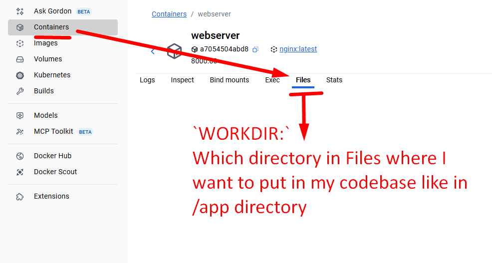

```Dockerfile
    WORKDIR /app
```
- **`COPY`**:
    - Copy package.json and package-lock.json to the working directory
    - `*` means to pick package.json and package-lock.json
    - `./` means to get the files from the current (root) directory

```Dockerfile
    COPY package*.json ./
```

- **`RUN`**:
    - Install dependencies based on the preferred package manager

```Dockerfile
    RUN npm install
```

- **`COPY`**:
    - Copy the rest of the application codebase from current directory to WORKDIR /app

```Dockerfile
    COPY . .
```

- **`RUN`**:
    - Build the application

```Dockerfile
    RUN npm run build
```

- **`EXPOSE`**:
    - Expose port on which the app will run

```Dockerfile
    EXPOSE 3000
```

- **`CMD`**:
    - Run the application

```Dockerfile
    CMD ["npm", "start"]
```

##### Dockerfile (nextjs-docker) -> Image Building Commands

- To build image we write below command
    - `-t` means tag
    - `nextjs-docker-image` means image name
    - `.` means pick Dockerfile from current directory to create image

```bash
docker build -t nextjs-docker-image .
```
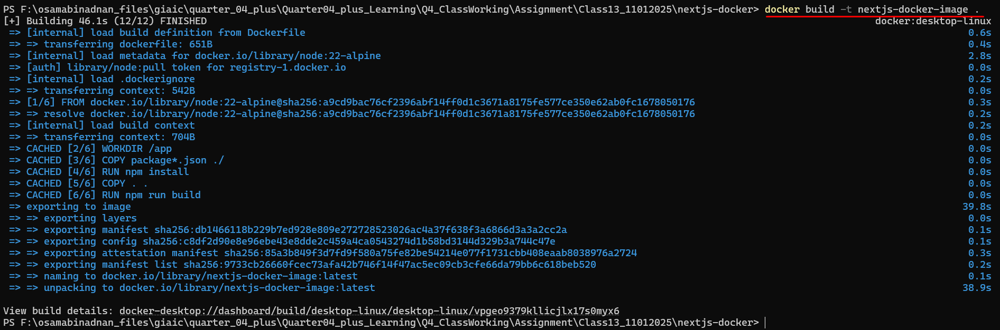

- Then run container by following command
- First 3000 means system port and 3000 means container port

```bash
docker run -d -p 3000:3000 --name nextjs-docker-container nextjs-docker-image
```
- When you run above command you will get `Container ID`, see below image


#### Dockerfile (fastapi-docker) -> Image Building

- To build image we have to write docker file first, see below picture

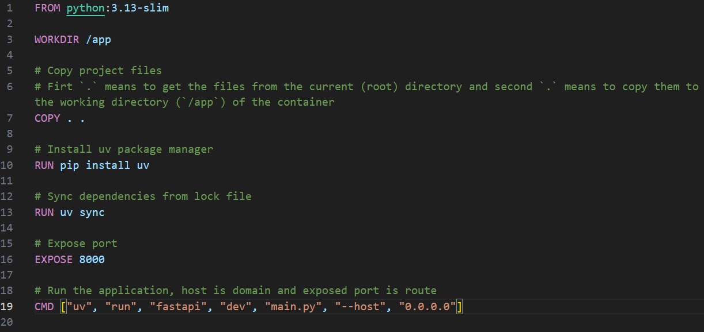

##### Dockerfile (fastapi-docker) -> Image Building Commands

- To build image we write below command

```bash
docker build -t fastapi-docker-image .
```

- See below picture, image building is completed

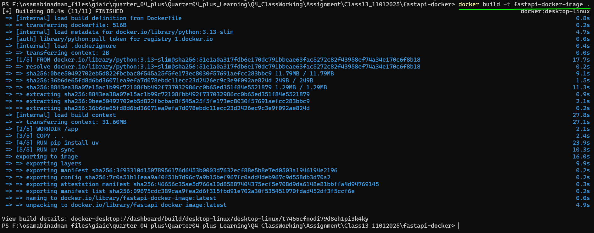

- Image showing in Docker Desktop:

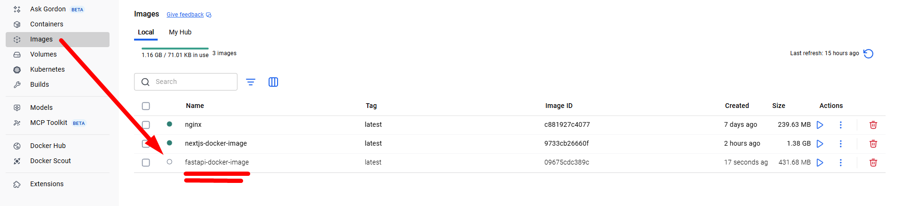

- Now we will run container by following command

```bash
docker run -d -p 8000:8000 --name fastapi-docker-container fastapi-docker-image
```

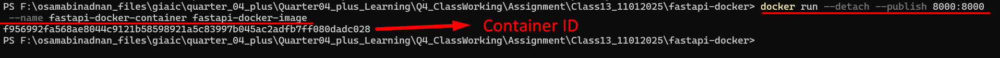

- When you click on `fastapi-docker-image` in Docker Desktop, you will see number of **Layers**, these layer are defined by **Docker Daemon: The Docker Engine**, Docker Daemon works Layer by Layer to create image like it bring first dependencies then codebase, then environment variable (if any) etc. then combine these layers on make a container.

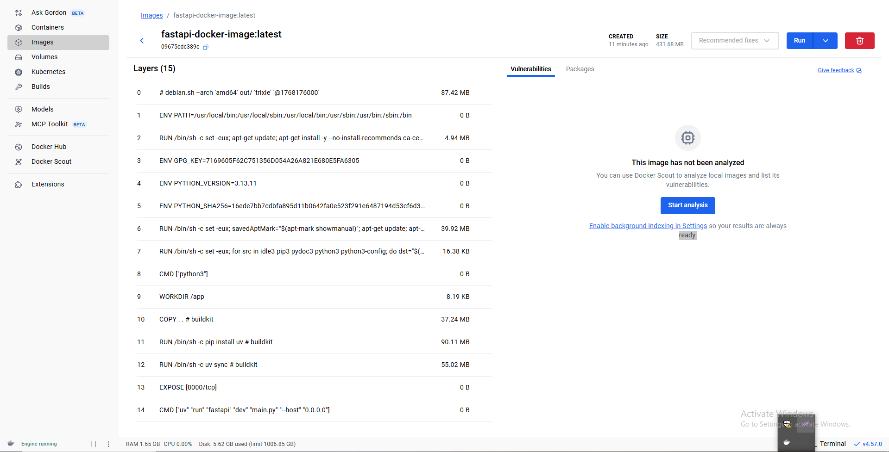

#### Docker PS
- There is a command name `docker ps`, which means **docker process status**
- When you run this command on terminal, you will get list of all running containers

```bash
docker ps
```

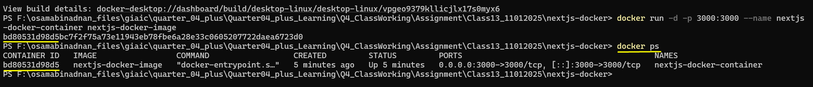

- If you want to see `all process status`, you need to run below command

```bash
docker ps -a

# OR

docker ps --all
```

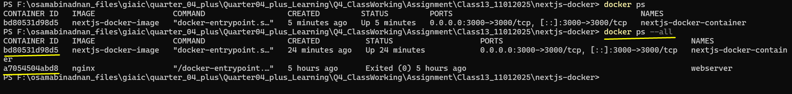

