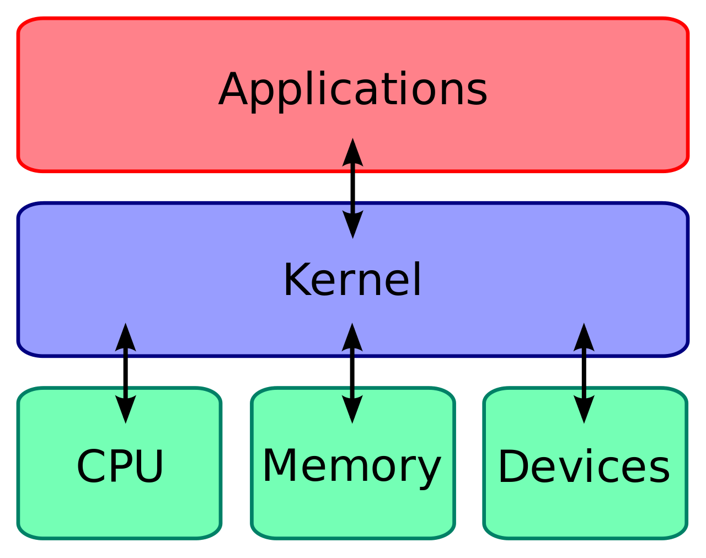
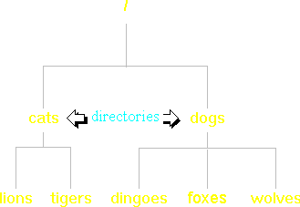
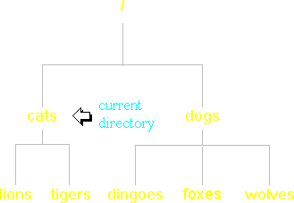
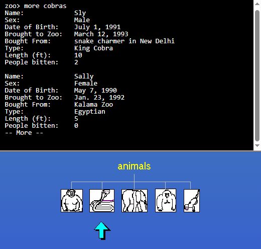
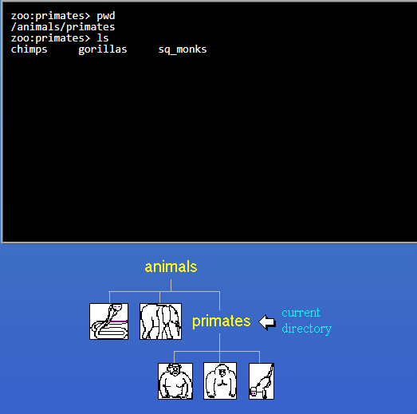
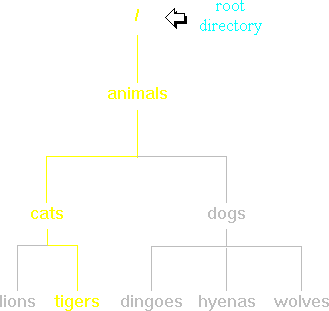
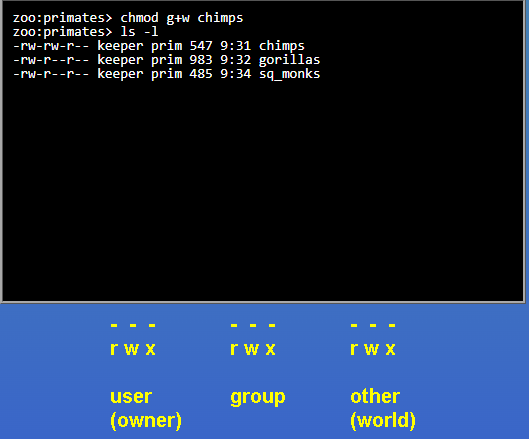
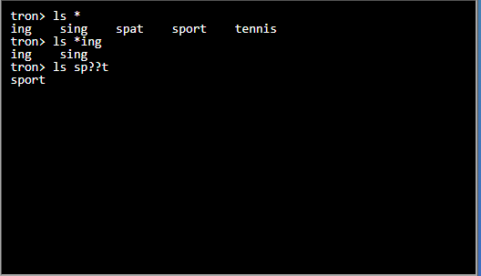

# Linux
Linux is a family of open-source, Unix-like operating systems based on the Linux kernel, first released by **Linus Torvalds (Founder of Linux)** on September 17, 1991. It is the most widely used open-source software project in the world, powering everything from smartphones and personal computers to the world's 500 fastest supercomputers.

- Check Linux Torvalds Github profile, [Github Link](https://github.com/torvalds)
- Check Torvalds working on Linux (Open Source), [Linux Github](https://github.com/torvalds/linux)

## Why need of New **Operating System**?

Linux was originally a personal "hobby" project started by **Linus Torvalds** in 1991. At the time, Torvalds was a 21-year-old computer science student at the **University of Helsinki** in Finland. 

### Key Origins of the Project 

-   **Inspiration**: Torvalds was frustrated with the licensing and limitations of **MINIX**, a Unix-like educational operating system. He wanted to create a free alternative specifically for his new Intel 80386-based PC.
-   **The "Hobby" Announcement**: He famously announced his work on the **comp.os.minix** newsgroup on August 25, 1991, stating it was "just a hobby, won't be big and professional like GNU".
-   **Collaboration with GNU**: While Torvalds created the **kernel** (the core engine), he used many existing tools from **Richard Stallman's** GNU Project to build a complete operating system.
-   **Relicensing for Growth**: A pivotal moment occurred in 1992 when Torvalds released the kernel under the **GNU General Public License (GPL)**, allowing developers worldwide to freely modify and distribute the code.

## Linux's Kernel

In Linux, the**kernel** is the core software that acts as a bridge between your computer's hardware and its software. It is the first program loaded when the system starts and remains in memory until the system is turned off. 

### Core Functions 
-   **Hardware Management**: It acts as a mediator, using **device drivers** to communicate with components like the CPU, memory, hard drives, and network cards.
-   **Memory Management**: The kernel decides how much RAM each program can use and prevents them from interfering with each other's data.
-   **Process Scheduling**: It manages "multitasking" by deciding which programs get to use the CPU and for how long.
-   **Security**: It creates a wall between "user space" (where your apps run) and "kernel space" (the protected area for core system tasks) to prevent a single app crash from taking down the whole system. 

### Key Characteristics 

-   **Monolithic Architecture**: Unlike some other kernels, Linux is "monolithic," meaning all main operating system services run in the same privileged memory space for maximum speed.
-   **Modular Design**: Even though it's monolithic, it is highly flexible; you can add or remove **kernel modules** (like new drivers) without having to reboot the entire system.
- **Programming Languages**: It is written primarily in **C** and **Assembly**, with initial support for **Rust** introduced in version 6.1.

### Ecosystem and Usage 

-   **Distributions**: The kernel is the "engine" inside "cars" like [Ubuntu](https://ubuntu.com/kernel), Fedora, and Debian.
-   **Ubiquity**: It powers nearly all of the world's **500 fastest supercomputers**, over **96% of top web servers**, and billions of **Android** devices.
-   **Source Access**: The official source code is hosted and distributed through [kernel.org](https://www.kernel.org/).

---



---

## Commands of Linux

In the world of `Cloud Native`, Linux has been using on every level/stage. Linux can also run on local so it will be beneficial to learn it
- Keep in mind that the operating system (OS) is a layer between your machine’s hardware and the software.
- To connect/communicate with software, we will use (Linux) commands.

> **There is a website to learn commands of Linux named [Linux Survival](https://linuxsurvival.com/)**. We are following Linux Survival app to learn Linux which divided in four modules, so we will follow the same:

### Module 1: Introduction
Linux Survival is a free tutorial designed to make it as easy as possible to learn Linux. Even though Linux has hundreds of commands, there are only about a dozen you need to know to perform most basic tasks. If you **`Ubuntu` (Linux Distribution)**.

Before we are following `Linux Survival`, there is an example given in it my the name `zoo`, so we will explore it as well

#### Directory
Before we explore the commands used to manipulate the **Linux environment**, we should take a quick look at the structure of the environment itself.
`Microsoft Windows users` will find the Linux file system to be a familiar structure because it is basically the same. You can think of a Linux file system as an upside-down tree. See the diagram to the right.
Okay, so it doesn't look a lot like a tree, but try to keep an open mind. In this diagram, dogs and cats are directories. Dogs contains three files, while cats contains two files.



#### List Directory
Probably the most often used command in Linux is the `"ls"` command. It is used to list the contents of a directory.

For example, if your current directory were `"cats"` and you wanted to see what it contained, you would type `"ls"`. The output would be the following:

```bash
    lions     tigers
```
Unlike many other operating systems, Linux is case-sensitive. In other words, if you type `"LS"` instead of **"ls"**, Linux will not recognize the command. This applies to filenames, like "lions" and "tigers", as well.



---

")

#### View File Content
Before we start moving the files around, let's take a look in one of them to see what it contains. We'll look at the cobras file to make sure it has the proper information in it.

The `"more"` command is used to view the contents of a file. For example, to see the contents of the "cobras" file, you would type

```bash
    more cobras
```
It is called **"more"** because after it has displayed a page of text, it pauses and puts "-- More --" at the bottom of the screen to let you know that there is more text yet to be shown. To see the next page of text, you just hit the spacebar.

---


---

#### Create Directory

Okay, it's time to start organizing our animal files. First, we'll create a directory under "animals" called "primates". The command to create a directory is "mkdir" which is short for "make directory".

For example, to make a directory named dogs, you would type

```bash
mkdir dogs
```

#### Move and Rename Directory
Now, let's move all of the primate files into our newly created directory.

To move a file, you just use the "mv" command. For example, to move a file called "wolves" into directory "dogs", you would type

```bash

    mv wolves dogs
```
Renaming files is simply a case of "moving" a file from one name to another. For example, to rename file "wolves" to "coyotes", you would type

```bash
    mv wolves coyotes
```

Let's start by moving "chimps" into the "primates" directory. Type the command to move file "chimps" into directory "primates".


#### Change Directory
Now, we want to go into the "primates" directory and admire our handiwork. To change directories, use the **"cd"** command, which stands for -- you guessed it -- "change directory".

For example, to change to directory "dogs", you would type

```bash
    cd dogs
```
At the "zoo>" prompt, type the command to change to directory "primates".


#### Get Current Location
Some people modify their personal Linux configuration so that whenever they change to another directory, the command prompt changes to reflect it. The prompt shown to the right is an example of one. It lists the **machine name first** (zoo), then a **':'**, and finally the **current directory** (primates). If you do not have this sort of configuration, then you will need to learn a command which tells you where you are in the directory structure.

To find out where you are, use the **"pwd"** command, which stands for "print working directory".

Type it at the command prompt to verify your current location. Then, at the second prompt, type the command which lists the contents of the current directory, so we can be sure that everything was moved into this directory properly.

---



---

Now that we know everything is as it should be, let's go back up one level to the "animals" directory to do some more organizing.

To change to your previous directory (also known as the "parent" directory), you need to use a special "argument" to the "cd" command. You would type

```bash
    cd ..
```
Wherever you see **".."**, it refers to the directory above your current directory.

In computer terms, the word `"argument"` does not refer to a disagreement, it refers to the `"thing"` which a command acts upon. In the example above, `".."` is the argument to the `"cd" command`. In this case, the `"thing"` is a directory.

You have actually been using arguments in most of the commands you have used so far. For example, in the `"more cobras"` command, `"cobras"` is the **argument** to the `"more" command`. The `"thing"` in this case is a **file**.

Note that you always have to put a space between a command and its argument. Windows Command Prompt users might find this irritating, since Windows does not have this requirement. So, for example, **Windows allows you to enter "cd..". Linux would give you an error message.**


### Module 2

#### PathName:

Now we have to take a time-out to explain "pathnames".

So far we have only been manipulating files that are in our current directory. But sometimes you might want to manipulate files that are not in your current directory. For example, you may be doing a lot of work in the "dogs" directory, but you remember that you wanted to rename "tigers" to "siberians". You could accomplish this by using these commands:

```bash
	cd ..
	cd cats
	mv tigers siberians
	cd ..
	cd dogs
	(continue working in "dogs")
```
That's an awful lot of work just to perform a simple task. Fortunately, there's a way to accomplish this task with only one command instead of five.

You can refer to a filename by its "pathname". This means that you specify what "path" to follow down the tree to find the file. The path to "tigers" is marked in yellow in the tree at the right. That path is represented like this:

```bash
	/animals/cats/tigers
```

We built this pathname by starting at the top of the tree with the "root" ('/') and adding "animals" to it. Then we added a "slash" ('/') every time we moved down the tree another level.

We can use this pathname to accomplish our task with only one command:
```bash
	mv /animals/cats/tigers
	     /animals/cats/siberians
```
---



---

Note that the command above would actually be on one line, but we don't have enough room for it on this narrow page.

Typing in a full pathname can be tedious, though, especially if you are a long way down the tree. That's why it is often easier to specify a "relative pathname". It is called "relative" because it specifies a filename relative to your current location, rather than from the root directory. If you don't put a '/' at the beginning of a pathname, then Linux knows that you are using a relative pathname. For example, if you were in the "animals" directory and you wanted to rename "tigers" to "siberians", you could do so with this command:

```bash
    mv cats/tigers cats/siberians
```
In this case, you specified your pathnames relative to the "animals" directory (your current directory), so you didn't need to include "animals" in them.

So far we haven't shown you how to use relative pathnames from the "dogs" directory, which was our current directory in the original example. There is a way to do it by using something we learned a few pages ago.

```bash
      mv ../cats/tigers ../cats/siberians
```

Recall that ".." refers to the directory above your current directory.

#### Copy File

We need to move "cobras" from the "reptiles" directory to the "snakes" directory, but out of paranoia, we're going to copy it and then remove the original file after we're sure that it was copied correctly. The copy command is "cp" and it has the same syntax as the "mv" command. For example:

```bash
    cp apples apples2
```
We're not in the "reptiles" directory, so you'll have to use a relative pathname in your copy command. Type the command to copy "cobras" from the "reptiles" directory to the "snakes" directory.

---


---

#### Remove File

Let's assume that you've checked the copy of "cobras" which is in the "snakes" directory and everything is okay. We should now remove the original "cobras" file in the "reptiles" directory. The remove command is "rm". For example, to remove file "platypus", you would type

```bash
	rm platypus
```

Type the command to remove the "cobras" file from the "reptiles" directory.

---


---

#### Remove Directory

Now we should remove the "reptiles" directory. The "remove directory" command is "rmdir". For example, to remove directory "fish", you would type

```bash
    rmdir fish
```
Type the command to remove directory "reptiles".

---


---

#### File Security

Now it's time to talk about security. Linux is a multi-user operating system, so it has security to prevent people from accessing each other's confidential files.

In our zoo, we don't want anyone to modify the primate files except for those workers who take care of the primates. It will take quite a bit of explanation before we can show you how to arrange this sort of security.

When you execute an **"ls" command**, you are not given any information about the security of the files, because by default `"ls"` only lists the names of files. You can get more information by using an "option" with the "ls" command. All options start with a `'-'`. For example, to execute `"ls"` with the "long listing" option, you would type

```bash
	ls -l
```
When you do so, each file will be listed on a separate line in long format. There is an example in the window on the right.

There are lots of other options you can use with the ls command, but we won't need them to accomplish our goals at the zoo.

---


---

There's a lot of information in those lines (and we've even simplified things for clarity).

- The `first character` will almost always be either a **'-', which means it's a file**, or **a 'd', which means it's a directory**. In our example, all three of them are files.
- The next nine characters `(rw-r--r--)` show the security; we'll talk about them on the next page.
- The next column shows the `owner` of the file. In our imaginary zoo, your UserID is `"keeper"`.
- The next column shows the `group owner` of the file. Recall that we want to give the `"prim"` group of people special access to these files.
- The next column shows the `size` of the file in bytes.
- The next column shows the `time the file was last modified` (in reality, it would also show the date).
- And, of course, the final column gives the `filename`.

---


---

Deciphering the security characters will take a bit more work.

- First, you must think of those nine characters as three sets of three characters. Each of the three **"rwx"** characters refers to a different operation you can perform on the file.
    - The **'r'** means you can `"read"` the file's contents.
    - The **'w'** means you can `"write"`, or modify, the file's contents.
    - The **'x'** means you can `"execute"` the file. This permission is given only if the file is a program.
    - If any of the **"rwx"** characters is replaced by a `'-'`, then that permission has been `revoked`.

> **-rw-r--r--** 
    >> first `-` is represent a file, if `d` is present then it's a director, plus permission are given in sequence it means first will be **read** then **write** then **excute** which make `rwx`
    >>> - then we have first set of three characters `rw-`, owner permission
    >>> - then we have second set `r--`, group permision
    >>> - then we have third set `r--`, user permissionwho has UserID on Linux system
    >>> - if `-` replace any of the character then it means permission revoke.

For example, the **owner's permissions** for our three primate files are "rw-". This means that the owner of the file ("keeper", i.e. you) can "read" it (look at its contents) and "write" it (modify its contents). You cannot execute it because it is not a program; it is a text file.

Members of the **group "prim"** can only read the files ("r--"). We want to change the second permission character from '-' to 'w' so that those people can modify the contents of these files as well.

The final three characters show the permissions allowed to anyone who has a **UserID on this Linux system**. We prefer to refer to this set as "world". Our three primate files are "world-readable", that is, anyone in our Linux world can read their contents, but they cannot modify the contents of the files. This is the way we want to leave it.

#### Change File Permission

The command you use to change the security permissions on files has a horribly cryptic name. It's called **"chmod"**, which stands for `"change mode"`, because the nine security characters are collectively called the `security "mode"` of the file.

Now it will become clear why we named the three `"rwx"` sets `"user"`, `"group"`, and `"other"`. The first argument you give to the `"chmod"` command is **'u', 'g', 'o', or a combination of them** which specifies which of the three "rwx" sets you want to modify. For example, if you want to give "execute" permission to the world ("other") for file "gorillas", you would start by typing

```bash
    chmod o
```
Now you would type a '+' to say that you are "adding" a permission.

```bash
    chmod o+
```

Then you would type an 'x' to say that you are adding "execute" permission.

```bash
    chmod o+x
```
Finally, specify which file you are changing.

```bash
    chmod o+x gorillas
```
You can also change multiple permissions at once. For example, if you want to take all permissions away from everyone, you would type

```bash
    chmod ugo-rwx gorillas
```
Type the command to give "write" permission to the prim "group" for file "chimps".

---



---

#### Wildcards

A wildcard allows you to specify more than one file at the same time. The **`*`** matches any number of characters. For example, if you want to execute a command on all files in the current directory, you would specify **`*`** as the filename. If you want to be more selective and match only files which end in `"ing"`, you would use **`*ing`**. Note that the **`*`** can even match zero characters, so **`*ing`** would match **ing** as well as **sing**.

The other wildcard, **`?`**, is not used very often, but it can be useful. It matches exactly one character. For example, if you want to match "sport", but not `"spat"`, you would use **`"sp??t"`**. The first **'?'** matches the **'a'** in "spat", but the second **'?'** can't match anything, so `"spat"` fails.

---



---

#### Groups Memberships
The default Linux security model is a bit inflexible. To give special access (such as modification privileges) to a group of people, you have to get your system administrator to create a group with those people in it. Furthermore, if you would like to give a different set of access privileges (such as read access) to another group of people, you can't do it because you can only assign one group owner per file or directory. To solve this problem, you can use ACLs (Access Control Lists), a topic which is beyond the scope of this tutorial.

While we're on the subject of groups, we should see which groups you're in. To get a listing of your group memberships, type

```bash
	groups
```
Try it at the command prompt.

**Glossary of Command in Linux**
1. **ls**: lists the contents of a directory (files and folders). By default, it shows the contents of the current directory.
2. **mkdir:** creates a new directory (folder).
3. **cd:** changes the current working directory to another directory.
4. **more:** command is used to view the contents of a file
5. **mv:** moves files or directories from one location to another. It is also used to rename files or directories.
6. **pwd:** command, which stands for "print working directory
7. **cd ..:** change to your previous directory (also known as the "parent" directory)
8. **cp:** copies files or directories from one location to another.
9. **rm:** deletes files or directories.
10. **rmdir:** removes empty directories only.
11. **ls -l:** lists directory contents in long format. It shows permissions, owner, group, size, and last modification time.
12. **chmod:** changes the permissions of a file or directory. It controls read (r), write (w), and execute (x) access for users, groups, and others.
13. **ls `*`** lists all files and directories in the current directory using a wildcard. The `*` matches any sequence of characters.
14. **groups:** displays the groups a user belongs to. By default, it shows the groups of the current user.