# Kubernetes

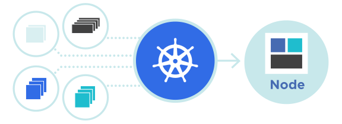

## Table of Contents
- [Planet scale](#planet-scale)
- [Never outgrow](#never-outgrow)
- [Run K8s anywhere](#run-k8s-anywhere)
- [Brief history of Kubernetes](#brief-history-of-kubernetes)
  - [1. Internal Origins at Google (2003–2013)](#1-internal-origins-at-google-20032013)
  - [2. The Birth of "Project Seven" (2014)](#2-the-birth-of-project-seven-2014)
  - [3. Stability and Open Governance (2015)](#3-stability-and-open-governance-2015)
  - [4. The "Orchestrator Wars" & Dominance (2016–2018)](#4-the-orchestrator-wars--dominance-20162018)
  - [5. Modern Era (2020–Present)](#5-modern-era-2020present)
- [Where things get tricky...](#where-things-get-tricky)
  - [This is where Kubernetes comes to the rescue! 🚀](#this-is-where-kubernetes-comes-to-the-rescue-)
  - [Then Came Containers 🚢](#then-came-containers-)
- [The Problem Kubernetes Solves 🧠](#the-problem-kubernetes-solves-)
  - [The Growing Headache of Managing Containers 💡](#the-growing-headache-of-managing-containers-)
  - [Cloud-Managed Services Helped... But Only Up To a Point 🧑‍💻](#cloud-managed-services-helped-but-only-up-to-a-point-)
  - [Kubernetes: Smarter, Leaner, and More Flexible 💪](#kubernetes-smarter-leaner-and-more-flexible-)
  - [Kubernetes Lets You Customize Everything](#kubernetes-lets-you-customize-everything)
- [Kubernetes Components](#kubernetes-components)
  - [Control Plane Components](#control-plane-components)
  - [Worker / Node Components](#worker--node-components)
  - [Common Add-ons / Core Extensions](#common-add-ons--core-extensions)
  - [How They Connect Together](#how-they-connect-together)
- [MiniKube](#minikube)
- [Kubectl](#kubectl)
  - [Key Features and Usage](#key-features-and-usage)
  - [Common Commands](#common-commands)
- [How Kubernetes Works — Components of a Kubernetes Environment 🧑‍🔧](#how-kubernetes-works--components-of-a-kubernetes-environment-)
  - [1️⃣ Cluster 🏰](#1️⃣-cluster-)
  - [2️⃣ Master Node (Control Plane) 👑](#2️⃣-master-node-control-plane-)
  - [3️⃣ API Server 💌](#3️⃣-api-server-)
  - [4️⃣ Scheduler 📅](#4️⃣-scheduler-)
  - [5️⃣ Controller Manager 🎛️](#5️⃣-controller-manager-)
  - [6️⃣ etcd 📚](#6️⃣-etcd-)
  - [7️⃣ Worker Nodes 💪](#7️⃣-worker-nodes-)
  - [8️⃣ Kubelet 📢](#8️⃣-kubelet-)
  - [9️⃣ Kube Proxy 🚦](#9️⃣-kube-proxy-)
- [Kubernetes Workloads 🛠️ — Pods, Deployments, Services, & More](#kubernetes-workloads-️--pods-deployments-services--more)
  - [1️⃣ Pods](#1️⃣-pods)
  - [2️⃣ Deployments](#2️⃣-deployments)
  - [3️⃣ Services](#3️⃣-services)
  - [4️⃣ ReplicaSets](#4️⃣-replicasets)
  - [5️⃣ DaemonSets](#5️⃣-daemonsets)
  - [6️⃣ StatefulSets](#6️⃣-statefulsets)
  - [7️⃣ Jobs](#7️⃣-jobs)
  - [8️⃣ CronJobs](#8️⃣-cronjobs)

Kubernetes, also known as K8s, is an open source system for automating deployment, scaling, and management of containerized applications.

### Planet scale
Designed on the same principles that allow Google to run billions of containers a week, Kubernetes can scale without increasing your operations team.

### Never outgrow
Whether testing locally or running a global enterprise, Kubernetes flexibility grows with you to deliver your applications consistently and easily no matter how complex your need is.

### Run K8s anywhere
Kubernetes is open source giving you the freedom to take advantage of `on-premises (on-prem)`, `hybrid`, or `public cloud infrastructure`, letting you effortlessly move workloads to where it matters to you.
- You can run K8s anywhere like on Respberry Pi, on your system, on cloud like AWS, Azure, GCP, etc.

---
## Brief history of Kubernetes
Kubernetes traces its roots back to internal Google systems and has evolved into the global standard for container orchestration over the last decade.

### 1. Internal Origins at Google (2003–2013)

Before it was a public project, Google managed its massive global infrastructure using an internal cluster manager called **Borg**.

-   **Borg (2003–2004):** Designed to manage hundreds of thousands of jobs across massive clusters. Many core Kubernetes concepts—like **Pods**, **Services**, and **Labels**—originated here. Borg is made to manage containerized applications.
-   **Omega (2013):** A second-generation system that improved upon Borg’s flexibility and scalability.

### 2. The Birth of "Project Seven" (2014)

In 2013, Google engineers **Joe Beda, Brendan Burns, and Craig McLuckie** recognized the need for an open-source orchestrator as Docker popularized containers.

-   **Codename:** It was originally called `"Project Seven of Nine"` (a reference to a _Star Trek_ ex-Borg character).
-   **Logo:** The seven-spoked ship's wheel logo is a lingering tribute to this original codename.
-   **First Commit:** The first code was pushed to [GitHub](https://github.com/kubernetes/kubernetes) on **June 6, 2014**.

### 3. Stability and Open Governance (2015)

-   **Version 1.0:** Released on **July 21, 2015**, marking it as production-ready.
-   **CNCF Donation:** Simultaneously, Google partnered with the Linux Foundation to form the [Cloud Native Computing Foundation (CNCF)](https://www.cncf.io/) and donated Kubernetes as its seed technology to ensure vendor-neutrality.

### 4. The "Orchestrator Wars" & Dominance (2016–2018)

During this period, Kubernetes competed with **Docker Swarm** and **Apache Mesos** for dominance.

-   **2017 Turning Point:** Major industry players, including Microsoft (AKS), [AWS (EKS)](https://aws.amazon.com/), and even Docker itself, announced native support for Kubernetes.
-   **Graduation:** In 2018, Kubernetes became the first project to "graduate" from the CNCF, signifying its full maturity.

### 5. Modern Era (2020–Present)

Kubernetes is now the de facto industry standard, with a focus on stability and specialized workloads.

-   **Storage & State:** Introduction of the **Container Storage Interface (CSI)** simplified running databases and stateful apps.
-   **Refinement:** Recent updates (like **v1.24** in 2022) removed legacy components like "Dockershim" to streamline the internal architecture.

**[Learn Kubernetes – Full Handbook for Developers, Startups, and Businesses by free Code Camp](https://www.freecodecamp.org/news/learn-kubernetes-handbook-devs-startups-businesses/)**

---
## Where things get tricky...
When you have dozens (or even hundreds) of microservices, managing them becomes a nightmare. You might need to:
-   **Deploy** each one separately
-   **Monitor** them individually (to ensure they don’t crash/become slow due to too much load)
-   **Scale** them (make them bigger to handle more users) as traffic surges, one by one
So, if your banking app suddenly gets millions of users, you'd have to manually tweak and update each microservice to keep it running smoothly. 😖 It’s a lot of work, and if something goes wrong, you’re in deep trouble.

### This is where Kubernetes comes to the rescue! 🚀

Kubernetes is like a super-efficient manager for all these microservices. It’s a platform that helps you:
-   **Automate** the deployment (getting the apps up and running)
-   **Scale** the microservices (making them bigger or smaller as needed based on the inflow of traffic – your customers)
-   **Monitor** them (keeping an eye on their health)
-   **Ensure reliability** (so if one microservice breaks/fails, k8s replaces it immediately)
In simple terms, Kubernetes takes all your little microservices and organizes them, ensuring they run smoothly together, no matter how much traffic your app gets. It handles everything behind the scenes, like a conductor leading an orchestra, so your microservices work together without chaos.

### Then Came Containers 🚢
A more modern solution that eased the pain (a little) was using containers.
**So, what are containers?**
Think of a container like a lunchbox for your microservice. Instead of installing the microservice and its supporting tools directly on a server, you pack everything it needs – code, settings, software libraries – into this single, neat container. Wherever the container goes, the microservice runs exactly the same way. No surprises!
Tools like [Docker](https://www.docker.com/) made this super easy. Once your microservice was packed into a container, you could deploy it on:
-   A single server
-   Multiple servers
-   Or cloud platforms like AWS Elastic Beanstalk, Azure App Service, or Google Cloud Run.

## **The Problem Kubernetes Solves** 🧠

At first, when containers arrived on the scene, it felt like developers had struck gold.

You could package a microservice into a neat little container and run it anywhere – no more installing the same software on every server again and again. Tools like Docker and Docker Compose made this smooth for small projects.

But the real world? That’s where it got messy.

### The Growing Headache of Managing Containers 💡

When you have just a few microservices, you can manually deploy and manage their containers without much stress. But when your app grows – and you suddenly have dozens or even hundreds of microservices – managing them becomes an uphill battle:

-   You had to deploy each container manually.
    
-   You had to restart them if one crashed.
    
-   You had to scale them one by one when more users started flooding in.
    

Docker and Docker Compose were great for a small playground or startups, but not for an enterprise application with high traffic inflow.

### Cloud-Managed Services Helped... But Only Up To a Point 🧑‍💻

Cloud services like AWS Elastic Beanstalk, Azure App Service, and Google Code Engine offered a shortcut. They let you deploy containers without worrying about setting up servers.

You could:

-   Deploy each container on its own managed cloud instance.
    
-   Scale them automatically based on traffic.
    

BUT there were still some big headaches:

#### 📦 Grouping microservices was awkward and expensive

Sure, you could organize containers by environment (like “testing” or “production”) or even by team (like “Finance” or “HR”). But each new microservice usually needed its own cloud instance – for example, a separate Azure App Service or Elastic Beanstalk environment FOR EVERY SINGLE CONTAINER.

Imagine this:

-   Each App Service instance costs ~$50 per month.
    
-   You’ve got 10 microservices.
    
-   That’s $500/month... even if they’re barely used. 💸 Yikes!
    

### Kubernetes: Smarter, Leaner, and More Flexible 💪

With Kubernetes, you don’t need to spin up a separate server for each microservice. You can start with just one or two servers (VMs) – and Kubernetes will automatically decide which container goes where based on available space and resources.

No stress, no waste! 💡

### 🧑‍🍳 **Kubernetes Lets You Customize Everything**

1.  You can assign resources to each microservice container.  
    👉 Example: If you have a "Payment" microservice that’s lightweight, you might give it 0.5 vCPUs and 512MB of memory. If you have a "Data Analytics" microservice that’s resource-hungry, you could give it 2 vCPUs and 4GB of memory.
    
2.  You can set a minimum number of instances for each microservice.  
    👉 Example: If you want at least 2 copies of your "Login" service always running (so your app doesn’t break if one fails), Kubernetes makes sure you always have 2 live copies at all times.
    
3.  You can group your containers however you like:  
    👉 By teams (Finance, HR, DevOps) or by environments (Testing, Staging, Production). Kubernetes makes this grouping super clean and logical.
    
4.  You can automatically scale individual containers.  
    👉 When more users flood your app, Kubernetes can create extra copies (called “replicas”) of only the containers that are under pressure. No more wasting resources on containers that don’t need it.
    
5.  You can even scale your servers!  
    👉 Kubernetes can automatically increase the number of servers (VMs) in your environment – called a **Cluster** – when traffic grows. So you could start with 2 VMs at $30 each ($60/month) and let Kubernetes add more servers only when necessary, rather than locking yourself into high fixed costs like $500/month for cloud-managed services.
    

Also, Kubernetes works **the same way everywhere**. Whether you deploy your containers on AWS, Google Cloud, Azure, or even your own laptop – Kubernetes doesn’t care. Your setup stays the same.

Compare that to managed services like Elastic Beanstalk or Azure App Service – which tie you to their platform, making it super hard to switch later.

✅ **In short:** Kubernetes saves you money, time, and a whole lot of headaches. It lets you run, scale, and organize your microservices without being chained to a single cloud provider — and without drowning in manual work.

### Kubernetes Components

#### 🧠 **Control Plane Components**

These components make cluster-wide decisions and maintain the overall desired state of the system.

1.  **kube-apiserver**  
    The central management endpoint of Kubernetes — exposes the REST API that all other components use to communicate. 
    
2.  **etcd**  
    A distributed, consistent key/value store that acts as the _source of truth_ for all Kubernetes cluster state data.
    
3.  **kube-scheduler**  
    Watches for newly created Pods without a node and assigns them to appropriate worker nodes based on resources & policies.
    
4.  **kube-controller-manager**  
    Runs various controllers (e.g., Node, Deployment, Job) that reconcile cluster state to the desired configuration.
    
5.  **cloud-controller-manager** _(optional)_  
    Integrates Kubernetes with cloud provider APIs for managing load balancers, storage, and node lifecycle.

#### 🧱 **Worker / Node Components**

These run on every worker node and manage containers & networking.

6.  **kubelet**  
    An agent that runs on each node, ensures the containers defined in PodSpecs are running and healthy.
    
7.  **kube-proxy**  
    Implements networking rules (service abstraction) on each node — forwards traffic to the right Pods.
    
8.  **Container Runtime**  
    Software responsible for running containers (e.g., containerd, CRI-O).

#### 🧩 **Common Add-ons / Core Extensions**

These aren’t “required” components but are usually present in real clusters:

9.  **CoreDNS (cluster DNS)**  
    Provides DNS resolution for services and Pods within the cluster.
    
10.  **Dashboard / Web UI**  
    A web interface for managing and inspecting applications & cluster state.
    
11.  **Monitoring & Logging Add-ons**  
    Tools like Prometheus (metrics) and Fluentd (logs) collect observability data.

### 🧠 How They Connect Together

Here’s the high-level interaction flow in a cluster:

1.  **Clients** (such as `kubectl` or automation tools) send requests to the **API Server**.
    
2.  The **API Server** is the hub: it reads/writes data to **etcd** and communicates with all other control plane components.
    
3.  The **Scheduler** assigns Pods to nodes; controllers in the **Controller Manager** create or fix objects to match desired state.
    
4.  On each **Worker Node**, the **kubelet** watches for assigned Pods and instructs the **container runtime** to launch containers.
    
5.  **kube-proxy** manages network traffic so services can find Pods across nodes.

---

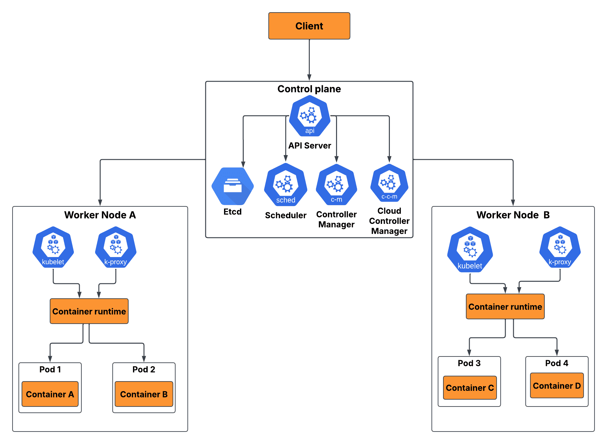

### MiniKube
In the Kubernetes ecosystem, **Minikube** is **an open-source tool that sets up a single-node Kubernetes cluster on your local machine**. It is primarily designed for developers to test applications locally and for beginners to learn Kubernetes concepts without needing expensive cloud resources.

[MiniKube Official Website](https://minikube.sigs.k8s.io/docs/)

---

---

### Kubectl
**kubectl** is the command-line interface (CLI) for managing **Kubernetes** clusters. It allows you to communicate with the Kubernetes API server to deploy applications, inspect resources, and troubleshoot issues.

[Kubectl Official Website](https://kubernetes.io/docs/reference/kubectl/overview/)

#### Key Features and Usage

-   **Resource Management**: Perform CRUD (Create, Read, Update, Delete) operations on cluster resources like pods, services, and deployments.
-   **Interactivity**: Execute commands inside containers with `kubectl exec` or view real-time logs with `kubectl logs`.
-   **Cross-Platform**: Compatible with **Linux**, **macOS**, and **Windows**.
-   **Configuration**: Uses a **kubeconfig** file (defaulting to `$HOME/.kube/config`) to store authentication and cluster connection details.

#### Common Commands

1.  `kubectl get pods`: Lists all pods in the current namespace.
2.  `kubectl apply -f [filename]`: Creates or updates resources defined in a YAML or JSON file.
3.  `kubectl describe [resource] [name]`: Shows detailed information about a specific resource.
4.  `kubectl delete [resource] [name]`: Removes a resource from the cluster.

## **How Kubernetes Works — Components of a Kubernetes Environment** 🧑‍🔧

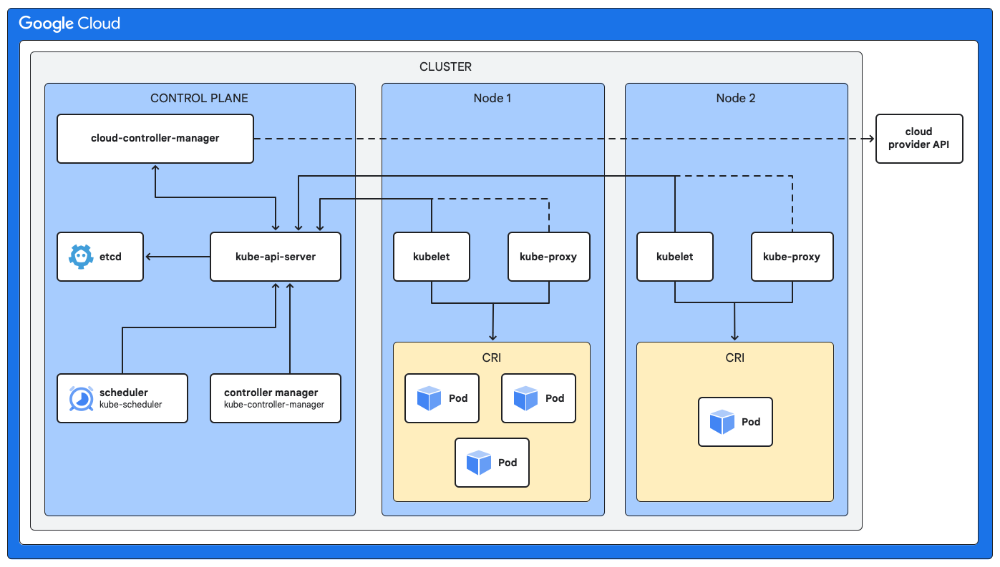

So by now you’ve seen the problem: running dozens (or hundreds!) of microservices manually is like juggling too many balls – you’re bound to drop some.

That’s why Kubernetes was created. But... how does it actually do all this magic? Let’s first break it down with the technical definition (simple but sharp – perfect for interviews) and then the layperson’s analogy (so it sticks in your head!).

### 1️⃣ **Cluster 🏰**

A Kubernetes Cluster is the entire setup of machines (physical or cloud-based) where Kubernetes runs. It’s made of one or more `Master Nodes (Control Plane)` and `Worker Nodes`, working together to deploy and manage containerized applications.

Think of a Kubernetes Cluster as your entire playground. This is the environment where all your microservices live, grow, and play together.

A cluster is made up of two types of computers (called nodes):

-   `Master Node` (nowadays often called the Control Plane)
-   `Worker Nodes`

### 2️⃣ **Master Node (Control Plane) 👑**

The Master Node is like the brain of Kubernetes. It manages and coordinates the whole cluster – deciding which applications run where, monitoring health, and scaling things up or down as needed.

It’s like the boss of the entire cluster. It doesn’t run your applications directly. Instead, it:

-   Watches over the worker nodes
-   Decides which microservice (container) goes where
-   Makes sure everything runs smoothly and fairly

Think of it like a factory manager who tells machines what to do, when to start, when to stop, and where to send the next package.

Inside the Master Node are a few clever mini-components that handle the real work.

### 3️⃣ **API Server 💌**

The API Server is the front door to Kubernetes. It handles communication between users and the system, taking commands and feeding them into the cluster.

This is where you (or your team) give Kubernetes instructions. Whether you're deploying a new app or scaling an existing one, you "talk" to the API Server first. It's like submitting a request at the front desk – the API server passes it on to the right people (or machines).

### 4️⃣ **Scheduler 📅**

The Scheduler assigns Pods (applications) to Worker Nodes based on available resources and needs.

Imagine you’ve asked Kubernetes to launch a new microservice. The Scheduler checks:

-   Which worker node has enough space?
-   Which node has enough memory and CPU?
-   Where would this service run best?

It makes the decision and assigns the microservice to the perfect spot. Smart, huh?

### 5️⃣ **Controller Manager 🎛️**

The Controller Manager runs controllers that watch over the cluster and ensures that the system’s actual state matches the desired state.

This component watches over the system like a hawk. Let’s say you told Kubernetes:  
_"Hey, I want 3 copies of my payment microservice running at all times."_

If one of them crashes, the Controller Manager sees that and spins up a new one to replace it automatically. It makes sure the reality always matches the plan.

### 6️⃣ **etcd 📚**

etcd is Kubernetes' memory – a distributed key-value store where cluster data is saved: config files, state, and metadata.

Imagine a notebook where all rules, records, and plans are written down. Without etcd, Kubernetes would forget everything.

### 7️⃣ **Worker Nodes 💪**

Worker Nodes are the servers that run the actual application containers, doing the heavy lifting in the cluster.

These are the machines where your microservices actually live and run. The Master Node gives orders, but the Worker Nodes do the heavy lifting – they run your containers!

Each worker node has a few helpers to manage its microservices:

-   The Kubelet
-   The Kube Proxy    

### 8️⃣ **Kubelet 📢**

The Kubelet is the agent which lives on each Worker Node that makes sure containers are healthy and running as expected.

It listens to the Master Node’s instructions. If the Master Node says:_"Hey, run this container!",_ the Kubelet makes it happen and keeps it running. If something goes wrong, the Kubelet reports back to the Master Node

### 9️⃣ **Kube Proxy 🚦**

Kube Proxy handles network traffic, ensuring that Pods can talk to each other and to the outside world.

Imagine your banking app’s login service needs to talk to the payments service. The Kube Proxy handles the routing so the request reaches the right place. It also handles load balancing, so no single microservice gets overwhelmed.

## Kubernetes Workloads 🛠️ — Pods, Deployments, Services, & More

Kubernetes workloads are the objects you use to manage and run your applications. Think of them as blueprints 📐 that tell Kubernetes **what** to run and **how** to run it – whether it’s a single app container, a group of containers, a database, or a batch job. Here are some of the workloads in Kubernetes:

### 1️⃣ **Pods**

A **Pod** is the smallest and simplest unit in the Kubernetes object model. It represents a single instance of a running process in your cluster and can contain one or more containers that share storage and network resources. ​

Think of a Pod as a wrapper around one or more containers that need to work together. They share the same network IP and storage, allowing them to communicate easily and share data. Pods are ephemeral (live for a short time, they can be replaced very easily). If a Pod dies, Kubernetes can create a new one to replace it almost instantly.​

Say you have an application which is split into 2 distributed monoliths – a frontend and a backend. The frontend will run in a container in Pod A, while the backend app will run in a container in another Pod B.

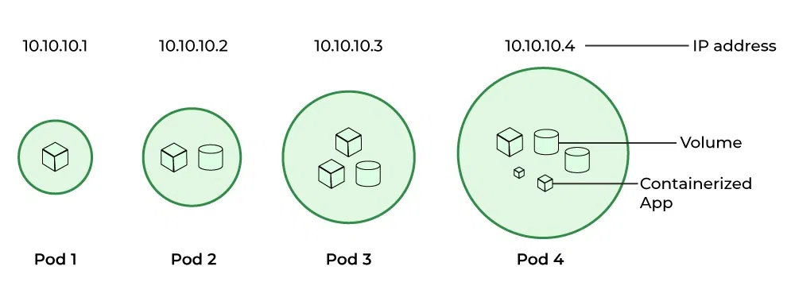

### 2️⃣ **Deployments**

A **Deployment** provides declarative updates for Pods and ReplicaSets. You describe a desired state in a Deployment, and the Deployment Controller changes the actual state to the desired state at a controlled rate.

Deployments manage the lifecycle of your application Pods. They ensure that the specified number of Pods are running and can handle updates, rollbacks, and scaling. If a Pod fails, the Deployment automatically replaces it to maintain the desired state.​

Imagine you're managing a store. A Deployment is like the store manager – you tell it how many workers (Pods) you want, and it makes sure they’re always present. If one doesn't show up for work, the manager finds a replacement automatically. You can also tell it to hire more workers or fire some when needed.

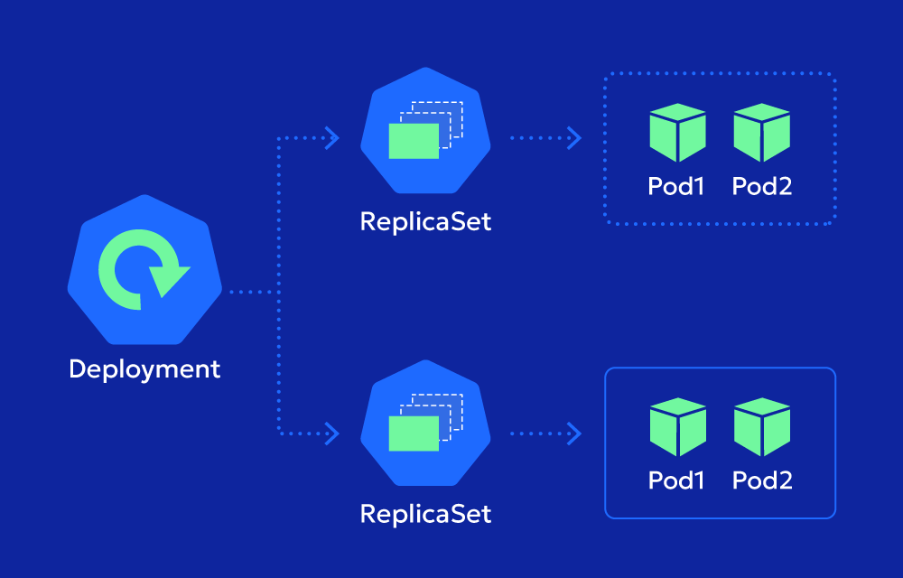

### 3️⃣ **Services**

A **Service** in Kubernetes defines a way to access/communicate with Pods. Services enable communication between different Pods (for example, your frontend Pod A can communicate with your backend Pod B via a service) and can expose your application to external traffic (for example the public internet). ​

Services act as a stable endpoint to access a set of Pods. Even if the underlying Pods change, the Service's IP and DNS name remain constant, ensuring communication between the Pods within the cluster or with the internet.

A Service is like the front door to your app. No matter which worker (Pod) is behind it, people always use the same entrance to access it. It hides the messy stuff happening behind the scenes and gives users a simple way to connect to your app.

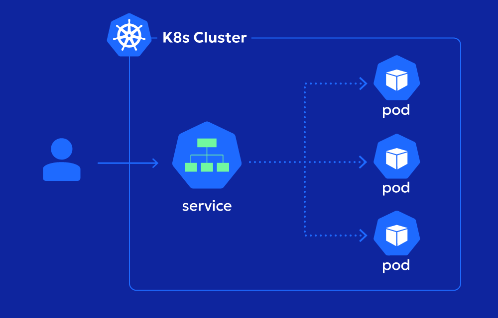

### 4️⃣ **ReplicaSets**

A **ReplicaSet** ensures that a specified number of identical Pods are running at any given time. It is often used to guarantee the availability of a specified number of Pods (horizontal scaling). ​

ReplicaSets maintain a stable set of running Pods. If a Pod crashes or is deleted, the ReplicaSet automatically creates a new one to replace it, ensuring your application remains available.​

Think of a ReplicaSet like a robot that counts how many copies of your app are running. If one goes missing, it automatically makes a new one. It keeps the number steady, just like you told it to.

### 5️⃣ **DaemonSets**

A **DaemonSet** ensures that all (or some) Nodes run an instance (a copy) of a specific Pod. As nodes are added to the cluster, Pods are added to them. As nodes are removed from the cluster, those Pods are also removed. ​

DaemonSets are used to deploy a Pod on every node in the cluster. This is useful for running background tasks like log collection or monitoring agents on all nodes (for example to get the CPU, memory, and disk usage of each node).​

A DaemonSet is like saying, “I want this helper app to run on **every single computer** we have.” As mentioned earlier, it’s great for things like log collectors or security checkers – small helpers that every machine should have.

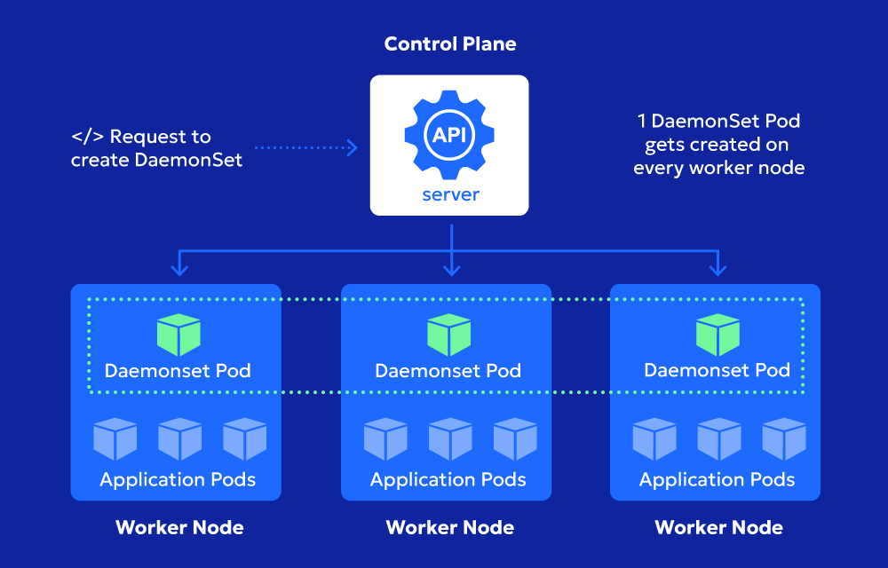

### 6️⃣ **StatefulSets**

A **StatefulSet** is the workload API object used to manage stateful applications (applications that store data, for example in their filesystem – databases). It manages the deployment and scaling of a set of Pods and provides guarantees about the ordering and uniqueness of these Pods.

StatefulSets are designed for applications that require persistent storage and stable network identities, like databases.

Let’s say you’re running a database or anything that needs to save info. A StatefulSet is like giving each app a name tag and a personal drawer to store their stuff. Even if you restart them, they come back with the same name and same drawer.

---

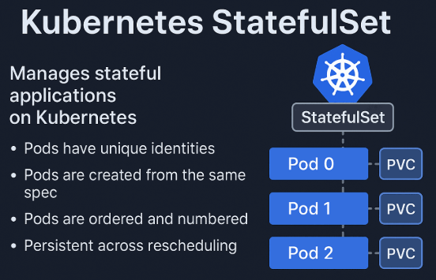

---

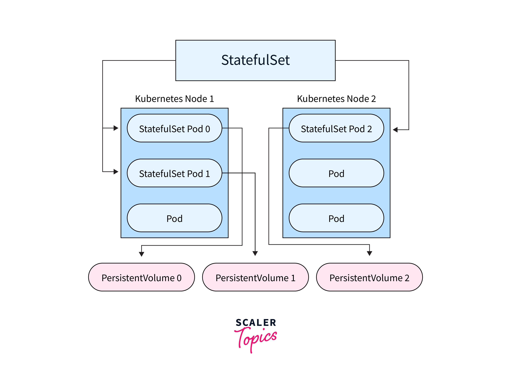

---

### 7️⃣ **Jobs**

A **Job** creates one or more Pods and ensures that a specified number of them successfully terminate. As Pods successfully complete, the Job tracks the successful completions. When a specified number of successful completions is reached, the Job is complete. ​

A Job is like a one-time task. Imagine sending out a batch of emails or processing a report. You want the task to run, finish, and then stop. That’s exactly what a Job does.

---

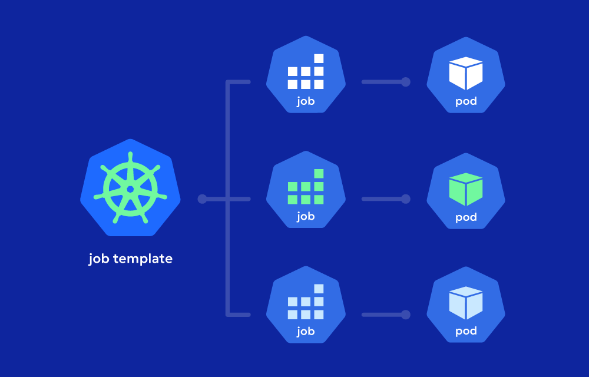

---

### 8️⃣ **CronJobs**

A **CronJob** creates Jobs on a time-based schedule. It runs a Job periodically on a given schedule, written in Cron format.

A CronJob is like setting a reminder or alarm. It tells your app (in this case the Job) to do something every night at 2 AM, every Monday morning, or once a month – whatever schedule you give it.

---

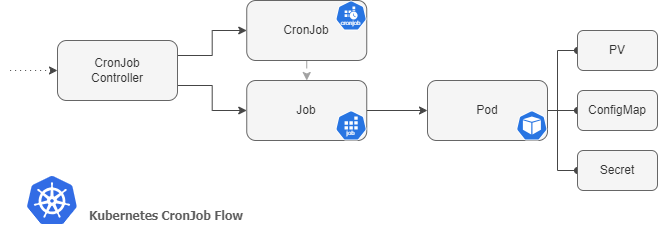

---