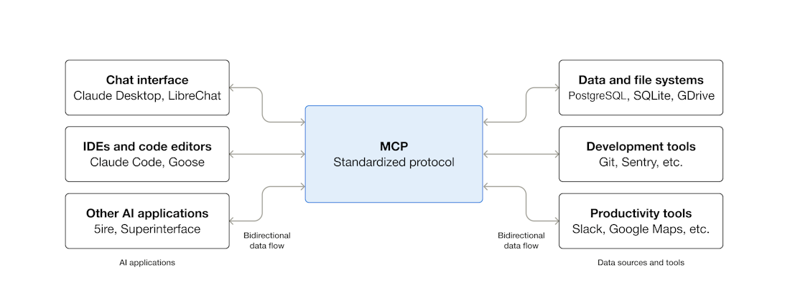
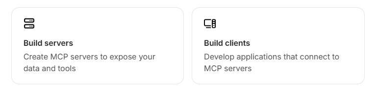

# What is the Model Context Protocol (MCP)?
MCP (Model Context Protocol) is an open-source standard for connecting AI applications to external systems. 
Using MCP, AI applications like Claude or ChatGPT can connect to data sources (e.g. local files, databases), tools (e.g. search engines, calculators) and workflows (e.g. specialized prompts)—enabling them to access key information and perform tasks.
Think of MCP like a USB-C port for AI applications. Just as USB-C provides a standardized way to connect electronic devices, MCP provides a standardized way to connect AI applications to external systems.



In October 2022, `LangChain` was first introduced by Harrison Chase as one of the first frameworks to provide prebuilt components for building AI Native systems.
These components include:
- APIs of AI providers (like OpenAI, Anthropic (Claude), Google (Gemini))
- Specialized Databases (like Vector DB)
- Specialized patterns to build AI native products (like RAG)

In November 2024, `MCP` (Model Context Protocol) was introduced by Anthropic (announced on November 25, 2024)
- They highlighted the common problem of fragmented integrations — every new data source or tool required a custom connector, and data in systems like RAG was often static
- **MCP provides a standardized, open-source protocol for connecting AI models to external tools (APIs, Servers, Databases, etc.), data sources, and workflows in real time**

## What can MCP enable?
- Agents can access your Google Calendar and Notion, acting as a more personalized AI assistant.
- Claude Code can generate an entire web app using a Figma design.
- Enterprise chatbots can connect to multiple databases across an organization, empowering users to analyze data using chat.
- AI models can create 3D designs on Blender and print them out using a 3D printer.

## Why does MCP matter?
Depending on where you sit in the ecosystem, MCP can have a range of benefits.
- **Developers**: MCP reduces development time and complexity when building, or integrating with, an AI application or agent.
- **AI applications or agents**: MCP provides access to an ecosystem of data sources, tools and apps which will enhance capabilities and improve the end-user experience.
- **End-users**: MCP results in more capable AI applications or agents which can access your data and take actions on your behalf when necessary.

## Start Building



- Lower level system -> It means your PC

## Architecture overview

This overview of the Model Context Protocol (MCP) discusses its scope and core concepts, and provides an example demonstrating each core concept.

Because MCP SDKs abstract away many concerns, most developers will likely find the data layer protocol section to be the most useful. It discusses how MCP servers can provide context to an AI application.

For specific implementation details, please refer to the documentation for your language-specific SDK.

## Scope

The Model Context Protocol includes the following projects:

-   [MCP Specification](https://modelcontextprotocol.io/specification/latest): A specification of MCP that outlines the implementation requirements for clients and servers.
-   [MCP SDKs](https://modelcontextprotocol.io/docs/sdk): SDKs for different programming languages that implement MCP.
-   **MCP Development Tools**: Tools for developing MCP servers and clients, including the [MCP Inspector](https://github.com/modelcontextprotocol/inspector)
-   [MCP Reference Server Implementations](https://github.com/modelcontextprotocol/servers): Reference implementations of MCP servers.

## Concepts of MCP

MCP is built around three key ideas: **Participants** (who is involved), **Layers** (how communication is structured), and **Primitives** (what kind of data is exchanged).

---

### 1. Participants (Who is involved?)

There are **three main players** in any MCP setup:

| Participant | Role | Example |
|---|---|---|
| **MCP Host** | The AI application that coordinates everything. It manages one or more MCP clients. | [Claude Desktop](https://www.claude.ai/download), [Claude Code](https://www.anthropic.com/claude-code) |
| **MCP Client** | A component inside the host that maintains a connection to an MCP server and fetches context from it. | A built-in connector inside Claude Desktop |
| **MCP Server** | A program that **provides context** (tools, data, prompts) to MCP clients. | [Sentry MCP Server](https://docs.sentry.io/product/sentry-mcp/), [Local Filesystem Server](https://github.com/modelcontextprotocol/servers/tree/main/src/filesystem) |

> **Simple analogy:** Think of the **Host** as a restaurant manager, the **Client** as a waiter who takes and delivers orders, and the **Server** as the kitchen that prepares the food (data).

---

### 2. Layers (How is communication structured?)

MCP communication is organized into **two layers**:

#### a) Data Layer
- Defines the **protocol** for client-server communication using [JSON-RPC 2.0](https://www.jsonrpc.org/)
- Handles:
  - **Lifecycle management** — connection initialization, capability negotiation, and termination
  - **Server features** — tools, resources, and prompts (see Primitives below)
  - **Client features** — allows servers to ask the client to sample from the host LLM, get user input, and send log messages
  - **Utility features** — notifications for real-time updates and progress tracking

#### b) Transport Layer
- Defines **how** the data actually travels between client and server
- Two transport mechanisms:
  - **Stdio transport** — Uses standard input/output streams for **local** communication (same machine, no network overhead)
  - **Streamable HTTP transport** — Uses HTTP for **remote** server communication, supports streaming via Server-Sent Events (SSE), and standard HTTP authentication (OAuth, API keys, bearer tokens)

> **Simple analogy:** The **Data Layer** is like the *language* you speak (what you say), while the **Transport Layer** is like the *phone line* (how the message reaches the other person).

---

### 3. Primitives (What kind of data is exchanged?)

Primitives are the **core building blocks** of what MCP servers can provide. There are **three main primitives**:

| Primitive | What it does | Example |
|---|---|---|
| **Tools** | Executable functions the AI can **call to perform actions** | File operations, API calls, database queries |
| **Resources** | Data sources that provide **contextual information** to the AI | File contents, database records, API responses |
| **Prompts** | Reusable **templates** that help structure interactions with the AI model | System prompts, few-shot examples |

> **Simple analogy:** **Tools** are like a Swiss Army knife (actions you can take), **Resources** are like a library (information you can read), and **Prompts** are like pre-written scripts (guiding how a conversation should go).

---

### 4. Additional Features

Beyond the core primitives, MCP also supports:

- **Sampling** — Allows MCP servers to request LLM completions from the client's AI application (so the server doesn't need its own LLM SDK)
- **Elicitation** — Allows servers to ask the **user** for additional information or confirmation before taking an action
- **Logging** — Enables servers to send log messages to clients for debugging and monitoring
- **Tasks (Experimental)** — Durable execution wrappers for long-running operations like batch processing, expensive computations, or multi-step workflows

## Understanding MCP servers

An MCP server is a program that **exposes capabilities** to AI applications through the MCP protocol. Think of it as a specialized backend that gives AI models the ability to *do things*, *read data*, and *follow structured workflows*.

MCP servers provide **three core features**: Tools, Resources, and Prompts.

---

### 1. Tools (Let the AI *do* things)

Tools are **executable functions** that the AI can call to perform real-world actions.

#### How Tools Work:
- The server lists all available tools via `tools/list`
- The AI decides which tool to use based on the user's request
- The AI calls the tool via `tools/call` with the required parameters
- The server executes the function and returns the result

#### Example: Travel Booking

Imagine a Travel MCP Server that exposes these tools:

```
searchFlights(origin: "NYC", destination: "Barcelona", date: "2024-06-15")
createCalendarEvent(title: "Barcelona Trip", startDate: "2024-06-15", endDate: "2024-06-22")
sendEmail(to: "team@work.com", subject: "Out of Office", body: "...")
```

Each tool has a **name**, **description**, and an **input schema** (what parameters it needs). The AI reads this schema to know how to use the tool correctly.

#### User Interaction:
- Users can see available tools in the UI
- Approval dialogs appear before sensitive tool executions
- Activity logs show all tool executions with their results

> **Simple analogy:** Tools are like **buttons on a remote control** — each button does a specific action when pressed.

---

### 2. Resources (Let the AI *read* data)

Resources are **data sources** that provide context to the AI. They are identified by URIs (like web URLs).

#### How Resources Work:
- The server lists resources via `resources/list`
- Each resource has a **URI** (e.g., `calendar://events/2024`)
- The AI reads a resource via `resources/read`
- Resources can also be **subscribed to** via `resources/subscribe` for real-time updates

#### Two Types of Resources:

| Type | Description | Example |
|---|---|---|
| **Direct Resources** | Fixed URIs pointing to specific data | `calendar://events/2024` → returns calendar for 2024 |
| **Resource Templates** | Dynamic URIs with parameters for flexible queries | `travel://activities/{city}/{category}` → e.g., `travel://activities/barcelona/museums` |

#### Example: Travel Planning Context

The AI can read multiple resources to gather information:
- `calendar://events/2024` → Checks user availability
- `file:///Documents/Travel/passport.pdf` → Accesses important documents
- `trips://history/barcelona-2023` → References past trip preferences

#### Parameter Completion:
MCP also supports **auto-complete suggestions**:
- Typing "Par" for `weather://forecast/{city}` might suggest **"Paris"** or **"Park City"**
- Typing "JFK" for `flights://search/{airport}` might suggest **"JFK - John F. Kennedy International"**

#### User Interaction:
- Browse resources in tree/list views (like folder structures)
- Search and filter to find specific resources
- Automatic context inclusion or smart AI-based suggestions

> **Simple analogy:** Resources are like **bookshelves in a library** — the AI can browse them and pick out relevant information to help answer your question.

---

### 3. Prompts (Let the AI follow *structured workflows*)

Prompts are **reusable message templates** that guide how the AI interacts with you for specific tasks.

#### How Prompts Work:
- The server lists available prompts via `prompts/list`
- The user selects a prompt & provides arguments
- The server returns the structured template via `prompts/get`
- The AI follows the template to execute the workflow

#### Example: Vacation Planning Prompt

```json
{
  "name": "plan-vacation",
  "title": "Plan a vacation",
  "description": "Guide through vacation planning process",
  "arguments": [
    { "name": "destination", "type": "string", "required": true },
    { "name": "duration", "type": "number", "description": "days" },
    { "name": "budget", "type": "number", "required": false },
    { "name": "interests", "type": "array", "items": { "type": "string" } }
  ]
}
```

**How a user would interact:**
1. Select the **"Plan a vacation"** template
2. Provide structured input: *Barcelona, 7 days, $3000, ["beaches", "architecture", "food"]*
3. The AI follows the template to execute a consistent workflow

#### User Interaction:
- **Slash commands** — typing `/` shows available prompts (e.g., `/plan-vacation`)
- **Command palettes** for searchable access
- **UI buttons** for frequently used prompts
- Clear descriptions of what each prompt does

> **Simple analogy:** Prompts are like **recipe cards** — they give the AI a step-by-step guide for handling specific tasks consistently.

---

### Bringing Servers Together (Multi-Server Setup)

The real power of MCP shines when **multiple servers work together**. A single AI application (Host) can connect to several MCP servers at once, combining their capabilities.

#### Example: Multi-Server Travel Planning

Imagine three servers connected simultaneously:

| Server | Provides |
|---|---|
| **Travel Server** | Flights, hotels, itineraries |
| **Weather Server** | Climate data and forecasts |
| **Calendar/Email Server** | Schedules and communication |

#### The Complete Flow:

1. **User invokes a prompt** → Selects "Plan a vacation" with parameters (Barcelona, June 15-22, $3000, 2 travelers)

2. **User selects resources for context:**
   - `calendar://my-calendar/June-2024` *(from Calendar Server)*
   - `travel://preferences/europe` *(from Travel Server)*
   - `travel://past-trips/Spain-2023` *(from Travel Server)*

3. **AI processes using tools across all servers:**
   - `searchFlights()` → Queries airlines *(Travel Server)*
   - `checkWeather()` → Gets forecasts *(Weather Server)*
   - `bookHotel()` → Finds hotels within budget *(Travel Server)*
   - `createCalendarEvent()` → Adds trip to calendar *(Calendar Server)*
   - `sendEmail()` → Sends confirmation *(Calendar/Email Server)*

> **Simple analogy:** It's like planning a trip with a **team of assistants** — one handles flights, another checks weather, and another manages your calendar. MCP lets them all work together seamlessly through one AI interface.

## Understanding MCP clients

While MCP **servers** provide capabilities (tools, resources, prompts), MCP **clients** provide features that servers can request *from* the host AI application. Think of the client as the **bridge** between the server and the AI — it not only fetches data from servers, but also lets servers tap into the host's AI model and ask the user for input.

MCP clients provide **three core features**: Sampling, Elicitation, and Roots.

---

### 1. Sampling (Let servers use the host's AI brain)

Sampling allows an MCP server to **request LLM completions** from the client's host AI application — without the server needing its own AI model.

#### Why is this useful?
- Server developers don't need to include an AI SDK in their server
- The server stays **model-independent** — it works with whatever AI model the host uses (Claude, GPT, Gemini, etc.)
- Complex analysis can be delegated to the host's LLM

#### How Sampling Works:
1. The MCP server sends a `sampling/complete` request to the client
2. The request includes messages, model preferences, and constraints
3. The client forwards this to the host's LLM
4. The LLM processes it and returns the result back through the client to the server

#### Example: Flight Analysis

A Travel Server has a `findBestFlight` tool. Instead of building its own AI logic, it asks the host's LLM to analyze the options:

```json
{
  "messages": [
    {
      "role": "user",
      "content": "Analyze these flight options and recommend the best choice:\n[47 flights with prices, times, airlines, and layovers]\nUser preferences: morning departure, max 1 layover"
    }
  ],
  "modelPreferences": {
    "hints": [{ "name": "claude-sonnet-4-20250514" }],
    "costPriority": 0.3,
    "speedPriority": 0.2,
    "intelligencePriority": 0.9
  },
  "systemPrompt": "You are a travel expert helping users find the best flights based on their preferences",
  "maxTokens": 1500
}
```

The server can even specify **model preferences** — like prioritizing intelligence over speed for complex analysis.

> **Simple analogy:** Sampling is like a **kitchen asking the restaurant manager to taste-test a dish** — the server asks the host's AI for its opinion instead of building its own tasting ability.

---

### 2. Elicitation (Ask the user for input or confirmation)

Elicitation allows an MCP server to **request information directly from the user** through the client. This is essential for getting confirmations, preferences, or additional details before performing an action.

#### How Elicitation Works:
1. The MCP server sends an `elicitation/requestInput` request to the client
2. The request includes a message and a **schema** defining what input is needed
3. The client presents a form/dialog to the user
4. The user fills it in and the response goes back to the server

#### Example: Holiday Booking Approval

Before booking a vacation, the server asks the user to confirm details:

```json
{
  "method": "elicitation/requestInput",
  "params": {
    "message": "Please confirm your Barcelona vacation booking details:",
    "schema": {
      "type": "object",
      "properties": {
        "confirmBooking": {
          "type": "boolean",
          "description": "Confirm the booking (Flights + Hotel = $3,000)"
        },
        "seatPreference": {
          "type": "string",
          "enum": ["window", "aisle", "no preference"],
          "description": "Preferred seat type for flights"
        },
        "roomType": {
          "type": "string",
          "enum": ["sea view", "city view", "garden view"],
          "description": "Preferred room type at hotel"
        },
        "travelInsurance": {
          "type": "boolean",
          "default": false,
          "description": "Add travel insurance ($150)"
        }
      },
      "required": ["confirmBooking"]
    }
  }
}
```

The user sees a structured form with checkboxes, dropdowns, and options — making it easy to provide input.

> **Simple analogy:** Elicitation is like a **waiter coming back to your table** to confirm your order details before sending it to the kitchen.

---

### 3. Roots (Define workspace boundaries for servers)

Roots tell the MCP server **which directories or locations it is allowed to work within**. They act as boundaries that define the server's operational scope.

#### How Roots Work:
- The client provides a list of root URIs (usually `file://` paths) to the server
- These roots define the **workspace** the server should focus on
- Roots can be **dynamically updated** — the client sends a `roots/list_changed` notification when roots change
- Servers should **respect** these boundaries and only operate within the defined roots

#### Example: Travel Planning Workspace

A client might expose these roots to a filesystem MCP server:

| Root URI | Purpose |
|---|---|
| `file:///Users/agent/travel-planning` | Main workspace with all travel files |
| `file:///Users/agent/travel-templates` | Reusable itinerary templates |
| `file:///Users/agent/client-documents` | Passports and travel documents |

If a project is archived, the client can **remove** `file:///Users/agent/archive/2023-trips` from the roots and send a `roots/list_changed` notification — the server will update its scope accordingly.

#### Design Philosophy:
- Roots are **informational, not strict enforcement** — servers are expected to respect them but aren't technically blocked
- They help servers understand **what's relevant** without scanning the entire filesystem
- Users can manage roots via dedicated settings (e.g., adding/removing project directories)

> **Simple analogy:** Roots are like giving a **house cleaner a list of rooms** they should clean — they know exactly where to work and won't go into rooms that aren't on the list.

---

### Summary: How Clients & Servers Work Together

| Feature | Direction | Purpose |
|---|---|---|
| **Tools, Resources, Prompts** | Server → Client | Server provides capabilities to the AI |
| **Sampling** | Client → Server | Server borrows the host's AI for analysis |
| **Elicitation** | Client → Server (via User) | Server asks the user for input/confirmation |
| **Roots** | Client → Server | Client tells the server where it can operate |

> The **server** gives the AI **superpowers** (tools, data, workflows), while the **client** gives the server access to the **AI brain** (sampling), the **user** (elicitation), and the **workspace** (roots).
