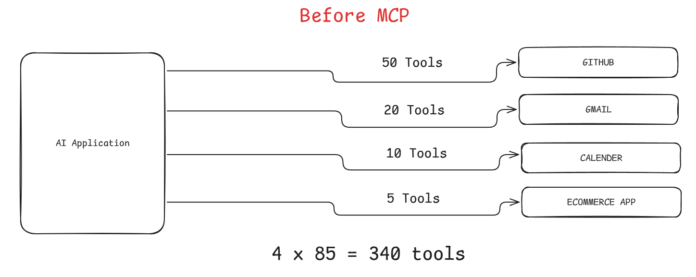
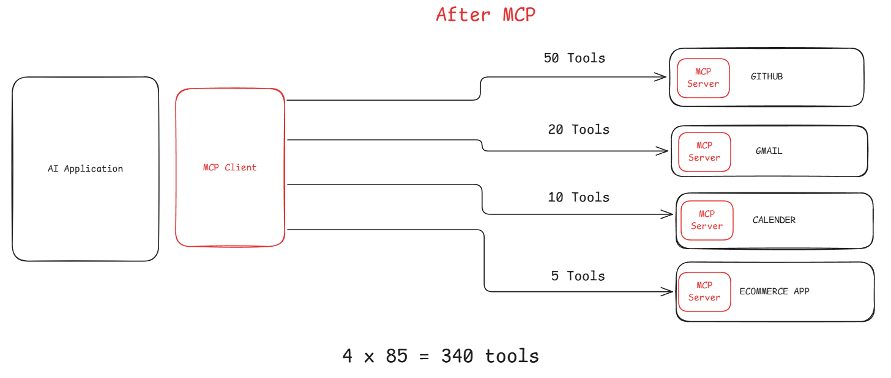

# Model Context Protocol (cont.)

When you visit mcp official website, the code mentioned there is very complex. So, Prefect made FastMCP which is very simple and easy to use. **FastMCP** is a high-level framework designed to simplify building servers and clients for the Model Context Protocol (MCP). Created by Prefect, it acts as a "USB-C port for AI," allowing developers to expose Python functions as tools, resources, and prompts to LLMs with minimal boilerplate. Below is the official link of it.

[FastMCP](https://gofastmcp.com/getting-started/welcome)


**JSON RPC** = JavaScript Object Notation – Remote Procedure Call
- JSON → Data format used to send information
- RPC → A way to call a function on another system/server remotely

## Communication Pattern

**MCP** uses **JSON-RPC** as the communication protocol between:
- **AI Client** (Claude, IDE, Agent, etc.)
- **MCP Server** (tools, database access, APIs, filesystem, etc.)


``` bash
    AI Client
       │
       │ JSON-RPC request
       ▼
    MCP Server
       │
       │ Execute tool / function
       ▼
    JSON-RPC response back to AI
```

- MCP uses JSON-RPC as the messaging protocol to let AI models call tools and services on MCP servers.
- Claude Code CLI → Interface where you type prompts
- Claude Model → Decides whether to use tools
- MCP Client (inside CLI) → Communicates with MCP servers
- MCP Server → Provides tools (GitHub, filesystem, browser, etc.)
- **Claude -> MCP Client -> MCP Server (has tools, prompts and resources)**
- MCP server only expose three things (tools, prompts and resources)

***Example:***
Suppose we have to send some python code to github then working pattern will be:

1.   **Client starts first**    
    -   Examples: Claude Code CLI, Qwen CLI, Cursor IDE, VS Code extension.
    -   These clients act as the **MCP Host**.
    -   Inside the host, there is an **MCP Client component**.

2.  **MCP Client role**    
    -   Responsible for communicating with **MCP Servers**.
    -   Communication protocol used: **JSON-RPC**.

3.   **Client loads MCP configuration**    
    -   When the client starts, it reads a configuration file (e.g., MCP settings).
    -   The config specifies which **MCP servers** should be started (e.g., GitHub MCP server).

4.   **MCP Server is launched**
    -   The MCP Client starts the MCP server as a **separate process**.
    -   Communication usually happens through:
        -   **stdin/stdout**, or
        -   **WebSocket / HTTP** (depending on implementation).

5.   **Initialization handshake**
    -   The MCP Client sends a **JSON-RPC `initialize` request** to the MCP Server.
    -   The MCP Server responds with its **capabilities** (tools, resources, prompts).
    -   This establishes an **active session** between client and server.

6.   **Tool discovery**
    -   The MCP Client asks the MCP Server for available tools.
    -   Example tools from a GitHub MCP server:
        -   create\_repository
        -   commit\_file
        -   create\_issue
        -   create\_pull\_request

7.   **User sends a prompt**    
    -   Example prompt: _“Add this Python file to my GitHub repository.”_

8.   **Model decides which tool to use**
    -   The AI model analyzes the prompt.
    -   It selects the appropriate MCP tool (e.g., `commit_file`).

9.   **Tool call via JSON-RPC**    
    -   The MCP Client sends a **JSON-RPC request** to the MCP Server to execute the tool.

10. -   **MCP Server performs the action**
    -   The server receives the request.
    -   It executes the tool internally.
    -   For GitHub operations, it calls the **GitHub API**.

11.   **External service execution** 
    -   GitHub API processes the request (e.g., commit Python code to a repository).

12.   **Response returned** 
    -   The MCP Server sends the result back to the MCP Client.
    -   The MCP Client passes it to the AI model.

13. **Final output**
-   The AI client (CLI/IDE) displays a human-readable result to the user.

**User prompt → Claude model analyzes → MCP Client sends JSON-RPC request → MCP Server executes tool → External service (GitHub) performs action → Result returned to client.**

---



---



---

## Transport Methods

In Model Context Protocol (MCP), different transport methods are used to communicate between MCP Client and MCP Server. Here is a brief explanation of when to use each.

### 1\. **stdio (Standard Input / Output)**

**When to use:**

-   When the MCP server runs **locally on the same machine** as the client.
-   When the client **starts the server process itself**.

**How it works:**

-   The client launches the MCP server process.
-   Communication happens through **stdin and stdout streams** using JSON-RPC messages.

**Best for:**

-   Local tools
-   CLI integrations
-   Simple and secure local communication

**Example use cases:**

-   Claude CLI using a **filesystem MCP server**
-   Local GitHub MCP server
-   Local database tool

``` bash
Claude CLI
   │
   ▼
stdin / stdout
   │
   ▼
Local MCP Server
```

### 2\. **HTTP**

**When to use:**

-   When the MCP server is **hosted remotely**.
-   When communication is **request–response only**.
-   When you want to expose MCP as a **web API service**.

**How it works:**

-   JSON-RPC requests are sent over **HTTP POST requests**.
-   Each request creates a **separate HTTP interaction**.

**Best for:**

-   Cloud-hosted MCP servers
-   Microservices
-   Scalable API-based tools

**Example use cases:**

-   Hosted AI tools
-   Remote database service
-   SaaS MCP tool servers

``` bash
Client
  │
HTTP POST
  │
  ▼
Remote MCP Server
```

### 3\. **WebSocket**

**When to use:**

-   When you need a **persistent, real-time connection**.
-   When the server must **push updates to the client**.
-   When multiple interactions happen frequently.

**How it works:**

-   A **single persistent connection** is established.
-   Both client and server can send JSON-RPC messages anytime.

**Best for:**

-   Real-time applications
-   Streaming data
-   Interactive tools

**Example use cases:**

-   Live collaboration tools
-   Real-time logs or monitoring
-   Interactive AI agents

``` bash
Client
  │
WebSocket (persistent connection)
  │
  ▼
MCP Server
```

