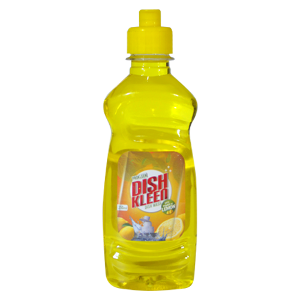
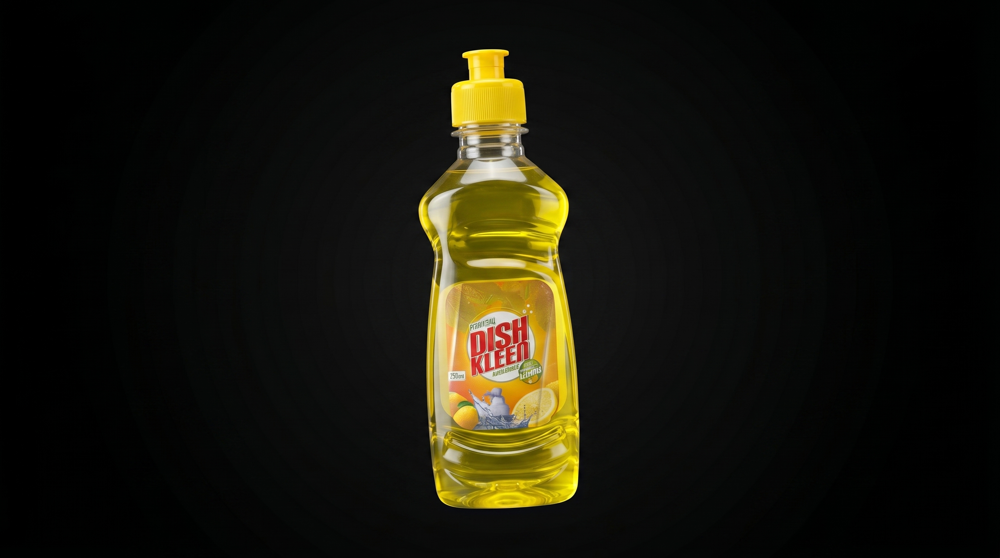
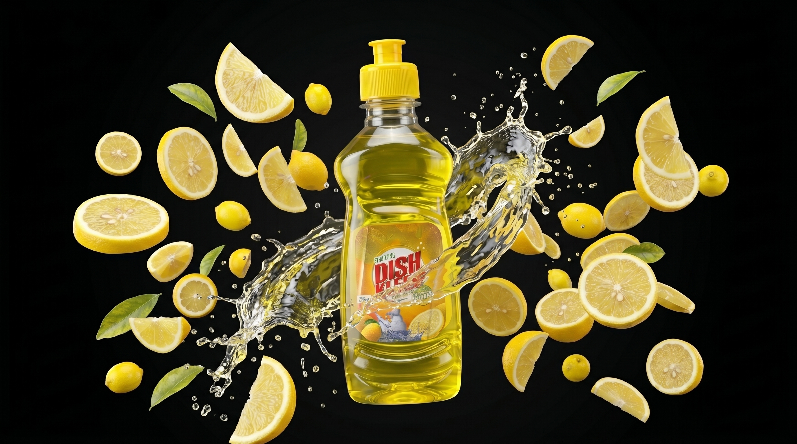
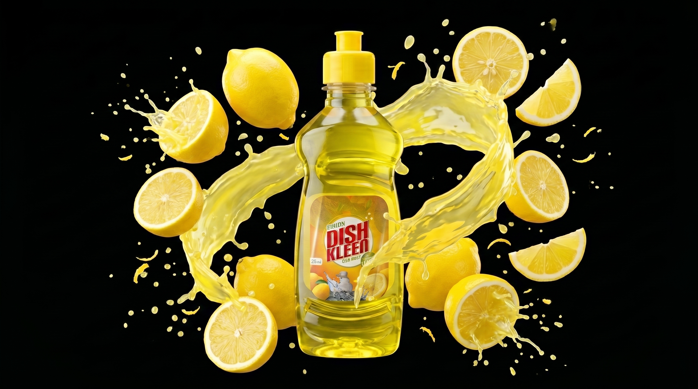

# GOOGLE FLOW

## FIRST PROMPT (To Generate First Frame Image via Flow Nano Banana 2)

**First Frame Image:**
Create a high-quality product image using the uploaded product photo.
Place the product floating in the center of the frame with a slight natural tilt, similar to commercial dish cleaner ads.
Use clean, soft studio lighting with subtle highlights and shadows to make the product look glossy and premium.
Keep all original label details sharp and readable.

**STYLE:**
- Same aesthetic as modern DTC dish cleaner ads
- Simple, minimal, flat background
- Clean color separation
- Slight vignette but no gradients

**BACKGROUND:**
- Pure solid Black (#000000)
- No reflection, no textures

**FRAMING:**
- Full vertical frame
- Product centered
- Enough margins for later motion tracking

**OUTPUT:**
- High resolution still image
- Black background for easy masking
- Maintain the exact shape, colors, and proportions of the user-uploaded product image

***Image I gave input to the Flow***

***Output of the generation Prompt***

## SECOND PROMPT (To Generate last image of video via Flow Nano Banana 2)

Using the uploaded product image, generate the final frame of a product animation.
The product should appear floating and tilted slightly forward, while multiple [ingredient] elements burst dynamically around it.

**INGREDIENT BURST:**
- Surround the product with floating [ingredient] pieces arranged in a dynamic outward explosion
- Include a high-energy liquid splash made from the product's flavor, wrapping partially around the bottle
- Ingredients should look as if captured in high speed photography: sharp, crisp, mid-air.
- Keep the product label visible and unobstructed

**STYLE:**
- Clean , soft commercial studio lighting
- Bright highlight on the bottle's plastics
- Sharp ingredient detail, no motion blur
- Energetic composition similar to beverage advertising key visuals

**PRODUCT POSITION:**
- Center of the frame
- Slight forward tilt for a dynamic, hero-shot angle.
- Ingredient positioned around the product with natural spacing for animation.

**BACKGROUND:**
- Pure solid black (#000000)
- No gradient, textures, fog, or shadow
- Design for clean masking and composition in video

**OUTPUT:**
- High-resolution final frame
- Product centered with bursting [ingredient] effect
- Completely black background
- Preserve the exact colors and proportions of the uploaded product image

[ingredient]: Lemon

***Output of the generation Prompt***

## TRANSITION PROMPT (To Generate Transition Sequence Image via Flow Veo 3.1)

Create a dynamic transition from the mid-spin frame to the final ingredient-burst frame using the uploaded product images.
Begin with the product tilted left in mid rotation on a pure black background.
As the rotation continues, introduce [ingredient] pieces gradually entering the frame from behind and around the product.
Increase the number of floating [ingredient] elements as the motion progresses, building toward a full ingredient burst.
Add a high-energy liquid splash emerging from behind the product and wrapping partially around it as the ingredients appear.
All elements must look sharp and suspended in high-speed motion
Ensure the product stays well-lit, well-centered and unobstructed
Background stays pure soldi black (#000000) with no addition effect
End the transition in the fully exploded ingredient-burst composition.

[ingredient] : Lemon

*Click on below image to see video*
